# ComfyUI-Custom-Batchbox 产品架构与需求文档

## 文档版本

| 版本 | 日期 | 描述 |
|------|------|------|
| 2.22 | 2026-01-30 | DOM Overlay UI 实验性分支（现代化卡片式界面） |
| 2.21 | 2026-01-29 | 动态缓存加载（根据输出端口连接状态按需加载图片） |
| 2.20 | 2026-01-29 | 共享图片数据优化（img2img 批量共用一份 base64）+ multipart 兼容修复 |
| 2.19 | 2026-01-29 | 修复请求体大小限制（分块读取解决HTTPRequestEntityTooLarge） |
| 2.18 | 2026-01-29 | 批量图片尺寸归一化（异尺寸 tensor 兼容） |
| 2.17 | 2026-01-28 | 选中图片放大显示 + 并发生成崩溃修复 |
| 2.16 | 2026-01-28 | 智能缓存：节点作为图片来源 |
| 2.15 | 2026-01-27 | 即时保存 + Gemini imageConfig 格式修复 |
| 2.14 | 2026-01-27 | 动态槽位紧凑 + 并行批处理 + 模型迁移 |
| 2.13 | 2026-01-27 | 画布右键菜单快捷添加功能 |
| 2.12 | 2026-01-27 | 动态参数持久化修复（无闪烁恢复机制） |
| 2.11 | 2026-01-27 | 配置热重载 + 模型下拉列表实时刷新 |
| 2.10 | 2026-01-27 | "开始生成"按钮扩展至所有节点类型 |
| 2.9 | 2026-01-27 | 独立并发生成 + 图片恢复优化 |
| 2.8 | 2026-01-26 | Queue Prompt 拦截开关 |
| 2.7 | 2026-01-26 | "开始生成"按钮部分执行支持 |
| 2.6 | 2026-01-26 | Gemini 原生 API 支持 + Prompt 前缀功能 |
| 2.5.1 | 2026-01-25 | 节点宽度管理器（API Manager 可配置默认宽度） |
| 2.5 | 2026-01-25 | 节点宽度保持机制（防止 252px 重置） |
| 2.4 | 2026-01-25 | 节点生成图片预览持久化 |
| 2.3 | 2026-01-25 | 模型排序、拖拽 UI |
| 2.2 | 2026-01-25 | 自动保存功能 |
| 2.1 | 2026-01-25 | 重试机制、TTL 缓存、日志系统 |
| 2.0 | 2026-01-24 | 手动端点选择、轮询模式、层级文件配置 |
| 1.0 | 2026-01-24 | 初稿 |

### 相关文档

| 文档 | 说明 |
|------|------|
| [docs/hierarchical_config.md](docs/hierarchical_config.md) | 层级配置指南（Provider > Endpoint > Mode） |
| [docs/comfyui_widget_serialization.md](docs/comfyui_widget_serialization.md) | ComfyUI Widget 序列化避坑指南 |
| [docs/preview_persistence.md](docs/preview_persistence.md) | 预览持久化机制 |
| [docs/node_width_retrospective.md](docs/node_width_retrospective.md) | 节点宽度保持开发复盘 |
| [YAML_CONFIG_REFERENCE.md](YAML_CONFIG_REFERENCE.md) | YAML 配置参考（供 LLM 使用） |

---

## 1. 项目概述

ComfyUI-Custom-Batchbox 是一套 ComfyUI 自定义节点系统，实现：

1. **动态参数面板** - 选择模型后自动更新参数控件
2. **多类别节点** - 图片/文本/视频/音频/编辑器
3. **多 API 中转站** - 同模型支持多个 API 站点
4. **智能端点管理** - 轮询、手动选择、故障转移
5. **灵活配置** - YAML 配置 + 可视化管理器

---

## 2. 系统架构

### 2.1 整体架构图

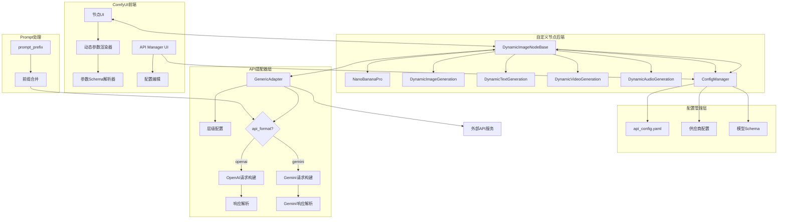

### 2.2 动态参数流程

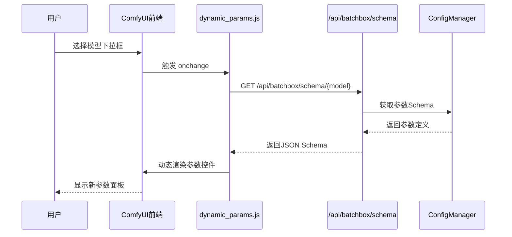

### 2.3 端点选择与轮询

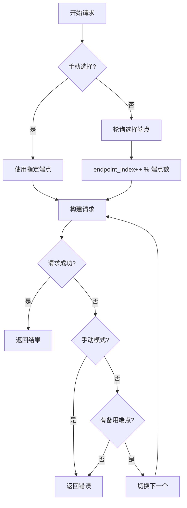

### 2.4 层级配置优先级

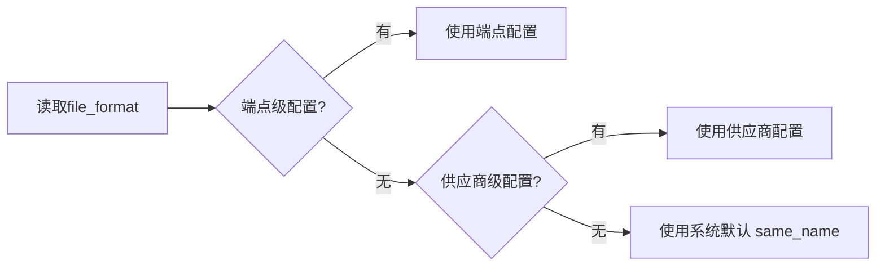

---

## 2.5 节点类型

| 节点 ID | 显示名称 | 用途 |
|---------|----------|------|
| `NanoBananaPro` | 🍌 Nano Banana Pro (Universal) | 通用图像节点 |
| `DynamicImageGeneration` | 🎨 Dynamic Image Generation | 动态图像生成 |
| `DynamicTextGeneration` | 📝 Dynamic Text Generation | 动态文本生成 |
| `DynamicVideoGeneration` | 🎬 Dynamic Video Generation | 动态视频生成 |
| `DynamicAudioGeneration` | 🎵 Dynamic Audio Generation (Beta) | 动态音频生成 |
| `DynamicImageEditor` | 🔧 Dynamic Image Editor | 图像编辑器 |

---

## 3. 核心功能

### 3.1 动态参数系统

**流程：**
```
用户选择模型 → JS 请求 /api/batchbox/schema/{model} 
            → 后端返回参数 Schema 
            → 前端动态渲染控件
```

**参数类型支持：**
- `string` - 文本输入
- `select` - 下拉选择
- `number` - 数字滑块
- `boolean` - 开关

### 3.2 端点管理

**模式：**
| 模式 | 描述 |
|------|------|
| 自动轮询 | 按顺序轮流使用各端点 |
| 手动选择 | 用户指定特定端点 |
| 故障转移 | 失败时自动切换下一个 |

**配置优先级：**
```
端点级 > 供应商级 > 系统默认
```

### 3.3 文件格式配置

**支持格式：**
| 格式 | 示例 | 适用 API |
|------|------|----------|
| `same_name` | `image, image` | OpenAI (默认) |
| `indexed` | `image[0], image[1]` | PHP |
| `array` | `images[]` | Rails |
| `numbered` | `image1, image2` | 传统 |

### 3.4 动态输入槽

**功能：** 连接图片后自动添加下一个输入槽

**配置：**
```yaml
dynamic_inputs:
  image:
    max: 14
    type: IMAGE
```

### 3.5 多 API 格式支持

**支持的 API 格式：**

| 格式 | 端点示例 | 特点 |
|------|----------|------|
| `openai` | `/v1/chat/completions` | 标准 OpenAI 兼容格式（默认） |
| `gemini` | `/v1beta/models/{model}:generateContent` | Gemini 原生格式，支持 `responseModalities` |

**Gemini 格式请求构建流程：**

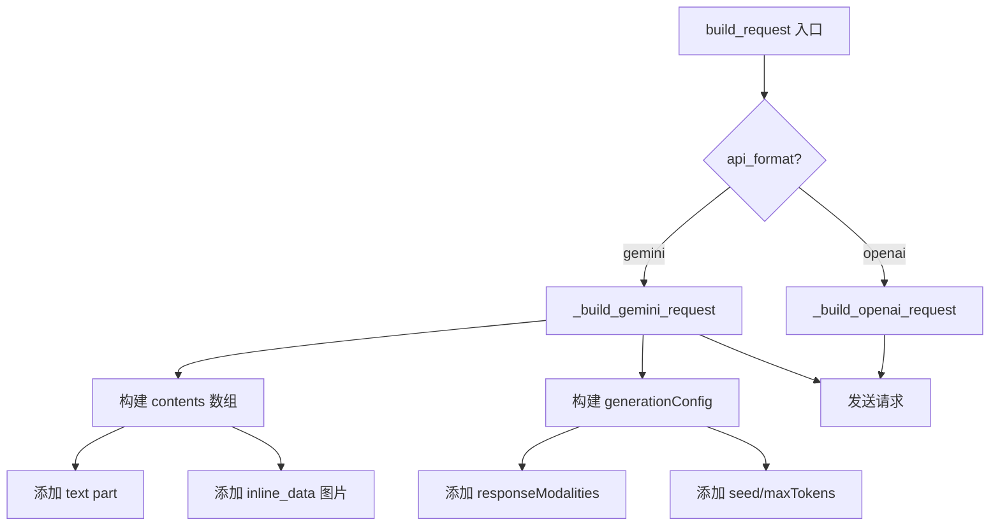

**Gemini 响应解析：**

```mermaid
flowchart TD
    A[parse_response] --> B{检测响应格式}
    B -->|candidates 存在| C[_parse_gemini_response]
    B -->|否则| D[OpenAI 格式解析]
    C --> E[提取 candidates[0].content.parts]
    E --> F{part 类型?}
    F -->|inlineData| G[base64 解码为图片]
    F -->|fileData| H[提取 fileUri URL]
    G --> I[返回 APIResponse]
    H --> I
```

### 3.6 Prompt 前缀

**功能：** 自动在用户 prompt 前添加配置的前缀文本

**用途：** 强制模型生成图片而非文本回复（如 Gemini 多模态模型）

**配置：**
```yaml
api_endpoints:
  - display_name: Gemini图片
    prompt_prefix: "生成一张图片："
    api_format: gemini
```

**处理流程：**
```
用户输入: "哈哈哈"
     ↓
prompt_prefix: "生成一张图片："
     ↓
实际发送: "生成一张图片：哈哈哈"
```

---

## 4. 配置系统

### 4.1 YAML 结构

```yaml
# 供应商
providers:
  openai_compatible:
    base_url: https://api.example.com
    api_key: sk-xxx
    file_format: same_name  # 供应商级默认

# 模型
models:
  ModelName:
    display_name: 🎨 显示名
    category: image
    dynamic_inputs: {...}
    parameter_schema:
      basic: {...}
      advanced: {...}
    api_endpoints:
      - provider: openai_compatible
        priority: 1
        modes:
          text2img:
            endpoint: /v1/images/generations
            response_path: data[0].url
          img2img:
            endpoint: /v1/images/edits
            file_format: indexed  # 端点级覆盖
```

### 4.2 可视化管理器

**功能：**
- 供应商 CRUD（包含高级文件格式设置）
- 模型配置（参数、端点）
- 端点高级设置（折叠式）

---

## 5. 文件结构

```
ComfyUI-Custom-Batchbox/
├── __init__.py              节点注册 + API 路由
├── nodes.py                 节点类定义
├── config_manager.py        配置管理（含缓存、验证）
├── batchbox_logger.py       日志与重试模块
├── errors.py                结构化异常类
├── image_utils.py           图片处理工具
├── api_config.yaml          主配置文件
├── README.md                项目说明
├── ARCHITECTURE.md          架构文档（本文）
├── YAML_CONFIG_REFERENCE.md LLM 配置参考
├── adapters/
│   ├── __init__.py          适配器导出
│   ├── base.py              适配器接口
│   ├── generic.py           通用适配器（层级配置 + 重试）
│   └── template_engine.py   请求模板引擎
├── web/                       前端模块
│   ├── api_manager.js         API管理界面
│   ├── api_manager.css        管理界面样式
│   ├── dynamic_params.js      动态参数渲染
│   ├── dynamic_params.css
│   └── dynamic_inputs.js      动态输入槽
├── save_settings.py           自动保存模块
└── tests/                     单元测试
    ├── test_errors.py       异常类测试
    └── test_adapters.py     适配器测试
```

---

## 6. API 接口

| 端点 | 方法 | 描述 |
|------|------|------|
| `/api/batchbox/config` | GET | 获取完整配置 |
| `/api/batchbox/config` | POST | 保存完整配置 |
| `/api/batchbox/models` | GET | 获取所有模型列表 |
| `/api/batchbox/schema/{model}` | GET | 获取模型参数 Schema |
| `/api/batchbox/providers` | GET | 获取供应商列表 |
| `/api/batchbox/providers/{name}` | PUT | 更新供应商配置 |
| `/api/batchbox/categories` | GET | 获取节点分类 |
| `/api/batchbox/save-settings` | GET | 获取自动保存配置 |
| `/api/batchbox/save-settings` | POST | 更新自动保存配置 |
| `/api/batchbox/save-settings/preview` | POST | 预览文件名 |
| `/api/batchbox/model-order/{category}` | GET | 获取模型排序 |
| `/api/batchbox/model-order/{category}` | POST | 更新模型排序 |
| `/api/batchbox/node-settings` | GET | 获取节点显示设置 |
| `/api/batchbox/node-settings` | POST | 更新节点显示设置 |

---

## 7. 技术要点

### 7.1 节点类型识别
```javascript
// ComfyUI 中需要用 comfyClass 而不是 type
const nodeType = node.comfyClass || node.type;
```

### 7.2 参数传递
```javascript
// 拦截 queuePrompt 在执行前收集参数
api.queuePrompt = async function(...) {
  // 更新 extra_params widget
  return origQueuePrompt.call(this, ...);
};
```

### 7.3 层级配置读取
```python
file_format = (
    mode_config.get("file_format") or
    endpoint.get("file_format") or
    provider.get("file_format") or
    "same_name"
)
```

### 7.4 自动保存功能

生成的图片会自动保存到指定目录，通过 `save_settings.py` 模块实现。

**配置项：**

| 设置项 | 类型 | 默认值 | 说明 |
|--------|------|--------|------|
| `enabled` | bool | true | 启用/禁用自动保存 |
| `output_dir` | string | "batchbox" | 保存目录（相对于 output/） |
| `format` | string | "original" | 文件格式：original/png/jpg/webp |
| `fallback_format` | string | "png" | 保持原格式时的默认格式 |
| `quality` | int | 95 | JPG/WebP 质量 (1-100) |
| `naming_pattern` | string | "{model}_{timestamp}_{seed}" | 命名模板 |
| `create_date_subfolder` | bool | true | 按日期创建子文件夹 |

**命名模板变量：**

| 变量 | 说明 | 示例 |
|------|------|------|
| `{model}` | 模型名称 | nano_banana_pro |
| `{timestamp}` | 完整时间戳 | 20260125_093421 |
| `{date}` | 日期 | 2026-01-25 |
| `{time}` | 时间 | 09-34-21 |
| `{seed}` | 随机种子 | 1234567890 |
| `{batch}` | 批次序号 | 1 |
| `{uuid}` | 8位唯一ID | a1b2c3d4 |
| `{prompt}` | 提示词（需启用） | beautiful_sunset |

**保存流程：**

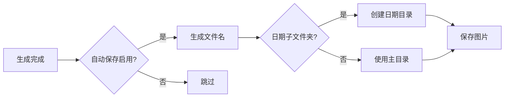

### 7.5 模型排序功能

通过 `model_order` 配置控制模型在 API Manager 和节点下拉框中的显示顺序。

**配置格式：**

```yaml
model_order:
  image:
    - Nano Banana Pro   # 第1个
    - tapnow_flash      # 第2个
    - grok2_image       # 第3个
  text: []
  video: []
```

**容错机制：**

| 情况 | 处理方式 |
|------|----------|
| 忘记配置 `model_order` | 使用默认顺序（字母排序） |
| 列表有重复模型名 | 仅保留首次出现的位置 |
| 模型已删除但残留在列表 | 自动过滤不存在的模型 |
| 新增模型未在列表中 | 自动追加到末尾 |

**前端拖拽实现：**

- 使用 HTML5 Drag & Drop API
- 拖拽手柄：`⋮⋮` 符号
- 视觉反馈：拖拽时行半透明，目标位置金色边框
- 释放后自动保存到后端

**排序逻辑（Python）：**

```python
def _sort_models_by_order(self, model_names, category):
    order = self.get_model_order(category)
    order_map = {name: i for i, name in enumerate(order)}
    max_index = len(order)
    # 已配置的按顺序排，未配置的按字母追加到末尾
    return sorted(model_names, key=lambda x: (order_map.get(x, max_index), x))
```

### 7.6 节点宽度保持机制

防止节点宽度在动态更新时被重置为 ~252px（LiteGraph 默认计算宽度）。**v2.5.1 新增"节点宽度管理器"**，用户可在 API Manager → 保存设置 Tab 中配置新建节点的默认宽度（300-1200px）。

**问题流程：**

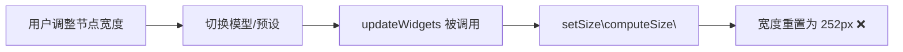

**解决方案流程：**

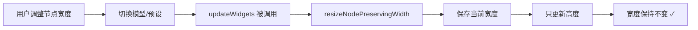

**核心实现：**

```javascript
// 辅助函数：保持宽度只更新高度
function resizeNodePreservingWidth(node) {
  const currentWidth = node.size[0];
  const computedSize = node.computeSize();
  node.setSize([currentWidth, computedSize[1]]);
}
```

**生命周期区分：**

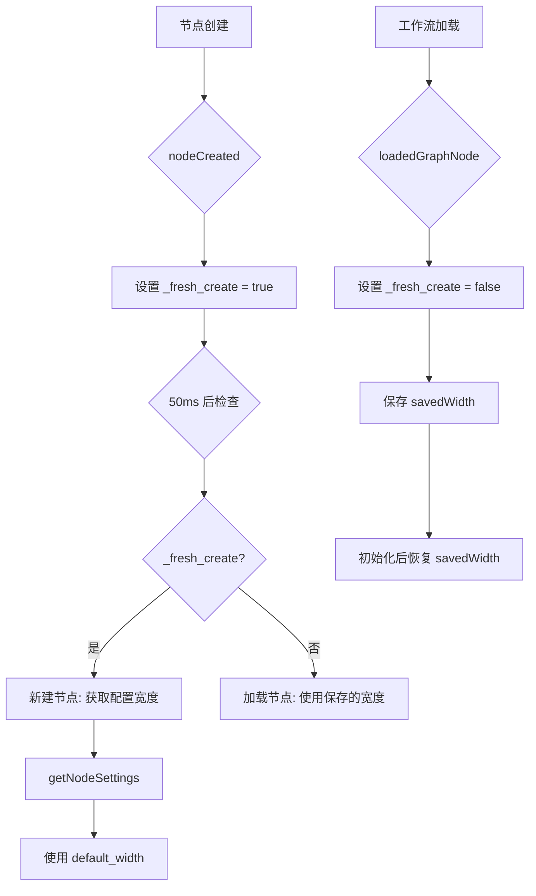

**可配置默认宽度（v2.5.1）：**

```javascript
// 从后端获取节点设置
async function getNodeSettings() {
    const resp = await api.fetchApi("/api/batchbox/node-settings");
    const data = await resp.json();
    return data.node_settings || { default_width: 500 };
}

// 在 nodeCreated 中使用
const nodeSettings = await getNodeSettings();
const defaultWidth = nodeSettings.default_width || 500;
node.size = [defaultWidth, computedSize[1]];
```

**配置存储 (api_config.yaml)：**

```yaml
node_settings:
  default_width: 500  # 范围: 300-1200px
```

**修改的函数：**

| 文件 | 函数 | 修改 |
|------|------|------|
| `dynamic_inputs.js` | `addDynamicInput` | 保存/恢复宽度 |
| `dynamic_inputs.js` | `removeDynamicInput` | 保存/恢复宽度 |
| `dynamic_inputs.js` | `updateInputsForType` | 保存/恢复宽度 |
| `dynamic_inputs.js` | `getNodeSettings` | 新增: 从后端获取配置 |
| `dynamic_inputs.js` | `nodeCreated` | 使用配置的默认宽度 |
| `dynamic_params.js` | `resizeNodePreservingWidth` | 新增辅助函数 |
| `dynamic_params.js` | 7 处 `setSize` 调用 | 替换为辅助函数 |
| `config_manager.py` | `get_node_settings` | 新增: 获取节点设置 |
| `config_manager.py` | `update_node_settings` | 新增: 更新节点设置 |
| `api_manager.js` | `renderSaveSettings` | 添加宽度滑块 UI |

### 7.7 部分执行机制

**功能：** 点击"▶ 开始生成"按钮时，只执行目标节点及其上游依赖，不执行工作流中不相关的分支。

**核心原理：**

ComfyUI 执行工作流时，会将整个 graph 序列化为 `prompt.output` 对象发送给后端。部分执行的实现是在发送前过滤 `prompt.output`，只保留需要执行的节点。

**实现流程：**

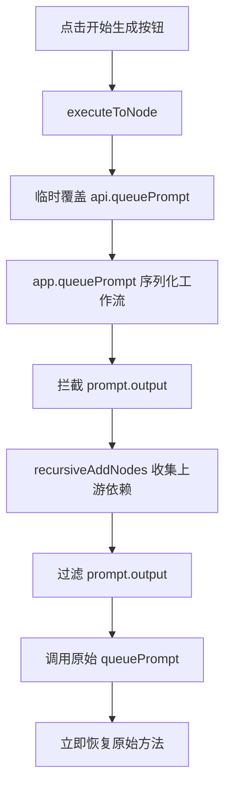

**核心函数：**

| 函数 | 作用 |
|------|------|
| `recursiveAddNodes(nodeId, oldOutput, newOutput)` | 递归收集节点及其上游依赖 |
| `executeToNode(node)` | 临时覆盖 `api.queuePrompt` 实现部分执行 |

**prompt.output 结构示例：**

```javascript
{
  "3": { "class_type": "KSampler", "inputs": {...} },      // 上游节点
  "4": { "class_type": "VAEDecode", "inputs": {"samples": ["3", 0]} },  // 依赖节点3
  "5": { "class_type": "SaveImage", "inputs": {"images": ["4", 0]} },   // 目标节点
  "8": { "class_type": "LoadImage", "inputs": {...} },    // 独立分支（被过滤）
  "9": { "class_type": "PreviewImage", "inputs": {...} }  // 独立分支（被过滤）
}
```

**官方 API 状态：**

| 功能 | 官方 API | 实现方式 |
|------|----------|----------|
| 右键菜单 | `getNodeMenuItems()` | ✅ 推荐 |
| 选择工具栏 | `getSelectionToolboxCommands()` | ✅ 推荐 |
| 修改 prompt | 无官方 API | ⚠️ 临时 monkey-patch |

> **注意：** 官方明确警告 monkey-patching 是 deprecated，但目前没有替代方案。实现采用临时覆盖（执行后立即恢复）以最小化影响。

### 7.8 Queue Prompt 拦截机制

**功能：** 全局 Queue Prompt 时自动排除 BatchBox 节点，仅允许通过节点上的"开始生成"按钮触发执行。

**应用场景：**
- ComfyUI 重启后用户按 Queue Prompt 时，避免重新执行所有 API 调用节点
- 工作流中有多个独立的 BatchBox 节点时，避免同时触发

**实现流程：**

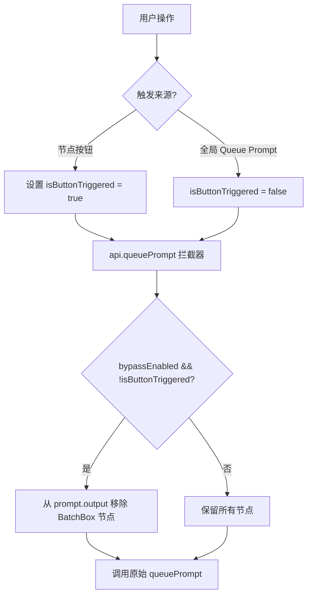

**配置存储 (api_config.yaml)：**

```yaml
node_settings:
  default_width: 500
  bypass_queue_prompt: true  # true=开启拦截, false=正常执行
```

**核心代码模式：**

```javascript
// 标记按钮触发
let isButtonTriggeredExecution = false;
let bypassQueuePromptEnabled = true;

// 拦截 queuePrompt
const origQueuePrompt = api.queuePrompt;
api.queuePrompt = async function(number, workflowData) {
  const wasButtonTriggered = isButtonTriggeredExecution;
  isButtonTriggeredExecution = false; // 立即重置
  
  if (bypassQueuePromptEnabled && !wasButtonTriggered) {
    // 移除 BatchBox 节点
    for (const nodeId of batchboxNodeIds) {
      delete workflowData.output[nodeId];
    }
  }
  return origQueuePrompt.call(this, number, workflowData);
};
```

**设置同步注意事项：**

当使用专用 API 保存设置时，必须同步回主配置对象，否则主"保存"按钮会覆盖：

```javascript
// 保存成功后同步
this.config.node_settings = { ...this.config.node_settings, ...newSettings };
```

### 7.9 独立并发生成机制

**功能：** 节点通过独立 API 调用生成内容，完全绕过 ComfyUI 的 `queue prompt` 队列，实现多节点同时并发执行。

**核心优势：**

| 特性 | ComfyUI Queue | 独立生成 |
|------|---------------|----------|
| 并发性 | 串行执行 | **并行执行** |
| 依赖管理 | 自动 | 手动解析 |
| 图片恢复 | 内置 | 手动持久化 |

**实现流程：**

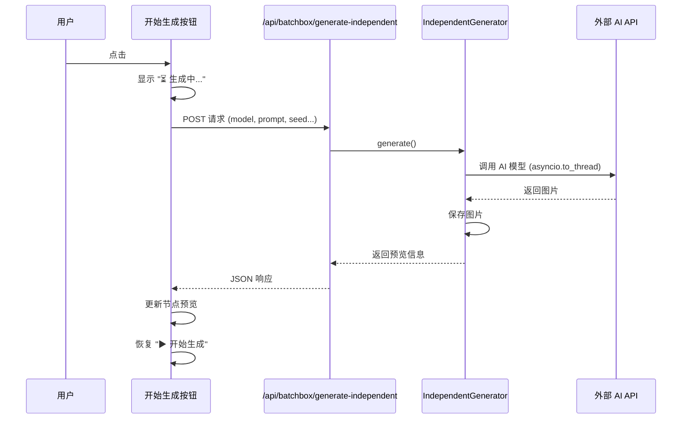

**后端关键实现（v2.20 并发控制）：**

```python
# independent_generator.py
async def generate(self, model, prompt, seed, batch_count, ...):
    async def process_single_batch(batch_idx):
        current_params = params.copy()
        if seed > 0:
            current_params["seed"] = seed + batch_idx
        # 使用 asyncio.to_thread 避免阻塞事件循环
        result = await asyncio.to_thread(
            self.execute_with_failover, model, current_params, mode
        )
        return (batch_idx, batch_images, batch_log)
    
    # v2.20: 智能自适应并发控制
    def get_max_concurrent():
        if mode == "text2img":
            return batch_count  # Text2img: 无输入图片，全部并行
        # Img2img: 根据分辨率限制
        resolution = str(extra_params.get("resolution", "")).upper()
        if "4K" in resolution: return 3
        elif "HD" in resolution: return 5
        else: return 6
    
    max_concurrent = get_max_concurrent()
    semaphore = asyncio.Semaphore(max_concurrent)
    
    async def process_with_limit(batch_idx):
        async with semaphore:
            return await process_single_batch(batch_idx)
    
    tasks = [process_with_limit(i) for i in range(batch_count)]
    results = await asyncio.gather(*tasks, return_exceptions=True)
```

**并发控制策略（v2.20）：**

| 模式 | 分辨率 | 并发数 | 说明 |
|------|--------|--------|------|
| **Text2img** | 任意 | **全部并行** | 无输入图片，无内存压力 |
| Img2img | 4K/2160p | 3 | 大图，防止内存溢出 |
| Img2img | HD/1080p | 5 | 中等平衡 |
| Img2img | 其他 | 6 | 默认 |

**滑动窗口工作原理（Img2img 模式）：**

```text
时间 →
Task1 ████████████░  (完成 → Task4 立即启动)
Task2 ██████████████████░
Task3 ████████░  (完成 → Task5 立即启动)
Task4      ████████████████░
Task5        ██████████░
...
始终保持 ≤N 个任务同时运行（N根据分辨率动态调整）
```

**前端关键实现：**

```javascript
// 更新节点预览（保存尺寸避免恢复时跳动）
function updateNodePreview(node, previewImages) {
    node.imgs = previewImages.map(img => {
        const imgEl = new Image();
        imgEl.onload = () => {
            node.setDirtyCanvas(true, true);  // 图片加载后触发重绘
        };
        imgEl.src = `/view?filename=${img.filename}&t=${Date.now()}`;
        return imgEl;
    });
    
    node.properties._last_images = JSON.stringify(previewImages);
    node.properties._last_size = JSON.stringify(node.size);  // 保存尺寸
}
```

**恢复时抑制跳动：**

```javascript
// loadedGraphNode 中使用 _isRestoring 标志
node._isRestoring = true;  // 抑制中间重绘
// ... 初始化代码 ...
node._isRestoring = false;
node.setDirtyCanvas(true, true);  // 最终一次性重绘
```

**修改的文件：**

| 文件 | 职责 |
|------|------|
| `independent_generator.py` | 后端独立生成逻辑、`asyncio.to_thread` 避免阻塞 |
| `__init__.py` | 注册 `/api/batchbox/generate-independent` 端点 |
| `web/dynamic_params.js` | 前端按钮触发、预览更新、尺寸保存 |
| `web/dynamic_inputs.js` | 恢复逻辑、`_isRestoring` 抑制机制 |

### 7.10 配置热重载机制

**功能：** 在 API Manager 中保存配置后，画布中的 BatchBox 节点立即刷新参数和模型列表，无需刷新浏览器。

**问题背景：**

| 问题 | 原因 |
|------|------|
| 动态参数不刷新 | `onModelChange()` 跳过相同模型 |
| 模型列表不更新 | Widget options 是 Python 后端定义的静态数据 |
| 需要手动刷新浏览器 | 没有事件通知机制 |

**实现流程：**

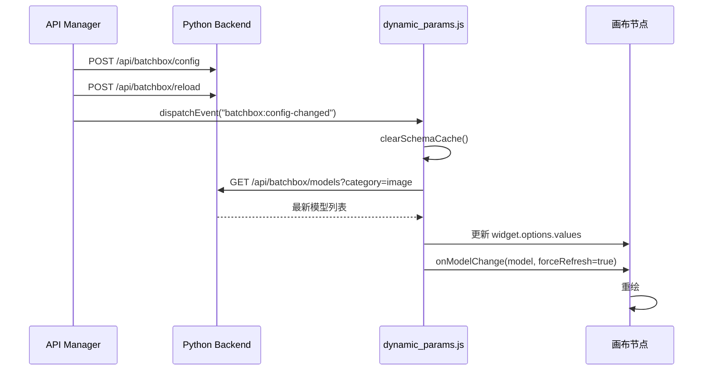

**前端关键实现：**

```javascript
// api_manager.js - 保存后触发热重载
async saveConfig() {
    await api.fetchApi("/api/batchbox/config", { method: "POST", body: JSON.stringify(this.config) });
    await api.fetchApi("/api/batchbox/reload", { method: "POST" });  // 强制后端刷新
    window.dispatchEvent(new CustomEvent("batchbox:config-changed"));  // 通知前端
}

// dynamic_params.js - 监听配置变更
window.addEventListener("batchbox:config-changed", async () => {
    clearSchemaCache();
    // 1. 获取最新模型列表
    const models = await fetchModelsForCategory(category);
    // 2. 更新 widget options
    modelWidget.options.values = models.names;
    // 3. 强制刷新参数
    await node._dynamicParamManager.onModelChange(modelWidget.value, true);
});

// onModelChange 支持强制刷新
async onModelChange(modelName, forceRefresh = false) {
    if (modelName === this.currentModel && !forceRefresh) return;  // 允许强制刷新
    // ... 继续获取 schema 并更新 widgets
}
```

**修改的文件：**

| 文件 | 职责 |
|------|------|
| `web/api_manager.js` | 保存后调用 `/api/batchbox/reload` + 触发 `batchbox:config-changed` 事件 |
| `web/dynamic_params.js` | 监听事件、刷新模型列表、强制更新参数、`forceRefresh` 参数 |

### 7.11 画布右键菜单快捷添加

**功能：** 在 ComfyUI 画布空白处右键可直接添加 BatchBox 节点，无需在节点浏览器中查找。

**支持的节点：**

| 菜单项 | 节点类型 |
|--------|----------|
| 🖼️ Dynamic Image Generation | `DynamicImageGeneration` |
| 🎬 Dynamic Video Generation | `DynamicVideoGeneration` |
| 📝 Dynamic Text Generation | `DynamicTextGeneration` |
| ✏️ Dynamic Image Editor | `DynamicImageEditor` |
| 🔊 Dynamic Audio Generation | `DynamicAudioGeneration` |

**配置开关：**

```yaml
node_settings:
  show_in_canvas_menu: true  # true=显示, false=隐藏
```

**实现方式：**

ComfyUI 官方推荐的 `getCanvasMenuItems()` hook：

```javascript
app.registerExtension({
  name: "ComfyUI-Custom-Batchbox.DynamicParams",
  
  getCanvasMenuItems() {
    if (!showInCanvasMenuEnabled) return [];  // 尊重设置
    
    return batchboxNodes.map(nodeInfo => ({
      content: nodeInfo.label,
      callback: () => {
        const node = LiteGraph.createNode(nodeInfo.type);
        node.pos = [canvas.graph_mouse[0], canvas.graph_mouse[1]];
        app.graph.add(node);
      }
    }));
  }
});
```

**热重载机制：**

设置变更后无需刷新页面即可生效：

1. API Manager 保存设置 → 调用 `/api/batchbox/node-settings`
2. 触发 `batchbox:node-settings-changed` 事件
3. `dynamic_params.js` 监听事件 → `fetchNodeSettings()` 更新 `showInCanvasMenuEnabled`
4. 下次右键时 `getCanvasMenuItems()` 自动返回正确结果

**修改的文件：**

| 文件 | 职责 |
|------|------|
| `web/dynamic_params.js` | `getCanvasMenuItems()` hook + 热重载逻辑 |
| `web/api_manager.js` | "右键菜单快捷添加" 开关 UI |

### 7.13 动态槽位紧凑策略

**功能：** 断开中间输入槽位后，连接自动向前移动填补空隙，保持槽位紧凑。

**核心问题：**

```
原状态：image1(连接A) → image2(空) → image3(连接B) → image4(空)
断开 image1 后：
  ❌ 旧行为：image1(空) → image2(空) → image3(连接B) → image4(空)
  ✅ 新行为：image1(连接B) → image2(空)
```

**实现策略：存储-删除-重建-重连**

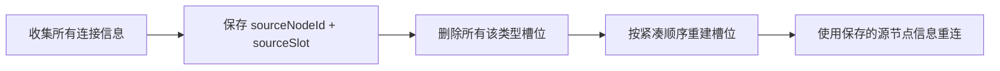

**关键实现：**

```javascript
// web/dynamic_inputs.js - updateInputsForType()
// 1. 收集连接信息（不使用 link ID，删除后会失效）
const connections = [];
for (let i = 1; i <= currentInputCount; i++) {
    const input = node.inputs.find(inp => inp.name === `${prefix}${i}`);
    if (input?.link) {
        const linkInfo = graph.links[input.link];
        if (linkInfo) {
            connections.push({
                sourceNodeId: linkInfo.origin_id,
                sourceSlot: linkInfo.origin_slot
            });
        }
    }
}

// 2. 删除所有槽位
while (slotExists) { node.removeInput(slotIndex); }

// 3. 按紧凑顺序重建
for (let i = 1; i <= connections.length + 1; i++) {
    node.addInput(`${prefix}${i}`, inputType);
}

// 4. 使用源节点信息重连
for (let i = 0; i < connections.length; i++) {
    const sourceNode = graph.getNodeById(conn.sourceNodeId);
    sourceNode.connect(conn.sourceSlot, node, inputIndex);
}
```

**为什么不用 Link ID：**

| 方式 | 问题 |
|------|------|
| Link ID | 删除槽位后 link 被销毁，ID 失效 |
| sourceNodeId + sourceSlot | ✅ 节点和槽位独立于 link 存在 |

**修改的文件：**

| 文件 | 职责 |
|------|------|
| `web/dynamic_inputs.js` | `updateInputsForType()` 紧凑策略实现 |

### 7.14 智能缓存：节点作为图片来源

**功能：** 让 BatchBox 节点在已生成图片后，行为类似 Load Image 节点：
- 已生成图片的节点在 Queue Prompt 时**不调用 API**，直接返回缓存图片
- 下游节点能正常接收到这些图片
- 即使重启 ComfyUI 也能恢复

**适用场景：**
- **开启"拦截全局 Queue Prompt"**：节点不执行，但下游节点仍能接收到之前生成的图片
- **关闭"拦截全局 Queue Prompt"**：如果参数未变，直接返回缓存图片

**问题背景：**

独立生成（"开始生成"按钮）和 Queue Prompt 之间无法正确共享缓存：
- 独立生成后点击 Queue Prompt 会重复调用 API
- 原因：前端和后端分别计算哈希，结果不一致

**核心问题：**

| 问题 | 原因 | 解决方案 |
|------|------|----------|
| JSON 格式差异 | Python 默认 `{"key": "value"}`，JS 默认 `{"key":"value"}` | Python 使用 `separators=(',', ':')` |
| 前后端分别计算 | 细微差异导致哈希不匹配 | 统一由后端计算 |
| extra_params 包含 seed | 与独立 seed 字段冲突 | 哈希计算时排除 seed |

**实现流程：**

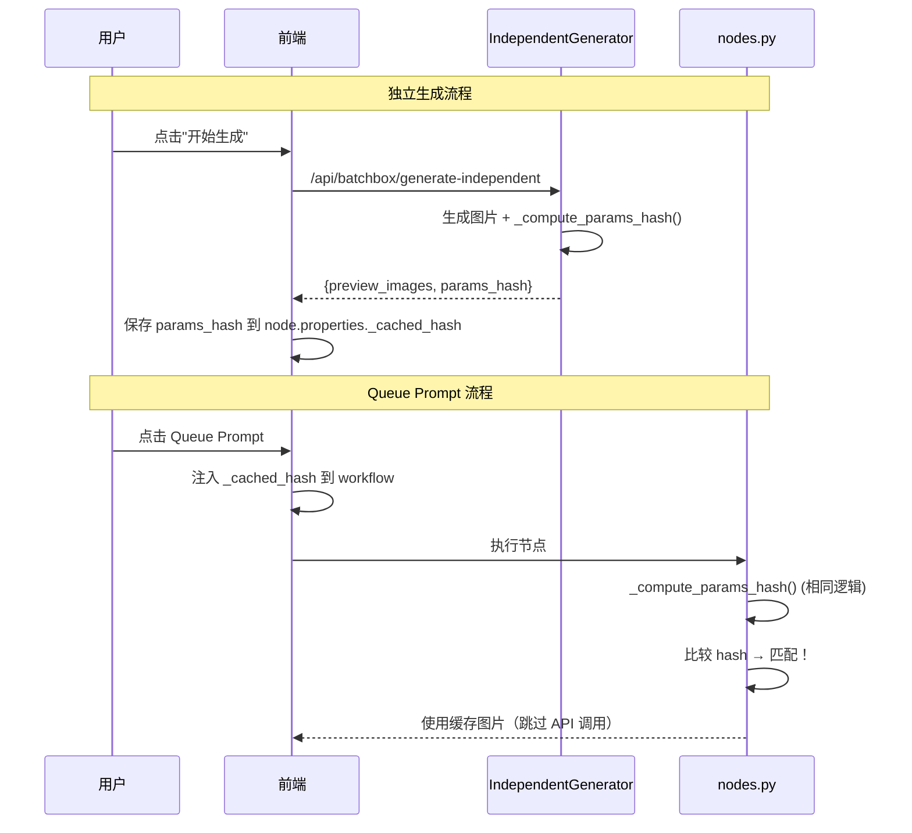

**后端关键实现：**

```python
# independent_generator.py
def _compute_params_hash(self, model, prompt, batch_count, seed, extra_params):
    """与 nodes.py 使用完全相同的逻辑"""
    params_for_hash = dict(extra_params) if extra_params else {}
    params_for_hash.pop("seed", None)  # 排除 seed
    
    # 紧凑格式匹配 JavaScript
    extra_params_normalized = json.dumps(params_for_hash, sort_keys=True, separators=(',', ':'))
    
    params_str = f"{model}|{prompt}|{batch_count}|{seed}|{extra_params_normalized}"
    return hashlib.md5(params_str.encode()).hexdigest()

async def generate(self, ...):
    # ... 生成图片 ...
    params_hash = self._compute_params_hash(model, prompt, batch_count, seed, extra_params)
    return {
        "success": True,
        "preview_images": all_previews,
        "params_hash": params_hash  # 返回后端计算的哈希
    }
```

**前端关键实现：**

```javascript
// dynamic_params.js - executeIndependent()
const result = await response.json();
if (result.success) {
    // 直接使用后端返回的哈希，不再前端计算
    const paramsHash = result.params_hash;
    updateNodePreview(node, result.preview_images, paramsHash);
}
```

**"参数变化检测"设置：**

| 状态 | 行为 |
|------|------|
| 开启（默认） | 修改参数后 Queue Prompt 会重新生成 |
| 关闭 | 忽略参数变化，仅按钮触发生成 |

**配置存储：**

```yaml
node_settings:
  smart_cache_hash_check: true  # true=检测参数变化, false=仅按钮触发
```

**修改的文件：**

| 文件 | 职责 |
|------|------|
| `config_manager.py` | 添加 `smart_cache_hash_check` 默认设置 |
| `api_manager.js` | 添加设置 UI 复选框 |
| `dynamic_params.js` | 读取设置、注入参数、使用后端哈希 |
| `nodes.py` | 添加 `_skip_hash_check` 输入，修复 JSON 格式 |
| `independent_generator.py` | 添加 `_compute_params_hash()` 并返回哈希 |

### 7.15 选中图片放大显示

**功能：** 生成多张图后，节点自动放大显示选中的图片（默认第一张），并在执行后保持放大状态：

| 场景 | 行为 |
|------|------|
| 生成完成后 | 默认第一张放大显示，输出给下游 |
| 点击 X 按钮 | 回到缩略图模式 |
| 点击缩略图 | 该图片放大显示 |
| Queue Prompt | 保持放大显示，输出选中图片 |
| 重启恢复 | 选中图片信息持久化，依旧放大显示 |

**问题背景：**

ComfyUI 的渲染循环在每一帧都会调用 `imageIndex = null`，这会覆盖用户的选择，导致执行后闪回缩略图。

**核心解决方案：Property Interception + Execution Window Guard**

```javascript
// dynamic_params.js - 拦截 imageIndex setter
Object.defineProperty(this, 'imageIndex', {
  set: function(value) {
    // 仅在执行窗口期间阻止 null
    if ((value === null) && selfNode._ignoreImageIndexChanges) {
      selfNode._imageIndexInternal = selfNode._selectedImageIndex || 0;
      return;  // 阻止
    }
    selfNode._imageIndexInternal = value;  // 其他时候允许
  }
});
```

**时间窗口控制：**

```javascript
// dynamic_inputs.js - onExecuted
this._ignoreImageIndexChanges = true;
this.imageIndex = selectedIdx;

setTimeout(() => {
    this._ignoreImageIndexChanges = false;
}, 100);  // 100ms 足够 ComfyUI 渲染完成
```

**修改的文件：**

| 文件 | 职责 |
|------|------|
| `web/dynamic_params.js` | imageIndex setter 拦截，阻止执行期间的 null |
| `web/dynamic_inputs.js` | onExecuted 中设置选中索引，100ms 后恢复 |

**用户交互流程（简版）：**

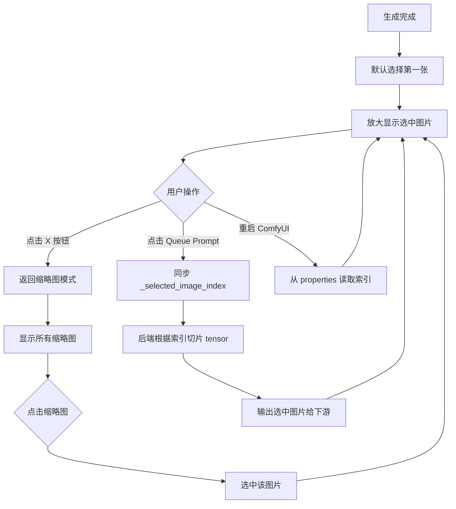

**用户交互流程（含技术实现细节）：**

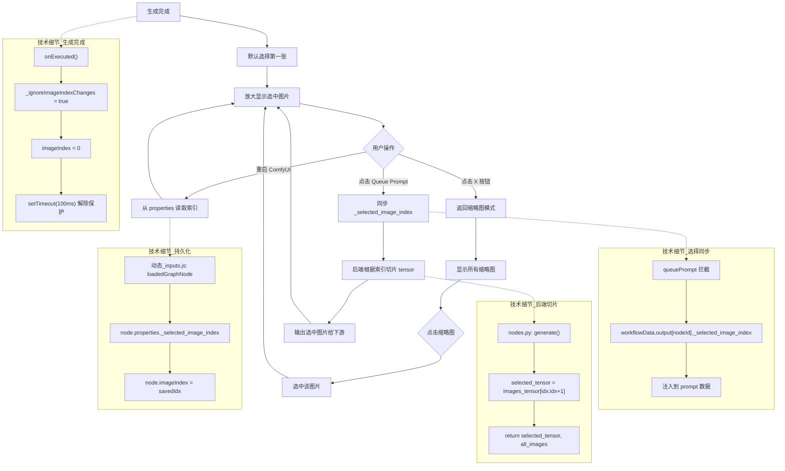

**行为与实现对照表：**

| 用户行为 | 技术实现 | 文件位置 |
|----------|----------|----------|
| 生成完成后放大 | `onExecuted()` 设置 `imageIndex = 0` + 100ms null 阻止 | `dynamic_inputs.js` |
| 点击 X 回缩略图 | ComfyUI 原生设置 `imageIndex = null` | ComfyUI 核心 |
| 点击缩略图放大 | setter 保存 `_selectedImageIndex` | `dynamic_params.js` |
| Queue Prompt 输出 | 注入 `_selected_image_index` → 后端 tensor 切片 | `dynamic_params.js` → `nodes.py` |
| 重启恢复选择 | 从 `properties._selected_image_index` 读取 | `dynamic_inputs.js` |

**设计决策：**

| 选项 | 选择 | 原因 |
|------|------|------|
| 阻塞模式 vs 非阻塞 | ✅ 非阻塞 | 无需等待用户选择，立即输出第一张 |
| onMouseDown + setTimeout | ✅ Object.defineProperty | 更可靠，无时序竞争 |
| 自定义 X 按钮 | ✅ 使用 ComfyUI 原生 | 更简洁，利用现有 UI |

**技术实现时序：**

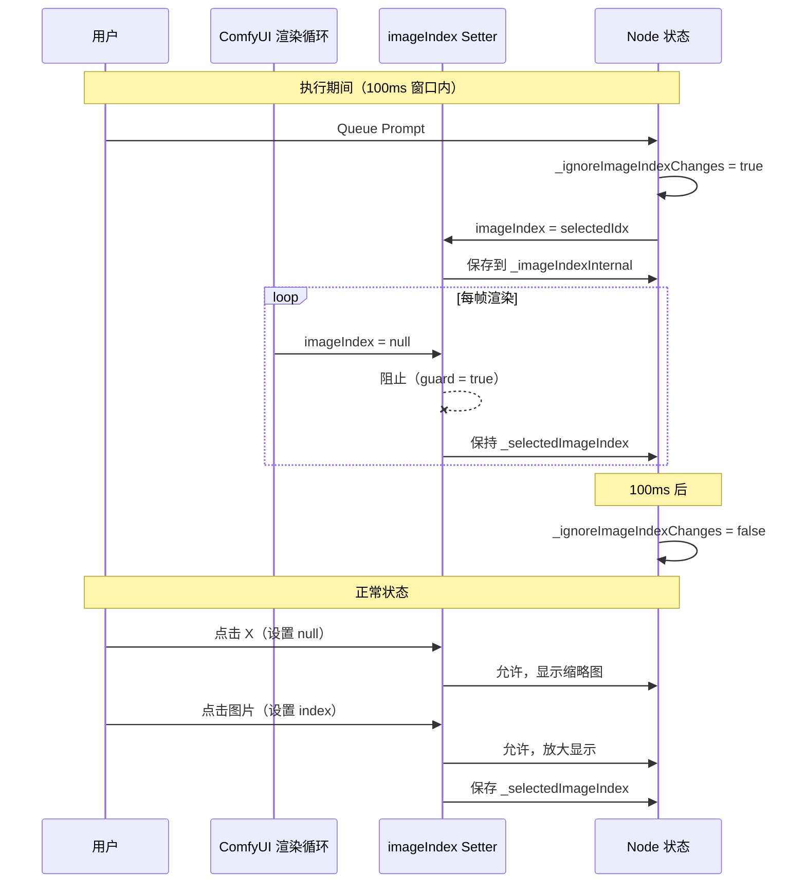

### 7.16 请求体无限制读取（v2.19）

**问题背景：**

`generate-independent` API 端点接收大型 base64 图片时，会触发 `HTTPRequestEntityTooLarge` 错误。aiohttp 默认的 `request.json()` 方法有约 1MB 的限制。

**解决方案：分块迭代读取**

```python
# __init__.py - generate_independent 函数
chunks = []
async for chunk in request.content.iter_any():
    chunks.append(chunk)

body = b''.join(chunks)
data = json.loads(body)
```

**关键设计决策：**

| 问题 | 原因 | 解决方案 |
|------|------|----------|
| `HTTPRequestEntityTooLarge` | aiohttp 默认限制 ~1MB | 使用 `iter_any()` 绕过限制 |
| `JSONDecodeError: Unterminated string` | `read(limit)` 可能在数据未完全到达时返回 | 使用 `iter_any()` 确保完整读取 |
| 内存占用 | 无限制可能导致内存问题 | 依赖上游（如 Nginx）限制 |

**修改的文件：**

| 文件 | 修改内容 |
|------|----------|
| `__init__.py` | `generate_independent` 函数使用分块读取 |

### 7.17 共享图片数据优化（v2.20）

**问题背景：**

Img2img 批量生成时，每个请求都要重新编解码 base64 图片数据，N 个批次就有 N 份图片副本在内存中，导致 `MemoryError`。

**解决方案：一次编解码，所有批次共享引用**

```python
# independent_generator.py - 预处理阶段
shared_upload_files = []
for img_b64 in images_base64:
    img_bytes = base64.b64decode(img_b64)  # 解码一次
    # 4 元组：(filename, bytes, mime, cached_base64)
    shared_upload_files.append((
        "image.png",
        (filename, img_bytes, "image/png", img_b64)  # 缓存 base64
    ))
params["_upload_files"] = shared_upload_files  # 所有批次共享

# generic.py - 使用缓存
if len(file_tuple) >= 4:
    _, _, mime_type, cached_b64 = file_tuple  # 直接用缓存
else:
    b64_data = base64.b64encode(file_bytes)   # 回退
```

**内存占用对比：**

```text
之前：Batch 1: decode→bytes→encode  (×N 份副本)
      Batch 2: decode→bytes→encode
      ...
      
现在：预处理: decode→bytes + cache_b64  (仅 1 份)
      Batch 1-N: 共享引用 → 发送
```

| 场景 | 之前内存 | 现在内存 |
|------|----------|----------|
| 10 批 × 4MB 图片 | ~40MB | ~4MB |
| 50 批 × 8MB 图片 | ~400MB | ~8MB |

**修改的文件：**

| 文件 | 修改内容 |
|------|----------|
| `independent_generator.py` | 预缓存 bytes + base64，全部批次并行 |
| `adapters/generic.py` | `_build_gemini_payload` 和 `_prepare_images_base64` 使用缓存 |

### 7.18 动态缓存加载优化（v2.21）

**问题背景：**

从缓存加载 4K 图片时，每张图片作为 float32 tensor 需要 ~195MB 内存。加载 6 张 4K 图就需要 ~1.2GB，导致 `MemoryError`。

**解决方案：根据输出端口连接状态动态决定加载策略**

```python
# 前端检测 all_images 输出端口是否连接
const allImagesConnected = node.outputs[1]?.links?.length > 0;
nodeData.inputs._all_images_connected = allImagesConnected ? "true" : "false";

# 后端根据连接状态加载
def _load_persisted_images(self, json, selected_index, load_all=False):
    if load_all:
        # 加载全部图片（all_images 已连接）
        for info in image_infos:
            tensors.append(load_single_image(info))
        return selected_tensor, torch.cat(tensors), infos
    else:
        # 只加载选中的（内存优化）
        tensor = load_single_image(image_infos[selected_index])
        return tensor, tensor, infos
```

**内存占用对比（6 张 4K 图片）：**

| 输出连接状态 | 加载策略 | 内存占用 |
|-------------|---------|----------|
| 只连 `selected_image` | 加载 1 张 | ~195 MB |
| 连了 `all_images` | 加载全部 | ~1.2 GB |

**修改的文件：**

| 文件 | 修改内容 |
|------|----------|
| `nodes.py` | 添加 `_all_images_connected` hidden input，`_load_persisted_images` 支持 `load_all` 参数 |
| `web/dynamic_params.js` | 检测 `node.outputs[1].links` 并注入连接状态 |

### 7.19 DOM Overlay UI（v2.22 实验性）

**功能：** 基于 DOM 的现代化节点界面，替代传统 Canvas 绘制方式，解决 LiteGraph z-order 冲突。

> ⚠️ **实验性分支**: `feature/dom-overlay-ui`

---

#### 7.19.1 核心问题：Canvas z-order 冲突

LiteGraph 的原生 widget 通过内部渲染循环绘制，始终覆盖 `onDrawForeground` 的自定义绘制。DOM overlay 通过将 UI 元素放在独立的 DOM 层解决此问题。

#### 7.19.2 Portal Container 模式

在 `document.body` 注入全局容器，避免父元素裁剪：

```javascript
function getOverlayContainer() {
    let container = document.getElementById("batchbox-overlay-container");
    if (!container) {
        container = document.createElement("div");
        container.id = "batchbox-overlay-container";
        container.style.cssText = `
            position: absolute;
            top: 0; left: 0;
            width: 100%; height: 100%;
            pointer-events: none;  /* 点击穿透到 Canvas */
            z-index: 100;
        `;
        document.body.appendChild(container);
    }
    return container;
}
```

#### 7.19.3 主题配置（THEME）

集中管理颜色、尺寸、字体：

```javascript
const THEME = {
    // 颜色
    bgPrimary: "#1e1e2e",     // 主背景
    bgSecondary: "#181825",   // 次级背景
    accent: "#4CAF50",        // 强调色（生成按钮）
    text: "#cdd6f4",          // 文字
    textMuted: "#6c7086",     // 次级文字
    border: "rgba(255,255,255,0.1)",
    
    // 尺寸
    toolbarHeight: 44,
    buttonHeight: 32,
    buttonRadius: 6,
    promptHeight: 100,
    
    // 字体
    fontFamily: "-apple-system, BlinkMacSystemFont, 'Segoe UI', sans-serif",
    fontSize: 13,
};
```

#### 7.19.4 组件架构

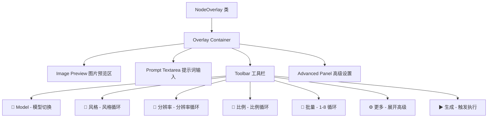

#### 7.19.5 比例缩放同步

使用 CSS `transform: scale()` 确保 DOM 与 Canvas 缩放一致：

```javascript
updatePosition() {
    const canvas = app.canvas;
    const scale = canvas.ds?.scale || 1;
    const offset = canvas.ds?.offset || [0, 0];
    
    // 1. 计算节点的屏幕坐标
    const nodeX = (this.node.pos[0] + offset[0]) * scale;
    const nodeY = (this.node.pos[1] + offset[1]) * scale;
    const nodeW = this.node.size[0] * scale;
    
    // 2. 定位容器
    this.container.style.left = `${nodeX}px`;
    this.container.style.top = `${nodeY + 30 * scale}px`;  // 跳过标题栏
    this.container.style.width = `${nodeW - 20}px`;
    
    // 3. CSS 缩放保持比例
    this.container.style.transform = `scale(${scale})`;
    this.container.style.transformOrigin = "top left";
}
```

#### 7.19.6 高性能同步桥接

三重触发机制确保平滑跟随：

```javascript
attachToCanvas() {
    const update = () => this.updatePosition();
    
    // 1. Canvas Mouse 事件
    const canvasEl = document.querySelector("canvas.graphcanvas");
    canvasEl?.addEventListener("wheel", update, { passive: true });
    canvasEl?.addEventListener("mousemove", update, { passive: true });
    
    // 2. requestAnimationFrame 循环
    let lastScale = 0, lastOffsetX = 0, lastOffsetY = 0;
    const loop = () => {
        if (!this.container) return;
        const ds = app.canvas?.ds;
        if (ds && (ds.scale !== lastScale || 
                   ds.offset[0] !== lastOffsetX || 
                   ds.offset[1] !== lastOffsetY)) {
            lastScale = ds.scale;
            lastOffsetX = ds.offset[0];
            lastOffsetY = ds.offset[1];
            update();
        }
        requestAnimationFrame(loop);
    };
    requestAnimationFrame(loop);
}
```

#### 7.19.7 Widget 发现与同步

动态参数通过 `api_name` 模式匹配定位：

```javascript
findDynamicWidget(apiNamePattern) {
    return this.node._dynamicParamManager?.dynamicWidgets?.find(
        w => w._paramDef?.api_name?.toLowerCase().includes(apiNamePattern)
    );
}

// 循环切换值
onStyleClick() {
    const widget = this.findDynamicWidget("style");
    if (widget?.options?.values) {
        const values = widget.options.values;
        const currentIdx = values.indexOf(widget.value);
        const nextIdx = (currentIdx + 1) % values.length;
        widget.value = values[nextIdx];
        this.updateButtonLabels();
    }
}
```

#### 7.19.8 图片监听器

轮询节点的图片属性并更新预览：

```javascript
startImageWatcher() {
    this._imageWatcher = setInterval(() => {
        this.updateImagePreview();
    }, 500);
}

updateImagePreview() {
    // 发现栈：检查多个可能的图片属性
    const images = this.node._cachedImages || 
                   this.node._previewImages ||
                   this.node.imgs ||
                   this.node.images;
    
    if (images?.length > 0) {
        const selectedIdx = this.node._selectedImageIndex || 0;
        const image = images[selectedIdx];
        
        // 解析 URL（支持字符串、HTMLImageElement、metadata 对象）
        let url = typeof image === "string" ? image :
                  image.src || image.url ||
                  `/view?filename=${image.filename}&type=temp`;
        
        if (url && this.previewImg.src !== url) {
            this.previewImg.src = url;
            this.placeholder.style.display = "none";
            this.previewImg.style.display = "block";
        }
    }
}
```

#### 7.19.9 初始化流程

```javascript
// dynamic_params.js 中初始化
import { NodeOverlay } from "./image_panel.js";

app.registerExtension({
    name: "Comfy.Custom.DynamicParams",
    async nodeCreated(node) {
        if (isBatchboxNode(node)) {
            // 隐藏原生 widgets
            node.widgets?.forEach(w => w.element?.style.display = "none");
            
            // 创建 DOM overlay
            node._overlay = new NodeOverlay(node);
        }
    }
});
```

---

**修改的文件：**

| 文件 | 职责 |
|------|------|
| `web/image_panel.js` | NodeOverlay 类（~800行）：主题、容器、组件、同步、交互 |
| `web/image_panel.css` | 样式文件 |
| `web/dynamic_params.js` | 导入并在 nodeCreated 中初始化 overlay |

**待完成功能：**

| 功能 | 状态 |
|------|------|
| 图片预览显示 | 🟡 watcher 已实现，待调试 |
| 缩略图画廊 | ⚪ 未开始 |
| 生成按钮 loading 动画 | ⚪ 未开始 |
| Canvas 缩放抖动优化 | 🟡 基本实现 |

## 8. 维护指南


### 8.1 添加新 API

1. 获取第三方 API 文档
2. 将 `YAML_CONFIG_REFERENCE.md` + API 文档发给 LLM
3. 请求 LLM 生成 YAML 配置
4. 在 API Manager 中测试

### 8.2 常见问题

| 问题 | 解决方案 |
|------|----------|
| 参数不显示 | 检查 `parameter_schema` 格式 |
| 图片不发送 | 检查 `file_format` 配置 |
| 端点不切换 | 检查 `priority` 设置 |

---

## 9. 更新日志

### v2.22 (2026-01-30) - 实验性分支

- 🧪 DOM Overlay UI：基于 DOM 的现代化节点界面（`feature/dom-overlay-ui` 分支）
- ⚪ 新增 `image_panel.js` + `image_panel.css`：NodeOverlay 类实现
- ⚪ 7 个工具栏按钮：Model/Style/Resolution/Ratio/Batch/More/Generate
- ⚪ 图片预览区 + 提示词输入框 + 高级设置面板
- ⚠️ 待完成：图片预览显示、Canvas 缩放同步优化

### v2.21 (2026-01-29)

- ✅ 动态缓存加载：根据 `all_images` 输出端口连接状态决定加载策略
- ✅ 未连接时只加载选中的 1 张图片（~195MB），连接时加载全部
- ✅ 前端检测 `node.outputs[1].links` 传递给后端
- ⚙️ 技术：`_all_images_connected` hidden input + `load_all` 参数

### v2.20 (2026-01-29)

- ✅ 共享图片数据优化：Img2img 批量生成时所有请求共享同一份 base64 数据
- ✅ 一次编解码：预处理阶段缓存 bytes + base64，避免重复编解码
- ✅ 内存占用从 N×ImageSize 降到 ~1×ImageSize
- 🔧 fix: multipart 请求兼容 - 4 元组截取前 3 元素给 `requests` 库
- ⚙️ 技术：4 元组 `(filename, bytes, mime, cached_b64)` + 全部批次并行

### v2.19 (2026-01-29)

- ✅ 修复 `HTTPRequestEntityTooLarge` 错误：大请求体（如 base64 图片）不再失败
- ✅ 使用分块迭代读取 `request.content.iter_any()` 确保完整接收
- ✅ 移除请求体大小限制，支持任意大小的 base64 图片
- 🔧 fix: JSON 解析错误（Unterminated string）- 确保完整读取后再解析

### v2.18 (2026-01-29)

- ✅ 批量图片尺寸归一化：API 返回不同尺寸图片时自动以最大尺寸为目标缩放
- ✅ 保存文件保留原始尺寸，归一化仅影响 tensor 输出
- ✅ 使用 LANCZOS 高质量缩放算法
- 📝 已记录到 Knowledge Base roadmap：自定义批量图片类型规划

### v2.17 (2026-01-28)

- ✅ 选中图片放大显示：生成多张图后默认第一张放大呈现并输出给下游
- ✅ 缩略图切换：点击 X 回到缩略图模式，点击任意缩略图重新放大
- ✅ 执行后保持放大：Queue Prompt 后选中图片依旧放大，不闪回缩略图
- ✅ 重启恢复：被选图片信息持久化，重启后依旧放大显示
- ⚙️ 技术：Property Interception + 100ms Execution Window Guard
- 🔧 fix: 并发生成时预览崩溃 - `updateNodePreview` 中使用临时数组避免暴露 null 元素

### v2.16 (2026-01-28)
- ✅ 智能缓存：节点作为图片来源，已生成图片后 Queue Prompt 不再调用 API
- ✅ 统一后端哈希：独立生成和 Queue Prompt 缓存状态协同
- ✅ 新增"参数变化检测"开关（API Manager → 节点显示设置）
- ✅ 修复跨平台 JSON 序列化差异

### v2.15 (2026-01-27)
- ✅ 即时保存：每张图片收到后立即写入磁盘，防止断电丢失
- ✅ Gemini API 格式修复：`imageSize`/`aspectRatio` 放入 `imageConfig` 嵌套对象
- ✅ 线程安全优化：预初始化 SaveSettings 实例

### v2.14 (2026-01-27)
- ✅ 动态输入槽紧凑：断开中间槽位后，连接自动向前移动
- ✅ 并行批处理：批量生成从串行改为并行，效率提升 4x+
- ✅ 模型迁移：新增 DALL-E-3、GPT-4o-Image、Sora-Image、Flux 系列、Midjourney、Luma Video

### v2.13 (2026-01-27)
- ✅ 画布右键菜单快捷添加功能
- ✅ 可在 API Manager → 节点显示设置 中开关
- ✅ 使用 `getCanvasMenuItems()` 官方 hook
- ✅ 热重载支持（无需刷新页面）

### v2.12 (2026-01-27)
- ✅ 动态参数持久化修复：风格、分辨率、比例等参数正确恢复
- ✅ Endpoint 选择器状态持久化
- ✅ 高级设置折叠/展开状态持久化
- ✅ 采用 "Pending State" 模式消除 UI 闪烁
- ✅ 修复 api_name vs widget.name key 不匹配问题

### v2.11 (2026-01-27)
- ✅ 配置热重载：保存 API Manager 设置后画布节点立即刷新
- ✅ 模型下拉列表实时更新（无需刷新浏览器）
- ✅ `batchbox:config-changed` 事件通知机制
- ✅ 从 `/api/batchbox/models` 获取最新模型列表更新 widget options
- ✅ `onModelChange()` 支持 `forceRefresh` 参数

### v2.10 (2026-01-27)
- ✅ "开始生成"按钮扩展至所有 BatchBox 节点类型
- ✅ DynamicVideo、DynamicText、DynamicAudio 节点现支持独立生成
- ✅ 使用统一的节点匹配模式列表替代硬编码条件

### v2.9 (2026-01-27)
- ✅ 独立生成日志优化（移除冗余 base64 输出）
- ✅ 修复事件循环阻塞问题（使用 asyncio.to_thread）
- ✅ 图片实时显示优化（onload 回调触发重绘）
- ✅ 重启后图片恢复（处理多种 _last_images 格式）
- ⚠️ 布局跳动问题部分缓解（_isRestoring 抑制机制）

### v2.8 (2026-01-26)
- ✅ Queue Prompt 拦截开关
- ✅ BatchBox 节点可选择仅通过"开始生成"按钮触发
- ✅ 全局 Queue Prompt 自动排除 BatchBox 节点（可配置）
- ✅ API Manager → 节点显示设置 → 拦截开关 UI
- ✅ 设置同步机制修复（防止主保存按钮覆盖）
- ✅ 设置实时生效（无需刷新页面）

### v2.7 (2026-01-26)
- ✅ "开始生成"按钮部分执行支持
- ✅ `recursiveAddNodes()` 递归收集上游依赖节点
- ✅ `executeToNode()` 临时覆盖 `api.queuePrompt` 过滤 `prompt.output`
- ✅ 只执行目标节点及其上游依赖，跳过不相关分支

### v2.6 (2026-01-26)
- ✅ Gemini 原生 API 格式支持 (`/v1beta/models/{model}:generateContent`)
- ✅ `responseModalities: ['Image']` 强制只返回图片
- ✅ Gemini 响应解析（inlineData base64 图片提取）
- ✅ Prompt 前缀功能（自动添加 "生成一张图片：" 等前缀）
- ✅ API Manager 端点设置添加 API 格式选择器
- ✅ API Manager 端点设置添加 Prompt 前缀输入框

### v2.5.1 (2026-01-25)
- ✅ 节点默认宽度可配置（300-1200px）
- ✅ API Manager → 保存设置 Tab 添加宽度滑块
- ✅ `getNodeSettings()` 从后端获取配置
- ✅ `/api/batchbox/node-settings` API 端点
- ✅ `config_manager.py` 新增 `get/update_node_settings`

### v2.5 (2026-01-25)
- ✅ 节点宽度保持机制（防止 252px 重置）
- ✅ `resizeNodePreservingWidth()` 辅助函数
- ✅ 新建/加载节点生命周期区分
- ✅ 切换模型后宽度不丢失
- ✅ 工作流保存/加载宽度正确恢复

### v2.4 (2026-01-25)
- ✅ 节点预览持久化（重启后不丢失）

### v2.3 (2026-01-25)
- ✅ 模型排序功能（model_order 配置）
- ✅ 拖拽排序 UI（HTML5 Drag & Drop）
- ✅ 节点下拉框按配置顺序显示
- ✅ ConfigManager 新增 get/set_model_order 方法

### v2.2 (2026-01-25)
- ✅ 自动保存功能（save_settings.py）
- ✅ 可配置保存目录、格式、命名模式
- ✅ “保持原格式”选项 + 默认格式设置
- ✅ API Manager 中新增“保存设置” Tab
- ✅ 文件名实时预览
- ✅ 按日期创建子文件夹

### v2.1 (2026-01-25)
- ✅ 请求日志系统（可配置级别）
- ✅ 请求重试机制（指数退避）
- ✅ 结构化异常类
- ✅ 配置验证
- ✅ 后端/前端 TTL 缓存
- ✅ 配置热更新
- ✅ RGBA 透明度保持
- ✅ WebP 格式支持
- ✅ 单元测试覆盖

### v2.0 (2026-01-24)
- ✅ 手动端点选择
- ✅ 轮询模式
- ✅ 层级文件格式配置
- ✅ 动态输入槽修复
- ✅ LLM 配置参考文档

### v1.0 (初版)
- 动态参数系统
- 多供应商支持
- 基础 API 适配器
