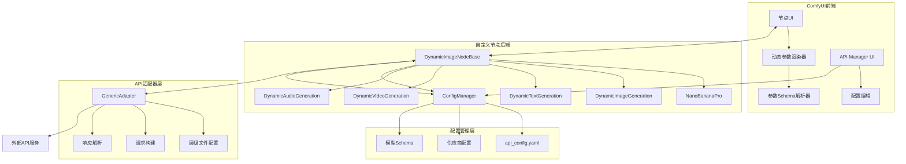
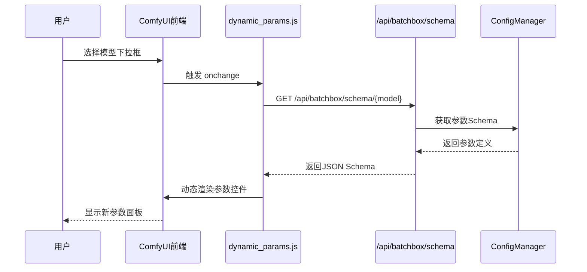
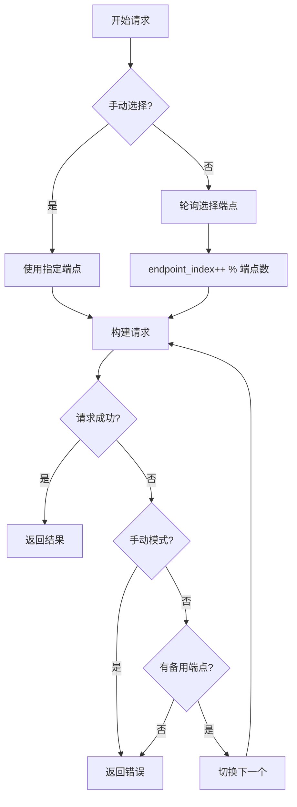
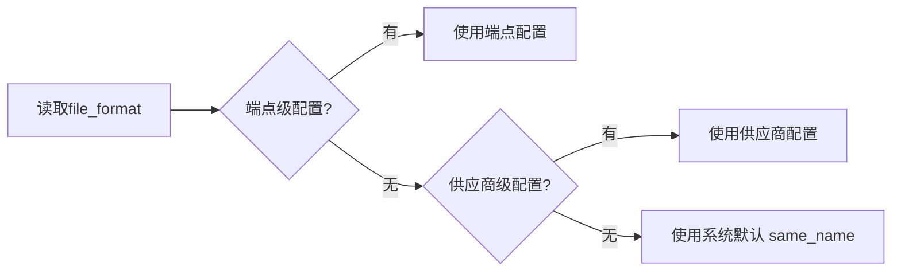
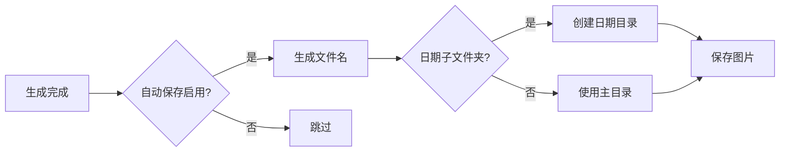

# ComfyUI-Custom-Batchbox 产品架构与需求文档

## 文档版本

| 版本 | 日期 | 描述 |
|------|------|------|
| 2.4 | 2026-01-25 | 节点生成图片预览持久化 |
| 2.3 | 2026-01-25 | 模型排序、拖拽 UI |
| 2.2 | 2026-01-25 | 自动保存功能 |
| 2.1 | 2026-01-25 | 重试机制、TTL 缓存、日志系统 |
| 2.0 | 2026-01-24 | 手动端点选择、轮询模式、层级文件配置 |
| 1.0 | 2026-01-24 | 初稿 |

### 相关文档

| 文档 | 说明 |
|------|------|
| [docs/hierarchical_config.md](docs/hierarchical_config.md) | 层级配置指南（Provider > Endpoint > Mode） |
| [docs/comfyui_widget_serialization.md](docs/comfyui_widget_serialization.md) | ComfyUI Widget 序列化避坑指南 |
| [docs/preview_persistence.md](docs/preview_persistence.md) | 预览持久化机制 |
| [YAML_CONFIG_REFERENCE.md](YAML_CONFIG_REFERENCE.md) | YAML 配置参考（供 LLM 使用） |

---

## 1. 项目概述

ComfyUI-Custom-Batchbox 是一套 ComfyUI 自定义节点系统，实现：

1. **动态参数面板** - 选择模型后自动更新参数控件
2. **多类别节点** - 图片/文本/视频/音频/编辑器
3. **多 API 中转站** - 同模型支持多个 API 站点
4. **智能端点管理** - 轮询、手动选择、故障转移
5. **灵活配置** - YAML 配置 + 可视化管理器

---

## 2. 系统架构

### 2.1 整体架构图



### 2.2 动态参数流程



### 2.3 端点选择与轮询



### 2.4 层级配置优先级



---

## 2.5 节点类型

| 节点 ID | 显示名称 | 用途 |
|---------|----------|------|
| `NanoBananaPro` | 🍌 Nano Banana Pro (Universal) | 通用图像节点 |
| `DynamicImageGeneration` | 🎨 Dynamic Image Generation | 动态图像生成 |
| `DynamicTextGeneration` | 📝 Dynamic Text Generation | 动态文本生成 |
| `DynamicVideoGeneration` | 🎬 Dynamic Video Generation | 动态视频生成 |
| `DynamicAudioGeneration` | 🎵 Dynamic Audio Generation (Beta) | 动态音频生成 |
| `DynamicImageEditor` | 🔧 Dynamic Image Editor | 图像编辑器 |

---

## 3. 核心功能

### 3.1 动态参数系统

**流程：**
```
用户选择模型 → JS 请求 /api/batchbox/schema/{model} 
            → 后端返回参数 Schema 
            → 前端动态渲染控件
```

**参数类型支持：**
- `string` - 文本输入
- `select` - 下拉选择
- `number` - 数字滑块
- `boolean` - 开关

### 3.2 端点管理

**模式：**
| 模式 | 描述 |
|------|------|
| 自动轮询 | 按顺序轮流使用各端点 |
| 手动选择 | 用户指定特定端点 |
| 故障转移 | 失败时自动切换下一个 |

**配置优先级：**
```
端点级 > 供应商级 > 系统默认
```

### 3.3 文件格式配置

**支持格式：**
| 格式 | 示例 | 适用 API |
|------|------|----------|
| `same_name` | `image, image` | OpenAI (默认) |
| `indexed` | `image[0], image[1]` | PHP |
| `array` | `images[]` | Rails |
| `numbered` | `image1, image2` | 传统 |

### 3.4 动态输入槽

**功能：** 连接图片后自动添加下一个输入槽

**配置：**
```yaml
dynamic_inputs:
  image:
    max: 14
    type: IMAGE
```

---

## 4. 配置系统

### 4.1 YAML 结构

```yaml
# 供应商
providers:
  openai_compatible:
    base_url: https://api.example.com
    api_key: sk-xxx
    file_format: same_name  # 供应商级默认

# 模型
models:
  ModelName:
    display_name: 🎨 显示名
    category: image
    dynamic_inputs: {...}
    parameter_schema:
      basic: {...}
      advanced: {...}
    api_endpoints:
      - provider: openai_compatible
        priority: 1
        modes:
          text2img:
            endpoint: /v1/images/generations
            response_path: data[0].url
          img2img:
            endpoint: /v1/images/edits
            file_format: indexed  # 端点级覆盖
```

### 4.2 可视化管理器

**功能：**
- 供应商 CRUD（包含高级文件格式设置）
- 模型配置（参数、端点）
- 端点高级设置（折叠式）

---

## 5. 文件结构

```
ComfyUI-Custom-Batchbox/
├── __init__.py              节点注册 + API 路由
├── nodes.py                 节点类定义
├── config_manager.py        配置管理（含缓存、验证）
├── batchbox_logger.py       日志与重试模块
├── errors.py                结构化异常类
├── image_utils.py           图片处理工具
├── api_config.yaml          主配置文件
├── README.md                项目说明
├── ARCHITECTURE.md          架构文档（本文）
├── YAML_CONFIG_REFERENCE.md LLM 配置参考
├── adapters/
│   ├── __init__.py          适配器导出
│   ├── base.py              适配器接口
│   ├── generic.py           通用适配器（层级配置 + 重试）
│   └── template_engine.py   请求模板引擎
├── web/                       前端模块
│   ├── api_manager.js         API管理界面
│   ├── api_manager.css        管理界面样式
│   ├── dynamic_params.js      动态参数渲染
│   ├── dynamic_params.css
│   └── dynamic_inputs.js      动态输入槽
├── save_settings.py           自动保存模块
└── tests/                     单元测试
    ├── test_errors.py       异常类测试
    └── test_adapters.py     适配器测试
```

---

## 6. API 接口

| 端点 | 方法 | 描述 |
|------|------|------|
| `/api/batchbox/config` | GET | 获取完整配置 |
| `/api/batchbox/config` | POST | 保存完整配置 |
| `/api/batchbox/models` | GET | 获取所有模型列表 |
| `/api/batchbox/schema/{model}` | GET | 获取模型参数 Schema |
| `/api/batchbox/providers` | GET | 获取供应商列表 |
| `/api/batchbox/providers/{name}` | PUT | 更新供应商配置 |
| `/api/batchbox/categories` | GET | 获取节点分类 |
| `/api/batchbox/save-settings` | GET | 获取自动保存配置 |
| `/api/batchbox/save-settings` | POST | 更新自动保存配置 |
| `/api/batchbox/save-settings/preview` | POST | 预览文件名 |
| `/api/batchbox/model-order/{category}` | GET | 获取模型排序 |
| `/api/batchbox/model-order/{category}` | POST | 更新模型排序 |

---

## 7. 技术要点

### 7.1 节点类型识别
```javascript
// ComfyUI 中需要用 comfyClass 而不是 type
const nodeType = node.comfyClass || node.type;
```

### 7.2 参数传递
```javascript
// 拦截 queuePrompt 在执行前收集参数
api.queuePrompt = async function(...) {
  // 更新 extra_params widget
  return origQueuePrompt.call(this, ...);
};
```

### 7.3 层级配置读取
```python
file_format = (
    mode_config.get("file_format") or
    endpoint.get("file_format") or
    provider.get("file_format") or
    "same_name"
)
```

### 7.4 自动保存功能

生成的图片会自动保存到指定目录，通过 `save_settings.py` 模块实现。

**配置项：**

| 设置项 | 类型 | 默认值 | 说明 |
|--------|------|--------|------|
| `enabled` | bool | true | 启用/禁用自动保存 |
| `output_dir` | string | "batchbox" | 保存目录（相对于 output/） |
| `format` | string | "original" | 文件格式：original/png/jpg/webp |
| `fallback_format` | string | "png" | 保持原格式时的默认格式 |
| `quality` | int | 95 | JPG/WebP 质量 (1-100) |
| `naming_pattern` | string | "{model}_{timestamp}_{seed}" | 命名模板 |
| `create_date_subfolder` | bool | true | 按日期创建子文件夹 |

**命名模板变量：**

| 变量 | 说明 | 示例 |
|------|------|------|
| `{model}` | 模型名称 | nano_banana_pro |
| `{timestamp}` | 完整时间戳 | 20260125_093421 |
| `{date}` | 日期 | 2026-01-25 |
| `{time}` | 时间 | 09-34-21 |
| `{seed}` | 随机种子 | 1234567890 |
| `{batch}` | 批次序号 | 1 |
| `{uuid}` | 8位唯一ID | a1b2c3d4 |
| `{prompt}` | 提示词（需启用） | beautiful_sunset |

**保存流程：**



### 7.5 模型排序功能

通过 `model_order` 配置控制模型在 API Manager 和节点下拉框中的显示顺序。

**配置格式：**

```yaml
model_order:
  image:
    - Nano Banana Pro   # 第1个
    - tapnow_flash      # 第2个
    - grok2_image       # 第3个
  text: []
  video: []
```

**容错机制：**

| 情况 | 处理方式 |
|------|----------|
| 忘记配置 `model_order` | 使用默认顺序（字母排序） |
| 列表有重复模型名 | 仅保留首次出现的位置 |
| 模型已删除但残留在列表 | 自动过滤不存在的模型 |
| 新增模型未在列表中 | 自动追加到末尾 |

**前端拖拽实现：**

- 使用 HTML5 Drag & Drop API
- 拖拽手柄：`⋮⋮` 符号
- 视觉反馈：拖拽时行半透明，目标位置金色边框
- 释放后自动保存到后端

**排序逻辑（Python）：**

```python
def _sort_models_by_order(self, model_names, category):
    order = self.get_model_order(category)
    order_map = {name: i for i, name in enumerate(order)}
    max_index = len(order)
    # 已配置的按顺序排，未配置的按字母追加到末尾
    return sorted(model_names, key=lambda x: (order_map.get(x, max_index), x))
```

---

## 8. 维护指南

### 8.1 添加新 API

1. 获取第三方 API 文档
2. 将 `YAML_CONFIG_REFERENCE.md` + API 文档发给 LLM
3. 请求 LLM 生成 YAML 配置
4. 在 API Manager 中测试

### 8.2 常见问题

| 问题 | 解决方案 |
|------|----------|
| 参数不显示 | 检查 `parameter_schema` 格式 |
| 图片不发送 | 检查 `file_format` 配置 |
| 端点不切换 | 检查 `priority` 设置 |

---

## 9. 更新日志

### v2.3 (2026-01-25)
- ✅ 模型排序功能（model_order 配置）
- ✅ 拖拽排序 UI（HTML5 Drag & Drop）
- ✅ 节点下拉框按配置顺序显示
- ✅ ConfigManager 新增 get/set_model_order 方法

### v2.2 (2026-01-25)
- ✅ 自动保存功能（save_settings.py）
- ✅ 可配置保存目录、格式、命名模式
- ✅ “保持原格式”选项 + 默认格式设置
- ✅ API Manager 中新增“保存设置” Tab
- ✅ 文件名实时预览
- ✅ 按日期创建子文件夹

### v2.1 (2026-01-25)
- ✅ 请求日志系统（可配置级别）
- ✅ 请求重试机制（指数退避）
- ✅ 结构化异常类
- ✅ 配置验证
- ✅ 后端/前端 TTL 缓存
- ✅ 配置热更新
- ✅ RGBA 透明度保持
- ✅ WebP 格式支持
- ✅ 单元测试覆盖

### v2.0 (2026-01-24)
- ✅ 手动端点选择
- ✅ 轮询模式
- ✅ 层级文件格式配置
- ✅ 动态输入槽修复
- ✅ LLM 配置参考文档

### v1.0 (初版)
- 动态参数系统
- 多供应商支持
- 基础 API 适配器
