# ComfyUI-Custom-Batchbox 架构文档

## 文档版本

| 版本 | 日期 | 描述 |
|------|------|------|
| 3.1 | 2026-03-09 | 对齐当前实现：修正执行链路、并发策略、接口方法、Account 登录流程 |
| 3.0 | 2026-03-09 | 架构文档重构：整合去重，changelog 独立 |
| 2.24 | 2026-03-01 | 逐张预览 + 生成进度计数器 + WebSocket 批次推送 |
| 2.23 | 2026-03-01 | Account 系统移植 + Google 官方 API 直连 + 多端点统一架构 |
| 2.22 | 2026-02-09 | GaussianBlurUpscale 节点 |
| 2.0 | 2026-01-24 | 初版架构文档 |

> 完整版本历史见 [CHANGELOG.md](CHANGELOG.md)，重构前的原始文档备份在 [docs/ARCHITECTURE_FULL.md](docs/ARCHITECTURE_FULL.md)。

### 相关文档

| 文档 | 说明 |
|------|------|
| [CLAUDE.md](CLAUDE.md) | Claude Code 快速上下文（开发规范速查） |
| [CHANGELOG.md](CHANGELOG.md) | 完整版本更新日志 |
| [YAML_CONFIG_REFERENCE.md](YAML_CONFIG_REFERENCE.md) | YAML 配置参考（供 LLM 使用） |
| [UPSTREAM.md](UPSTREAM.md) | 上游项目 (BlenderAIStudio) 版本追踪 |
| [docs/hierarchical_config.md](docs/hierarchical_config.md) | 层级配置指南 |
| [docs/comfyui_widget_serialization.md](docs/comfyui_widget_serialization.md) | Widget 序列化避坑指南 |
| [docs/preview_persistence.md](docs/preview_persistence.md) | 预览持久化机制 |
| [docs/node_width_retrospective.md](docs/node_width_retrospective.md) | 节点宽度保持开发复盘 |

---

## 1. 项目概述

ComfyUI-Custom-Batchbox 是一套 ComfyUI 自定义节点系统，实现：

1. **动态参数面板** - 选择模型后自动更新参数控件
2. **多类别节点** - 图片/文本/视频/音频/编辑器
3. **多 API 中转站** - 同模型支持多个 API 站点
4. **智能端点管理** - 优先级 / 轮询 / 随机、手动选择、故障转移
5. **灵活配置** - YAML 配置 + 可视化管理器
6. **Account 计费系统** - AIGODLIKE 账户登录、冰糕积分、代理通道
7. **多通道认证** - Account 稳定通道 / Google 官方 API / Vertex AI / 第三方代理

---

## 2. 系统架构

### 2.1 整体架构图

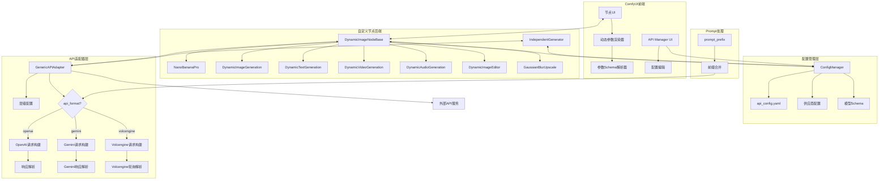
```mermaid
graph TB
    subgraph ComfyUI前端
        A[节点UI] --> B[动态参数渲染器]
        B --> C[参数Schema解析器]
        D[API Manager UI] --> E[配置编辑]
    end

    subgraph 自定义节点后端
        F[DynamicImageNodeBase] --> F1[NanoBananaPro]
        F --> G[DynamicImageGeneration]
        F --> H[DynamicTextGeneration]
        F --> I[DynamicVideoGeneration]
        F --> J[DynamicAudioGeneration]
        F --> K1[DynamicImageEditor]
        F --> K2[GaussianBlurUpscale]
        IG[IndependentGenerator]
    end

    subgraph 配置管理层
        CM[ConfigManager] --> L[api_config.yaml]
        CM --> M[供应商配置]
        CM --> N[模型Schema]
    end

    subgraph API适配器层
        O[GenericAPIAdapter] --> P[层级配置]
        O --> Q{api_format?}
        Q -->|openai| Q1[OpenAI请求构建]
        Q -->|gemini| Q2[Gemini请求构建]
        Q -->|volcengine| Q3[Volcengine请求构建]
        Q1 --> R[响应解析]
        Q2 --> R2[Gemini响应解析]
        Q3 --> R3[Volcengine轮询解析]
    end

    subgraph Prompt处理
        PP[prompt_prefix] --> PPM[前缀合并]
        PPM --> Q
    end

    A <--> F
    F <--> CM
    IG <--> CM
    F <--> O
    IG <--> O
    O --> S[外部API服务]
    D --> CM
```

### 2.2 动态参数流程

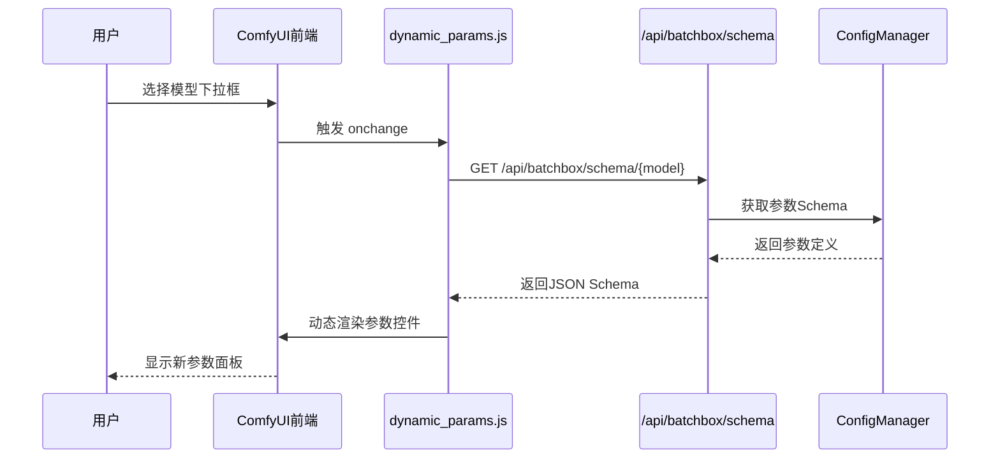
```mermaid
sequenceDiagram
    participant User as 用户
    participant UI as ComfyUI前端
    participant JS as dynamic_params.js
    participant API as /api/batchbox/schema
    participant Config as ConfigManager

    User->>UI: 选择模型下拉框
    UI->>JS: 触发 onchange
    JS->>API: GET /api/batchbox/schema/{model}
    API->>Config: 获取参数Schema
    Config-->>API: 返回参数定义
    API-->>JS: 返回JSON Schema
    JS->>UI: 动态渲染参数控件
    UI-->>User: 显示新参数面板
```

### 2.3 端点选择与自动策略

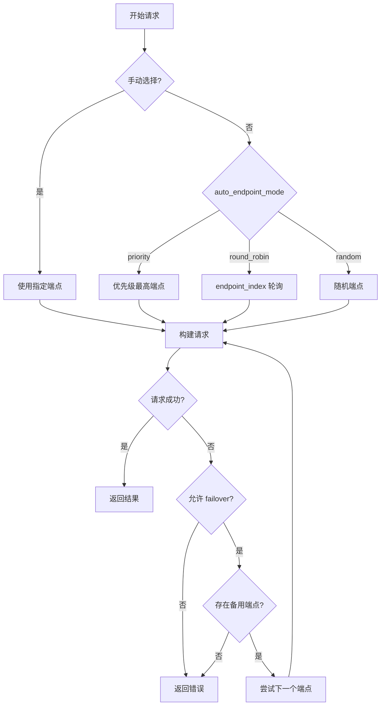
```mermaid
flowchart TD
    A[开始请求] --> B{手动选择?}
    B -->|是| C[使用指定端点]
    B -->|否| D{auto_endpoint_mode}
    D -->|priority| E[优先级最高端点]
    D -->|round_robin| F[endpoint_index 轮询]
    D -->|random| G[随机端点]
    C --> H[构建请求]
    E --> H
    F --> H
    G --> H
    H --> I{请求成功?}
    I -->|是| J[返回结果]
    I -->|否| K{允许 failover?}
    K -->|否| L[返回错误]
    K -->|是| M{存在备用端点?}
    M -->|是| N[尝试下一个端点]
    N --> H
    M -->|否| L
```

### 2.4 层级配置优先级

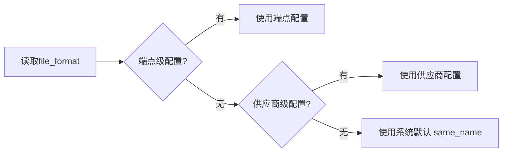
```mermaid
flowchart LR
    A[读取file_format] --> B{端点级配置?}
    B -->|有| C[使用端点配置]
    B -->|无| D{供应商级配置?}
    D -->|有| E[使用供应商配置]
    D -->|无| F[使用系统默认 same_name]
```

### 2.5 节点类型

| 节点 ID | 显示名称 | 用途 |
|---------|----------|------|
| `NanoBananaPro` | 🍌 Nano Banana Pro (Universal) | 通用图像节点 |
| `DynamicImageGeneration` | 🎨 Dynamic Image Generation | 动态图像生成 |
| `DynamicTextGeneration` | 📝 Dynamic Text Generation | 动态文本生成 |
| `DynamicVideoGeneration` | 🎬 Dynamic Video Generation | 动态视频生成 |
| `DynamicAudioGeneration` | 🎵 Dynamic Audio Generation (Beta) | 动态音频生成 |
| `DynamicImageEditor` | 🔧 Dynamic Image Editor | 图像编辑器 |
| `GaussianBlurUpscale` | 🔍 Gaussian Blur Upscale | 高斯模糊 + AI 放大 |

---

## 3. 核心功能

### 3.1 动态参数系统

```
用户选择模型 → JS 请求 /api/batchbox/schema/{model}
            → 后端返回参数 Schema
            → 前端动态渲染控件
```

**参数类型：** `string`（文本）、`select`（下拉）、`number`（数字输入）、`slider`（滑块）、`boolean`（开关）

### 3.2 端点管理

| 模式 | 描述 |
|------|------|
| 自动优先级 | 始终使用优先级最高的端点 |
| 自动轮询 | 按顺序轮流使用各端点 |
| 自动随机 | 随机选择一个端点 |
| 手动选择 | 用户指定特定端点 |
| 故障转移 | 失败时自动切换下一个 |

**说明：**

- 运行时支持 `priority` / `round_robin` / `random` 三种自动模式。
- API Manager 当前主要暴露 `priority` 和 `round_robin` 两种模式。
- `endpoint_override` 生效时会关闭自动 failover。

### 3.3 文件格式配置

| 格式 | 示例 | 适用 API |
|------|------|----------|
| `same_name` | `image, image` | OpenAI (默认) |
| `indexed` | `image[0], image[1]` | PHP |
| `array` | `images[]` | Rails |
| `numbered` | `image1, image2` | 传统 |

### 3.4 动态输入槽

连接图片后自动添加下一个输入槽：

```yaml
dynamic_inputs:
  image:
    max: 14
    type: IMAGE
```

### 3.5 多 API 格式与认证

**API 格式分发：**

| 格式 | 端点示例 | 特点 |
|------|----------|------|
| `openai` | `/v1/chat/completions` | 标准 OpenAI 兼容格式（默认） |
| `gemini` | `/v1beta/models/{model}:generateContent` | Gemini 原生格式，支持 `responseModalities` |
| `volcengine` | `/?Action=CVSync2AsyncSubmitTask&Version=2022-08-31` | 火山引擎 / 即梦专用适配器，走独立轮询解析 |

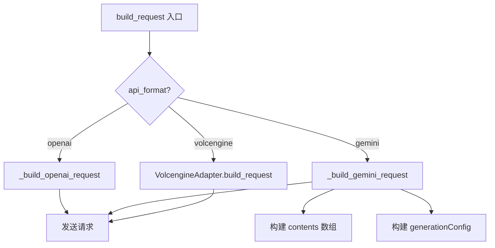
```mermaid
flowchart TD
    A[build_request 入口] --> B{api_format?}
    B -->|openai| C[_build_openai_request]
    B -->|gemini| D[_build_gemini_request]
    B -->|volcengine| VE[VolcengineAdapter.build_request]
    D --> GC[构建 contents 数组]
    D --> H[构建 generationConfig]
    C --> K[发送请求]
    D --> K
    VE --> K
```

**Gemini 响应解析：**

```mermaid
flowchart TD
    A[parse_response] --> B{检测响应格式}
    B -->|candidates 存在| C[_parse_gemini_response]
    B -->|否则| D[OpenAI 格式解析]
    C --> E[提取 candidates[0].content.parts]
    E --> F{part 类型?}
    F -->|inlineData| G[base64 解码为图片]
    F -->|fileData| H[提取 fileUri URL]
```

**四通道认证架构：**

| 通道 | 配置标识 | 认证方式 | 计费方式 |
|------|----------|----------|----------|
| Account 稳定通道 | `auth_type: account` | `X-Auth-T` Token | 冰糕积分 |
| Google 官方 API | `auth_header_format: none` | URL `?key=` | Google 计费 |
| Vertex AI | `auth_type: vertex` | URL `?key=` + GCS/Vertex 路径 | Google 计费 |
| 第三方代理 | 默认 (`bearer`) | `Authorization: Bearer` | 代理方计费 |

**认证决策流程：**

```
auth_type == "account"?
  → Yes: X-Auth-T Token, auto-refresh credits
  → No: auth_type == "vertex"?
    → Yes: No Auth header, API Key in URL ?key=, Vertex 路径 / GCS 策略
    → No: auth_header_format == "none"?
      → Yes: No Auth header, API Key in URL ?key=
      → No: Authorization: Bearer api_key (default)
```

### 3.6 Prompt 前缀

自动在用户 prompt 前添加配置的前缀文本（如强制 Gemini 生成图片）：

```yaml
api_endpoints:
  - prompt_prefix: "生成一张图片："
    api_format: gemini
```

---

## 4. 配置系统

### 4.1 YAML 结构

```yaml
# 供应商
providers:
  openai_compatible:
    base_url: https://api.example.com
    api_key: sk-xxx
    file_format: same_name  # 供应商级默认

# 模型
models:
  ModelName:
    display_name: 🎨 显示名
    category: image
    dynamic_inputs: {...}
    parameter_schema:
      basic: {...}
      advanced: {...}
    api_endpoints:
      - provider: openai_compatible
        priority: 1
        modes:
          text2img:
            endpoint: /v1/images/generations
            response_path: data[0].url
          img2img:
            endpoint: /v1/images/edits
            file_format: indexed  # 端点级覆盖
```

### 4.2 可视化管理器

供应商 CRUD（含高级文件格式设置）、模型配置（参数、端点）、端点高级设置（折叠式）。

---

## 5. 文件结构

```
ComfyUI-Custom-Batchbox/
├── __init__.py              节点注册 + API 路由
├── nodes.py                 节点类定义
├── config_manager.py        配置管理（含缓存、验证）
├── batchbox_logger.py       日志与重试模块
├── errors.py                结构化异常类
├── image_utils.py           图片处理工具
├── independent_generator.py 独立并发生成引擎
├── save_settings.py         自动保存模块
├── prompt_templates.py      Prompt 模板管理
├── oss_cache.py             阿里 OSS 图片缓存
├── gcs_cache.py             Google Cloud Storage 缓存
├── gemini_files_cache.py    Gemini Files API 缓存
├── api_config.yaml          主配置文件
├── secrets.yaml             API 密钥（.gitignored）
├── adapters/
│   ├── __init__.py          适配器导出
│   ├── base.py              适配器接口 + APIResponse
│   ├── generic.py           通用适配器（层级配置 + 重试）
│   ├── template_engine.py   请求模板引擎
│   └── volcengine.py        火山引擎适配器
├── account/
│   ├── __init__.py          公开 API 导出
│   ├── core.py              单例核心：登录、Token、积分、定价
│   ├── websocket_server.py  WebSocket 接收登录回调
│   ├── network.py           HTTP 会话管理
│   ├── task_sync.py         任务同步服务
│   ├── task_history.py      任务历史
│   ├── url_config.py        服务 URL 配置
│   └── exceptions.py        Account 异常
├── web/
│   ├── api_manager.js       API 管理界面
│   ├── api_manager.css
│   ├── dynamic_params.js    动态参数渲染
│   ├── dynamic_params.css
│   ├── dynamic_inputs.js    动态输入槽
│   ├── blur_upscale.js      高斯模糊放大节点 UI
│   └── blur_upscale.css
├── tests/
│   ├── test_config_manager.py
│   ├── test_adapters.py
│   └── test_errors.py
└── docs/                    文档
```

---

## 6. API 接口

### 配置管理

| 端点 | 方法 | 描述 |
|------|------|------|
| `/api/batchbox/config` | GET | 获取完整配置 |
| `/api/batchbox/config` | POST | 保存完整配置 |
| `/api/batchbox/reload` | POST | 强制重载配置 |
| `/api/batchbox/config/mtime` | GET | 获取文件修改时间 |

### 模型与供应商

| 端点 | 方法 | 描述 |
|------|------|------|
| `/api/batchbox/models` | GET | 获取模型列表（支持 `?category=` 过滤） |
| `/api/batchbox/schema/{model}` | GET | 获取模型参数 Schema |
| `/api/batchbox/model-order/{category}` | GET/POST | 模型排序 |
| `/api/batchbox/providers` | GET | 获取供应商列表 |
| `/api/batchbox/providers/{name}` | POST | 更新供应商 |
| `/api/batchbox/categories` | GET | 获取节点分类 |

### 节点与保存设置

| 端点 | 方法 | 描述 |
|------|------|------|
| `/api/batchbox/node-settings` | GET/POST | 节点显示设置 |
| `/api/batchbox/save-settings` | GET/POST | 自动保存设置 |
| `/api/batchbox/save-settings/preview` | POST | 预览文件名 |
| `/api/batchbox/upscale-settings` | GET/POST | 高清放大设置 |
| `/api/batchbox/style-presets` | GET/POST | 风格预设 |

### 生成

| 端点 | 方法 | 描述 |
|------|------|------|
| `/api/batchbox/generate-independent` | POST | 独立并发生成 |
| `/api/batchbox/generate-blur-upscale` | POST | 独立模糊放大生成 |
| `/api/batchbox/blur-preview` | POST | 模糊效果预览 |

### Account 系统

| 端点 | 方法 | 描述 |
|------|------|------|
| `/api/batchbox/account/login` | POST | 登录（启动 WebSocket） |
| `/api/batchbox/account/logout` | POST | 登出 |
| `/api/batchbox/account/status` | GET | 状态（昵称、积分、Token 过期） |
| `/api/batchbox/account/credits` | POST | 刷新积分余额 |
| `/api/batchbox/account/redeem` | POST | 兑换码兑换 |
| `/api/batchbox/account/pricing` | GET | 模型定价 |

---

## 7. 技术实现

### 7.1 节点类型识别

```javascript
// ComfyUI 中需要用 comfyClass 而不是 type
const nodeType = node.comfyClass || node.type;
```

### 7.2 参数传递

```javascript
// 拦截 queuePrompt 在执行前收集参数
api.queuePrompt = async function(...) {
  // 更新 extra_params widget
  return origQueuePrompt.call(this, ...);
};
```

### 7.3 层级配置读取

```python
file_format = (
    mode_config.get("file_format") or
    endpoint.get("file_format") or
    provider.get("file_format") or
    "same_name"
)
```

### 7.4 自动保存功能

生成的图片自动保存到指定目录（`save_settings.py`）。

**配置项：**

| 设置项 | 类型 | 默认值 | 说明 |
|--------|------|--------|------|
| `enabled` | bool | true | 启用/禁用 |
| `output_dir` | string | "batchbox" | 保存目录（相对于 output/） |
| `format` | string | "original" | 文件格式：original/png/jpg/webp |
| `fallback_format` | string | "png" | 保持原格式时的默认格式 |
| `quality` | int | 95 | JPG/WebP 质量 (1-100) |
| `naming_pattern` | string | `{model}_{timestamp}_{seed}` | 命名模板 |
| `create_date_subfolder` | bool | true | 按日期创建子文件夹 |

**命名模板变量：** `{model}`, `{timestamp}`, `{date}`, `{time}`, `{seed}`, `{batch}`, `{uuid}`, `{prompt}`

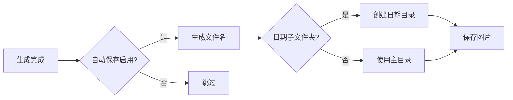
```mermaid
flowchart LR
    A[生成完成] --> B{自动保存启用?}
    B -->|是| C[生成文件名]
    B -->|否| D[跳过]
    C --> E{日期子文件夹?}
    E -->|是| F[创建日期目录]
    E -->|否| G[使用主目录]
    F --> H[保存图片]
    G --> H
```

### 7.5 模型排序功能

```yaml
model_order:
  image:
    - Nano Banana Pro
    - tapnow_flash
  text: []
  video: []
```

**容错：** 忘记配置→字母排序，重复→保留首次，已删除→自动过滤，新增→追加末尾。

```python
def _sort_models_by_order(self, model_names, category):
    order = self.get_model_order(category)
    order_map = {name: i for i, name in enumerate(order)}
    max_index = len(order)
    return sorted(model_names, key=lambda x: (order_map.get(x, max_index), x))
```

前端使用 HTML5 Drag & Drop API 实现拖拽排序。

### 7.6 节点宽度与排版管理

**问题：** 节点宽度在动态更新时被重置为 ~252px（LiteGraph 默认），加载工作流时 widget 文字重叠。

**解决方案：**

```javascript
// 辅助函数：保持宽度只更新高度
function resizeNodePreservingWidth(node) {
  const currentWidth = node.size[0];
  const computedSize = node.computeSize();
  node.setSize([currentWidth, computedSize[1]]);
}
```

**生命周期区分：**

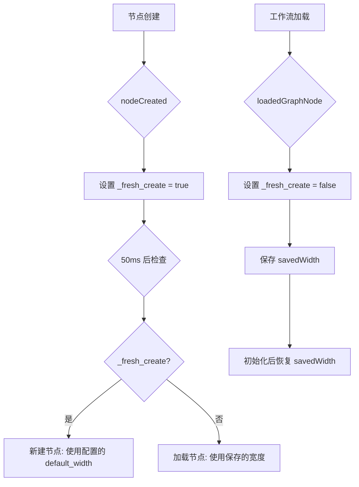
```mermaid
flowchart TD
    A[节点创建] --> B{nodeCreated}
    B --> C[设置 _fresh_create = true]
    C --> D{50ms 后检查}
    D --> E{_fresh_create?}
    E -->|是| F1[新建节点: 使用配置的 default_width]
    E -->|否| G[加载节点: 使用保存的宽度]

    H[工作流加载] --> I{loadedGraphNode}
    I --> J[设置 _fresh_create = false]
    J --> K[保存 savedWidth]
    K --> L[初始化后恢复 savedWidth]
```

**可配置默认宽度（v2.5.1）：** `node_settings.default_width`，范围 300-1200px。

**踩坑：`_isRestoring` 时序竞争（v2.22 修复）**

`dynamic_inputs.js` 设置 `_isRestoring=true` 时，`dynamic_params.js` 的 `resizeNodePreservingWidth()` 被静默跳过，导致 widget 数量变化但高度未更新→重叠。

修复：被跳过时标记 `_needsPostRestoreResize`，恢复后补做 resize + 1s 兜底。

### 7.7 按钮执行路径

当前默认按钮路径已经不是 Queue Prompt，而是独立生成 API：

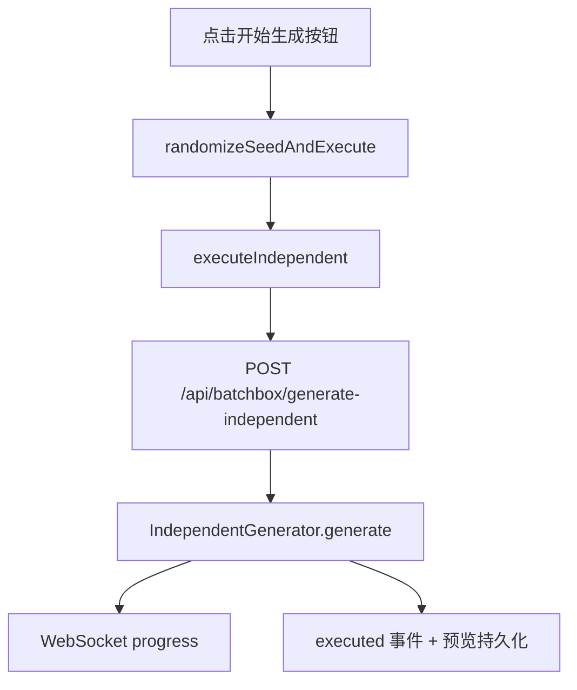
```mermaid
flowchart TD
    A[点击开始生成按钮] --> B[randomizeSeedAndExecute]
    B --> C[executeIndependent]
    C --> D[POST /api/batchbox/generate-independent]
    D --> E[IndependentGenerator.generate]
    E --> F[WebSocket progress]
    E --> G[executed 事件 + 预览持久化]
```

**当前实现分层：**

- 普通 BatchBox 节点按钮默认走 `executeIndependent()`，直接绕过 ComfyUI 队列。
- `executeToNode()` 仍保留在前端代码中，但已是 legacy/fallback 路径。
- `GaussianBlurUpscale` 也优先走独立生成；只有独立请求失败时才回退到 scoped queue patch。

### 7.8 Queue Prompt 拦截

全局 Queue Prompt 不再主动删除 BatchBox 节点，而是在发送工作流前注入缓存/状态字段；若开启 `bypass_queue_prompt` 且不是按钮触发，后端会尽量直接复用缓存图片，避免再次打外部 API。

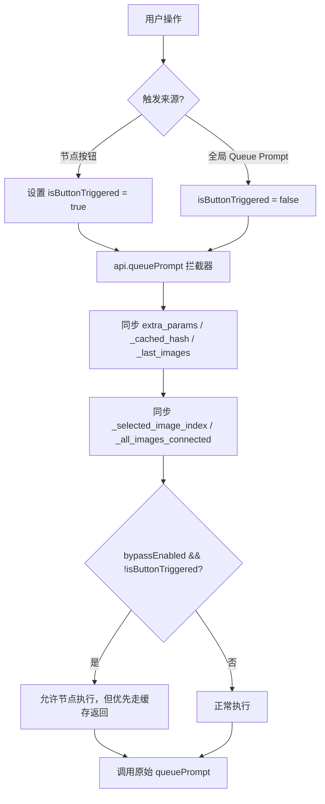
```mermaid
flowchart TD
    A[用户操作] --> B{触发来源?}
    B -->|节点按钮| C[设置 isButtonTriggered = true]
    B -->|全局 Queue Prompt| D[isButtonTriggered = false]
    C --> E[api.queuePrompt 拦截器]
    D --> E
    E --> F[同步 extra_params / _cached_hash / _last_images]
    F --> G[同步 _selected_image_index / _all_images_connected]
    G --> H{bypassEnabled && !isButtonTriggered?}
    H -->|是| I[允许节点执行，但优先走缓存返回]
    H -->|否| J[正常执行]
    I --> K[调用原始 queuePrompt]
    J --> K
```

```yaml
node_settings:
  bypass_queue_prompt: true  # true=开启拦截, false=正常执行
```

**设置同步注意：** 专用 API 保存设置后必须同步回主配置对象，否则主"保存"按钮会覆盖：

```javascript
this.config.node_settings = { ...this.config.node_settings, ...newSettings };
```

### 7.9 独立并发生成与进度推送

**核心优势：**

| 特性 | ComfyUI Queue | 独立生成 |
|------|---------------|----------|
| 并发性 | 串行执行 | **并行执行** |
| 依赖管理 | 自动 | 手动解析 |
| 图片恢复 | 内置 | 手动持久化 |

**实现流程：**

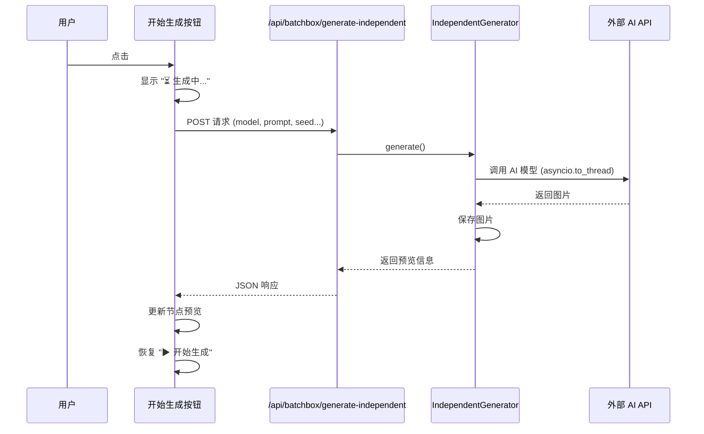
```mermaid
sequenceDiagram
    participant User as 用户
    participant Button as 开始生成按钮
    participant API as /api/batchbox/generate-independent
    participant Generator as IndependentGenerator
    participant External as 外部 AI API

    User->>Button: 点击
    Button->>Button: 显示 "⏳ 生成中..."
    Button->>API: POST 请求 (model, prompt, seed...)
    API->>Generator: generate()
    Generator->>External: 调用 AI 模型 (asyncio.to_thread)
    External-->>Generator: 返回图片
    Generator->>Generator: 保存图片
    Generator-->>API: 返回预览信息
    API-->>Button: JSON 响应
    Button->>Button: 更新节点预览
    Button->>Button: 恢复 "▶ 开始生成"
```

**当前并发策略：**

```python
async def generate(self, model, prompt, seed, batch_count, ...):
    async def process_single_batch(batch_idx):
        current_params = params.copy()
        if seed > 0:
            current_params["seed"] = seed + batch_idx
        result = await asyncio.to_thread(
            self.execute_with_failover, model, current_params, mode
        )
        return (batch_idx, batch_previews, batch_log)

    # 当前实现：每个 batch 启一个 task，直接 gather 全并发
    tasks = [process_single_batch(i) for i in range(batch_count)]
    results = await asyncio.gather(*tasks, return_exceptions=True)
```

| 类型 | 当前行为 |
|------|----------|
| Batch 调度 | `asyncio.gather` 全并发 |
| 阻塞 API 调用 | `asyncio.to_thread()` 放到线程池 |
| Img2img 内存优化 | 所有 batch 共享同一份 `_upload_files` 图片数据 |
| 进度回调 | 每个 batch 完成时发送一次 `batchbox:progress` |

**进度推送与预览加载：**

```
后端 (asyncio.gather 并行)          前端 (JS)
┌─────────────────────┐          ┌─────────────────────┐
│ batch 0 完成        │ ──WS──→  │ 按钮: ⏳ 1/4        │
│ batch 2 完成        │ ──WS──→  │ 按钮: ⏳ 2/4        │
│ batch 1 完成        │ ──WS──→  │ 按钮: ⏳ 3/4        │
│ batch 3 完成        │ ──WS──→  │ 按钮: ⏳ 4/4        │
│ 图片 onload 全部完成 │ ──JS──→ │ 一次性替换 node.imgs │
│ HTTP 200 (全部结果) │ ──HTTP→  │ onExecuted + 持久化 │
└─────────────────────┘          └─────────────────────┘
```

**WebSocket 事件 `batchbox:progress`：**

```json
{
  "node_id": "12",
  "generation_token": "ind_xxx",
  "batch_index": 0,
  "completed": 1,
  "total": 4,
  "preview": { "filename": "...", "subfolder": "...", "type": "output" }
}
```

**两阶段分离安全设计：**

| 阶段 | 触发时机 | 操作 | 安全约束 |
|------|---------|------|---------|
| 阶段 1：逐批进度 | 每个 batch 完成 | 更新按钮文字、预取图片 URL | ❌ 不动 `imageIndex` / `onExecuted` / `_last_images` |
| 阶段 2：预览换帧 | 所有图片 onload 完成 | 一次性替换 `node.imgs` / `node.images` | 避免部分加载导致的 UI 抖动 |
| 阶段 3：执行完成 | HTTP 响应返回 | `onExecuted` + 持久化 + 选择重置 | 与 queue 执行的最终状态对齐 |

**`appendSinglePreview` 安全追加：**

```javascript
// 先写 staging buffer
node._progressiveStagingSlots[batchIndex] = img;
// 只有全部图片都 ready 才切换到 node.imgs
if (filledCount >= totalBatches) {
  node.imgs = node._progressiveStagingSlots.filter(i => i !== null);
}
```

**预览模式配置：** `node_settings.preview_mode` = `progressive`（默认）| `wait_all`

**踩坑：`node.imgs = []` 导致画布冻结**

空数组 `[]` 在 JS 中是 truthy，ComfyUI 的 `drawImages` 检查 `if (this.imgs)` → truthy → 尝试绘制 → 数组长度 0 → 分配空白 image area → 布局崩溃。修复：不在生成开始时清除 `node.imgs`，由 progressive 回调自然覆盖旧图。

### 7.10 配置热重载

保存配置后画布中的 BatchBox 节点立即刷新参数和模型列表，无需刷新浏览器。

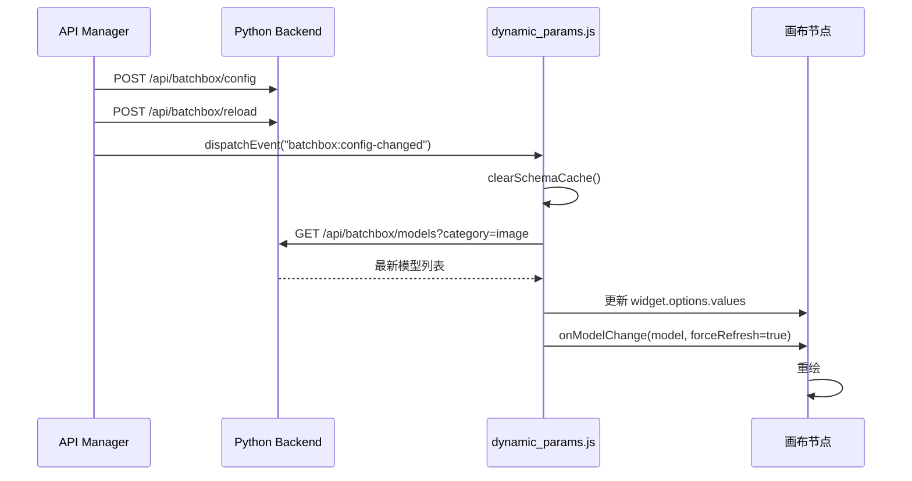
```mermaid
sequenceDiagram
    participant Manager as API Manager
    participant Backend as Python Backend
    participant Frontend as dynamic_params.js
    participant Canvas as 画布节点

    Manager->>Backend: POST /api/batchbox/config
    Manager->>Backend: POST /api/batchbox/reload
    Manager->>Frontend: dispatchEvent("batchbox:config-changed")
    Frontend->>Frontend: clearSchemaCache()
    Frontend->>Backend: GET /api/batchbox/models?category=image
    Backend-->>Frontend: 最新模型列表
    Frontend->>Canvas: 更新 widget.options.values
    Frontend->>Canvas: onModelChange(model, forceRefresh=true)
    Canvas->>Canvas: 重绘
```

```javascript
// onModelChange 支持强制刷新
async onModelChange(modelName, forceRefresh = false) {
    if (modelName === this.currentModel && !forceRefresh) return;
    // ... 获取 schema 并更新 widgets
}
```

### 7.11 画布右键菜单快捷添加

使用 ComfyUI 官方 `getCanvasMenuItems()` hook：

```javascript
app.registerExtension({
  name: "ComfyUI-Custom-Batchbox.DynamicParams",
  getCanvasMenuItems() {
    if (!showInCanvasMenuEnabled) return [];
    return batchboxNodes.map(nodeInfo => ({
      content: nodeInfo.label,
      callback: () => {
        const node = LiteGraph.createNode(nodeInfo.type);
        node.pos = [canvas.graph_mouse[0], canvas.graph_mouse[1]];
        app.graph.add(node);
      }
    }));
  }
});
```

**配置：** `node_settings.show_in_canvas_menu`，热重载通过 `batchbox:node-settings-changed` 事件。

### 7.12 动态参数持久化

风格、分辨率、比例等动态参数在工作流保存/加载时正确恢复。

**核心问题：** api_name vs widget.name key 不匹配导致参数丢失。

**解决方案：** 采用 "Pending State" 模式——加载时先缓存参数值，等 schema 获取完成后再恢复，消除 UI 闪烁。Endpoint 选择器和高级设置折叠/展开状态也持久化到 `node.properties`。

### 7.13 动态槽位紧凑策略

断开中间输入槽位后，连接自动向前移动填补空隙：

```
原状态：image1(连接A) → image2(空) → image3(连接B) → image4(空)
断开 image1 后：
  ❌ 旧行为：image1(空) → image2(空) → image3(连接B) → image4(空)
  ✅ 新行为：image1(连接B) → image2(空)
```

**实现策略：存储-删除-重建-重连**

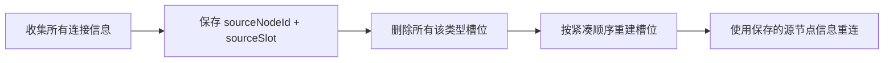
```mermaid
flowchart LR
    A[收集所有连接信息] --> B[保存 sourceNodeId + sourceSlot]
    B --> C[删除所有该类型槽位]
    C --> D[按紧凑顺序重建槽位]
    D --> E[使用保存的源节点信息重连]
```

> **为什么不用 Link ID：** 删除槽位后 link 被销毁，ID 失效。用 `sourceNodeId + sourceSlot` 更稳定。

### 7.14 缓存系统

#### 7.14.1 智能缓存（哈希匹配）

让 BatchBox 节点在已生成图片后行为类似 Load Image 节点——不调用 API，直接返回缓存。

**核心问题：** 前端和后端分别计算哈希，JSON 格式差异导致不匹配。

| 问题 | 解决方案 |
|------|----------|
| JSON 格式差异（Python `{"key": "value"}` vs JS `{"key":"value"}`） | Python 使用 `separators=(',', ':')` |
| extra_params 包含 seed | 哈希计算时排除 seed |
| img2img 输入图变化但参数没变 | 额外把图片内容哈希纳入 cache key |
| 前后端实现不一致 | Queue 路径和独立生成路径都复用相同哈希规则 |

```python
def _compute_params_hash(self, model, prompt, batch_count, seed, extra_params, images_hash=""):
    params_for_hash = dict(extra_params) if extra_params else {}
    params_for_hash.pop("seed", None)
    extra_params_normalized = json.dumps(params_for_hash, sort_keys=True, separators=(',', ':'))
    params_str = f"{model}|{prompt}|{batch_count}|{seed}|{extra_params_normalized}|{images_hash}"
    return hashlib.md5(params_str.encode()).hexdigest()
```

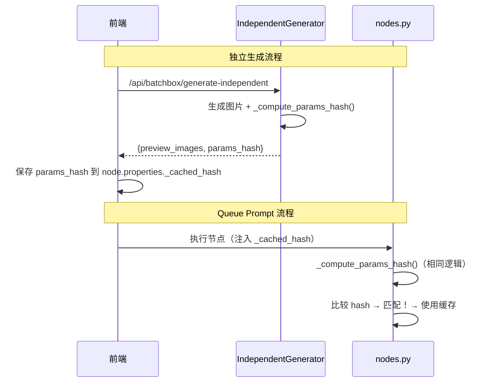
```mermaid
sequenceDiagram
    participant F as 前端
    participant IG as IndependentGenerator
    participant N as nodes.py

    Note over F,N: 独立生成流程
    F->>IG: /api/batchbox/generate-independent
    IG->>IG: 生成图片 + _compute_params_hash()
    IG-->>F: {preview_images, params_hash}
    F->>F: 保存 params_hash 到 node.properties._cached_hash

    Note over F,N: Queue Prompt 流程
    F->>N: 执行节点（注入 _cached_hash）
    N->>N: _compute_params_hash()（相同逻辑）
    N->>N: 比较 hash → 匹配！→ 使用缓存
```

**"参数变化检测"设置：** `node_settings.smart_cache_hash_check`（true=检测参数变化，false=仅按钮触发）

#### 7.14.2 共享图片数据（内存优化）

Img2img 批量生成时，所有批次共享同一份 base64 数据，避免 N 份副本导致 `MemoryError`。

```python
# 预处理阶段：一次编解码
shared_upload_files = []
for img_b64 in images_base64:
    img_bytes = base64.b64decode(img_b64)
    # 4 元组：(filename, bytes, mime, cached_base64)
    shared_upload_files.append(("image.png", (filename, img_bytes, "image/png", img_b64)))
params["_upload_files"] = shared_upload_files  # 所有批次共享

# generic.py 使用缓存
if len(file_tuple) >= 4:
    _, _, mime_type, cached_b64 = file_tuple  # 直接用缓存
```

| 场景 | 之前内存 | 现在内存 |
|------|----------|----------|
| 10 批 × 4MB 图片 | ~40MB | ~4MB |
| 50 批 × 8MB 图片 | ~400MB | ~8MB |

#### 7.14.3 动态缓存加载（按需加载）

根据输出端口连接状态动态决定加载策略，避免不必要的内存消耗。

```python
def _load_persisted_images(self, json, selected_index, load_all=False):
    if load_all:
        # all_images 已连接：加载全部
        for info in image_infos:
            tensors.append(load_single_image(info))
        return selected_tensor, torch.cat(tensors), infos
    else:
        # 只加载选中的 1 张（内存优化）
        tensor = load_single_image(image_infos[selected_index])
        return tensor, tensor, infos
```

| 输出连接状态 | 加载策略 | 内存占用（6 张 4K） |
|-------------|---------|-------------------|
| 只连 `selected_image` | 加载 1 张 | ~195 MB |
| 连了 `all_images` | 加载全部 | ~1.2 GB |

### 7.15 选中图片放大显示

生成多张图后，节点自动放大显示选中的图片（默认第一张），并在执行后保持放大状态。

| 场景 | 行为 |
|------|------|
| 生成完成后 | 默认第一张放大显示，输出给下游 |
| 点击 X 按钮 | 回到缩略图模式 |
| 点击缩略图 | 该图片放大显示 |
| Queue Prompt | 保持放大显示，输出选中图片 |
| 重启恢复 | 选中图片信息持久化 |

**核心解决方案：Property Interception + Execution Window Guard**

ComfyUI 的渲染循环每帧调用 `imageIndex = null`，覆盖用户选择。

```javascript
// 拦截 imageIndex setter
Object.defineProperty(this, 'imageIndex', {
  set: function(value) {
    if ((value === null) && selfNode._ignoreImageIndexChanges) {
      selfNode._imageIndexInternal = selfNode._selectedImageIndex || 0;
      return;  // 阻止
    }
    selfNode._imageIndexInternal = value;
  }
});

// onExecuted 中设置时间窗口
this._ignoreImageIndexChanges = true;
this.imageIndex = selectedIdx;
setTimeout(() => { this._ignoreImageIndexChanges = false; }, 100);
```

**用户交互流程：**

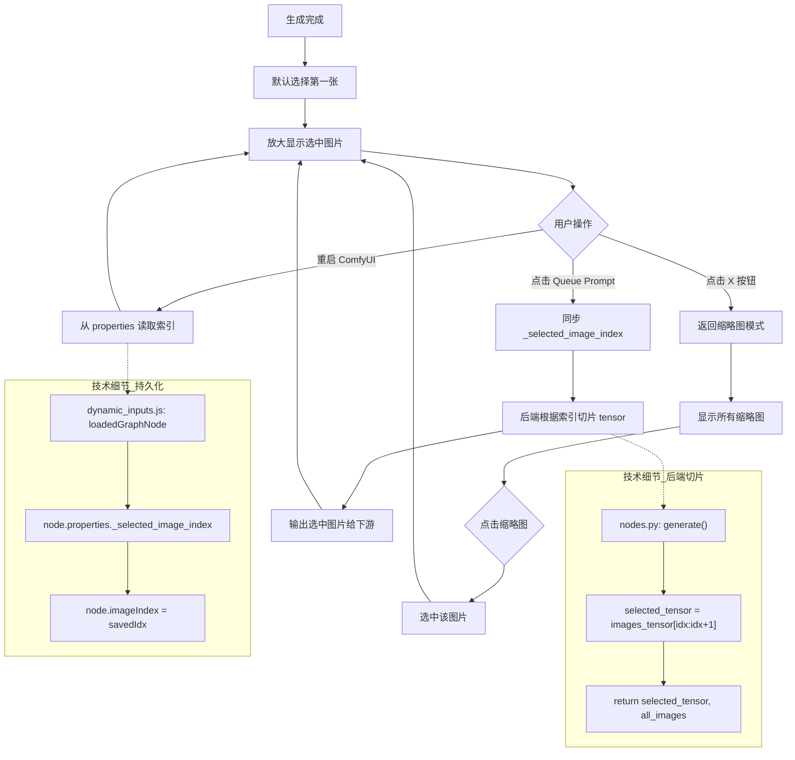
```mermaid
flowchart TD
    A[生成完成] --> B[默认选择第一张]
    B --> C[放大显示选中图片]
    C --> D{用户操作}

    D -->|点击 X 按钮| E[返回缩略图模式]
    E --> F[显示所有缩略图]
    F --> G{点击缩略图}
    G --> H[选中该图片]
    H --> C

    D -->|点击 Queue Prompt| I[同步 _selected_image_index]
    I --> J[后端根据索引切片 tensor]
    J --> K[输出选中图片给下游]
    K --> C

    D -->|重启 ComfyUI| L[从 properties 读取索引]
    L --> C

    subgraph 技术细节_后端切片
        J1["nodes.py: generate()"]
        J2["selected_tensor = images_tensor[idx:idx+1]"]
        J3["return selected_tensor, all_images"]
    end
    J -.-> J1 --> J2 --> J3

    subgraph 技术细节_持久化
        L1["dynamic_inputs.js: loadedGraphNode"]
        L2["node.properties._selected_image_index"]
        L3["node.imageIndex = savedIdx"]
    end
    L -.-> L1 --> L2 --> L3
```

### 7.16 请求体无限制读取

aiohttp 默认 `request.json()` 有约 1MB 限制，大型 base64 图片触发 `HTTPRequestEntityTooLarge`。

```python
# 分块迭代读取
chunks = []
async for chunk in request.content.iter_any():
    chunks.append(chunk)
body = b''.join(chunks)
data = json.loads(body)
```

### 7.17 GaussianBlurUpscale 节点

对输入图片施加高斯模糊后调用外部 AI 放大模型。

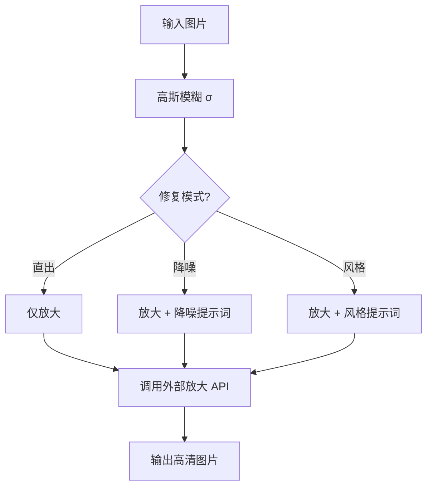
```mermaid
flowchart TD
    A[输入图片] --> B[高斯模糊 σ]
    B --> C{修复模式?}
    C -->|直出| D[仅放大]
    C -->|降噪| E[放大 + 降噪提示词]
    C -->|风格| F[放大 + 风格提示词]
    D --> G[调用外部放大 API]
    E --> G
    F --> G
    G --> H[输出高清图片]
```

**节点 UI：** Canvas 绘制自定义按钮组（模糊程度、修复模式），替代隐藏 widget。Widget 隐藏方式：

```javascript
widget.hidden = true;
widget.computeSize = () => [0, -4];
widget.type = "hidden";
```

> **注意：** `control_after_generate` 可能在 `onNodeCreated` 之后才添加，需 `setTimeout` 延迟重试。

**自定义面板：** 近全屏 DOM 浮层，含 σ 滑块（0.5-15）+ 实时 CSS 模糊预览 + 风格提示词。

**CSS 模糊预览精度修正：**

```javascript
// 修正公式：cssBlurPx = sigma × (displayedWidth / naturalWidth)
blurScaleRatio = img.offsetWidth / img.naturalWidth;
img.style.filter = `blur(${sigma * blurScaleRatio}px)`;
```

**风格预设系统：** CRUD + 拖拽排序，持久化到 `api_config.yaml` 的 `style_presets` 字段。

### 7.18 Multipart 参数过滤修复

**问题：** img2img 模式下 `image_size` 参数始终被过滤，导致分辨率锁定 1K。

**根因：**

```python
# BUG: 过滤所有以 "image" 开头的 key
request_info["data"] = {k: v for k, v in payload.items()
                       if not k.startswith("image")}  # ← image_size 被误删！

# FIX: 仅排除内部字段
request_info["data"] = {k: v for k, v in payload.items()
                       if not k.startswith("_")}
```

### 7.19 Account 计费系统

移植自 [AIGODLIKE/BlenderAIStudio](https://github.com/AIGODLIKE/BlenderAIStudio) v0.1.4（commit `8b8c533`），去除 Blender（bpy）依赖。

**核心文件：**

| 文件 | 职责 |
|------|------|
| `account/core.py` | 单例核心：登录、Token 管理、积分、定价 |
| `account/websocket_server.py` | WebSocket 接收登录回调 Token |
| `account/network.py` | HTTP 会话管理 |
| `account/task_sync.py` | 任务同步服务 |
| `account/url_config.py` | 服务 URL 配置 |

**登录流程：**

1. 用户点击 **🔑 登录** → 后台线程尝试启动 WebSocket Server（port `55441-55450`）
2. 打开浏览器 → `addon-login.acggit.com` 登录页（可被 `account.login_url` 覆盖）
3. 登录成功 → 登录页通过 WebSocket 回调 Token 到本地服务器
4. `init_force()` 自动执行：`ping_once()` + `fetch_credits()` + `fetch_credits_price()`
5. API Manager 打开 Account 页时请求 `/account/status` 刷新当前状态

**Token 过期处理：** `fetch_credits()` 收到 `code=-4001` → 设置 `token_expired=True` → 前端显示警告 + 重新登录按钮

**生图后自动刷新积分：**

```python
# adapters/generic.py execute() 末尾
if self.endpoint.get("auth_type") == "account":
    Account.get_instance().fetch_credits()
```

**Pricing Table 与 Model ID 解析：**

Account 服务不使用 Gemini 原始模型名，而是使用从 pricing table 查到的数字 ID。

```python
# 初始化
def configure(self, plugin_dir, account_config):
    self.load_account_info_from_local()
    self.ping_once()
    self.fetch_credits()
    self.fetch_credits_price()   # ← 关键！漏调会导致 pricing_data 为空

# 解析
def resolve_model_id(self, model_display_name):
    strategy = config_manager.get_node_settings().get("pricing_strategy", "bestPrice")
    model_data = self._pricing_data.get(model_display_name, {})
    return str(model_data.get(strategy, {}).get("modelId", ""))
```

**通道策略：**

| 策略 | 值 | 说明 |
|------|----|------|
| 低价优先 | `bestPrice` | 选择最优惠的供应商（默认） |
| 稳定优先 | `bestBalance` | 选择最稳定的供应商 |

存储于 `node_settings.pricing_strategy`，每次请求动态读取。

**generationConfig 对齐上游：**

| 参数 | 值 |
|------|------|
| `maxOutputTokens` | 32768 |
| `temperature` | 0.8 |
| `candidateCount` | 1 |
| `responseModalities` | `["IMAGE"]` |

**统一模型清单：**

| 模型 ID | 显示名 | 端点 | API model_name |
|---------|--------|------|----------------|
| `NanoBananaPro` | 🍌 Nano Banana Pro | Account + Google | `gemini-3-pro-image-preview` |
| `NanoBanana2` | 🍌 Nano Banana 2 | Account + Google | `gemini-3.1-flash-image-preview` |
| `NanoBanana` | 🍌 Nano Banana | Account + Google | `gemini-2.5-flash-image` |
| `Seedream_v4` | 🌱 Seedream v4 | Account | `doubao-seedream-4-0-250828` |
| `Seedream_v45` | 🌱 Seedream v4.5 | Account | `doubao-seedream-4-5-251128` |

**特殊处理：**

1. **URL 模板替换**: Google 端点中的 `{api_key}` 被替换为真实 API Key
2. **无 Auth Header**: `auth_header_format: none` 跳过 `Authorization` header
3. **Auto 比例跳过**: `auto` 不是合法 Gemini aspectRatio 值，所有通道统一跳过
4. **OSS 图片缓存**: img2img 模式通过阿里 OSS 上传图片，管理面板可即时开关
5. **模型参数来源**: 严格对齐上游 BlenderAIStudio `models_config.yaml`

**前端 UI 组件：**

| 区域 | 功能 |
|------|------|
| 服务器状态指示 | 🟢 已连接 / 🔴 未连接 |
| 积分显示 | 余额 + 消耗查询 |
| 购买入口 | 跳转冰糕充值页 |
| 兑换码输入 | 兑换冰糕 |
| Token 过期警告 | ⚠️ 提示 + 重新登录 |
| 通道策略选择 | 💰 低价优先 / ⚡ 稳定优先 |

**上游项目追踪：** 基准版本 BlenderAIStudio v0.1.4 (`8b8c533`, 2026-02-28)。详见 [UPSTREAM.md](UPSTREAM.md)。

---

## 8. 维护指南

### 8.1 添加新 API

1. 获取第三方 API 文档
2. 将 `YAML_CONFIG_REFERENCE.md` + API 文档发给 LLM
3. 请求 LLM 生成 YAML 配置
4. 在 API Manager 中测试

### 8.2 常见问题

| 问题 | 解决方案 |
|------|----------|
| 参数不显示 | 检查 `parameter_schema` 格式 |
| 图片不发送 | 检查 `file_format` 配置 |
| 端点不切换 | 检查 `priority` 设置 |
| img2img 分辨率不对 | 确认 multipart 过滤用 `k.startswith("_")` |
| Account Unknown Model | 确认 `fetch_credits_price()` 被调用 |
