# ComfyUI-Custom-Batchbox 产品架构与需求文档

## 文档版本

| 版本 | 日期 | 描述 |
|------|------|------|
| 2.5.1 | 2026-01-25 | 节点宽度管理器（API Manager 可配置默认宽度） |
| 2.5 | 2026-01-25 | 节点宽度保持机制（防止 252px 重置） |
| 2.4 | 2026-01-25 | 节点生成图片预览持久化 |
| 2.3 | 2026-01-25 | 模型排序、拖拽 UI |
| 2.2 | 2026-01-25 | 自动保存功能 |
| 2.1 | 2026-01-25 | 重试机制、TTL 缓存、日志系统 |
| 2.0 | 2026-01-24 | 手动端点选择、轮询模式、层级文件配置 |
| 1.0 | 2026-01-24 | 初稿 |

### 相关文档

| 文档 | 说明 |
|------|------|
| [docs/hierarchical_config.md](docs/hierarchical_config.md) | 层级配置指南（Provider > Endpoint > Mode） |
| [docs/comfyui_widget_serialization.md](docs/comfyui_widget_serialization.md) | ComfyUI Widget 序列化避坑指南 |
| [docs/preview_persistence.md](docs/preview_persistence.md) | 预览持久化机制 |
| [docs/node_width_retrospective.md](docs/node_width_retrospective.md) | 节点宽度保持开发复盘 |
| [YAML_CONFIG_REFERENCE.md](YAML_CONFIG_REFERENCE.md) | YAML 配置参考（供 LLM 使用） |

---

## 1. 项目概述

ComfyUI-Custom-Batchbox 是一套 ComfyUI 自定义节点系统，实现：

1. **动态参数面板** - 选择模型后自动更新参数控件
2. **多类别节点** - 图片/文本/视频/音频/编辑器
3. **多 API 中转站** - 同模型支持多个 API 站点
4. **智能端点管理** - 轮询、手动选择、故障转移
5. **灵活配置** - YAML 配置 + 可视化管理器

---

## 2. 系统架构

### 2.1 整体架构图

```mermaid
graph TB
    subgraph ComfyUI前端
        A[节点UI] --> B[动态参数渲染器]
        B --> C[参数Schema解析器]
        D[API Manager UI] --> E[配置编辑]
    end
    
    subgraph 自定义节点后端
        F[DynamicImageNodeBase] --> F1[NanoBananaPro]
        F --> G[DynamicImageGeneration]
        F --> H[DynamicTextGeneration]
        F --> I[DynamicVideoGeneration]
        F --> J[DynamicAudioGeneration]
        F --> K[DynamicImageEditor]
    end
    
    subgraph 配置管理层
        K[ConfigManager] --> L[api_config.yaml]
        K --> M[供应商配置]
        K --> N[模型Schema]
    end
    
    subgraph API适配器层
        O[GenericAdapter] --> P[层级文件配置]
        O --> Q[请求构建]
        O --> R[响应解析]
    end
    
    A <--> F
    F <--> K
    F <--> O
    O --> S[外部API服务]
    D --> K
```

### 2.2 动态参数流程

```mermaid
sequenceDiagram
    participant User as 用户
    participant UI as ComfyUI前端
    participant JS as dynamic_params.js
    participant API as /api/batchbox/schema
    participant Config as ConfigManager
    
    User->>UI: 选择模型下拉框
    UI->>JS: 触发 onchange
    JS->>API: GET /api/batchbox/schema/{model}
    API->>Config: 获取参数Schema
    Config-->>API: 返回参数定义
    API-->>JS: 返回JSON Schema
    JS->>UI: 动态渲染参数控件
    UI-->>User: 显示新参数面板
```



### 2.3 端点选择与轮询

```mermaid
flowchart TD
    A[开始请求] --> B{手动选择?}
    B -->|是| C[使用指定端点]
    B -->|否| D[轮询选择端点]
    D --> E[endpoint_index++ % 端点数]
    C --> F[构建请求]
    E --> F
    F --> G{请求成功?}
    G -->|是| H[返回结果]
    G -->|否| I{手动模式?}
    I -->|是| J[返回错误]
    I -->|否| K{有备用端点?}
    K -->|是| L[切换下一个]
    L --> F
    K -->|否| J
```



### 2.4 层级配置优先级

```mermaid
flowchart LR
    A[读取file_format] --> B{端点级配置?}
    B -->|有| C[使用端点配置]
    B -->|无| D{供应商级配置?}
    D -->|有| E[使用供应商配置]
    D -->|无| F[使用系统默认 same_name]
```



---

## 2.5 节点类型

| 节点 ID | 显示名称 | 用途 |
|---------|----------|------|
| `NanoBananaPro` | 🍌 Nano Banana Pro (Universal) | 通用图像节点 |
| `DynamicImageGeneration` | 🎨 Dynamic Image Generation | 动态图像生成 |
| `DynamicTextGeneration` | 📝 Dynamic Text Generation | 动态文本生成 |
| `DynamicVideoGeneration` | 🎬 Dynamic Video Generation | 动态视频生成 |
| `DynamicAudioGeneration` | 🎵 Dynamic Audio Generation (Beta) | 动态音频生成 |
| `DynamicImageEditor` | 🔧 Dynamic Image Editor | 图像编辑器 |

---

## 3. 核心功能

### 3.1 动态参数系统

**流程：**
```
用户选择模型 → JS 请求 /api/batchbox/schema/{model} 
            → 后端返回参数 Schema 
            → 前端动态渲染控件
```

**参数类型支持：**
- `string` - 文本输入
- `select` - 下拉选择
- `number` - 数字滑块
- `boolean` - 开关

### 3.2 端点管理

**模式：**
| 模式 | 描述 |
|------|------|
| 自动轮询 | 按顺序轮流使用各端点 |
| 手动选择 | 用户指定特定端点 |
| 故障转移 | 失败时自动切换下一个 |

**配置优先级：**
```
端点级 > 供应商级 > 系统默认
```

### 3.3 文件格式配置

**支持格式：**
| 格式 | 示例 | 适用 API |
|------|------|----------|
| `same_name` | `image, image` | OpenAI (默认) |
| `indexed` | `image[0], image[1]` | PHP |
| `array` | `images[]` | Rails |
| `numbered` | `image1, image2` | 传统 |

### 3.4 动态输入槽

**功能：** 连接图片后自动添加下一个输入槽

**配置：**
```yaml
dynamic_inputs:
  image:
    max: 14
    type: IMAGE
```

---

## 4. 配置系统

### 4.1 YAML 结构

```yaml
# 供应商
providers:
  openai_compatible:
    base_url: https://api.example.com
    api_key: sk-xxx
    file_format: same_name  # 供应商级默认

# 模型
models:
  ModelName:
    display_name: 🎨 显示名
    category: image
    dynamic_inputs: {...}
    parameter_schema:
      basic: {...}
      advanced: {...}
    api_endpoints:
      - provider: openai_compatible
        priority: 1
        modes:
          text2img:
            endpoint: /v1/images/generations
            response_path: data[0].url
          img2img:
            endpoint: /v1/images/edits
            file_format: indexed  # 端点级覆盖
```

### 4.2 可视化管理器

**功能：**
- 供应商 CRUD（包含高级文件格式设置）
- 模型配置（参数、端点）
- 端点高级设置（折叠式）

---

## 5. 文件结构

```
ComfyUI-Custom-Batchbox/
├── __init__.py              节点注册 + API 路由
├── nodes.py                 节点类定义
├── config_manager.py        配置管理（含缓存、验证）
├── batchbox_logger.py       日志与重试模块
├── errors.py                结构化异常类
├── image_utils.py           图片处理工具
├── api_config.yaml          主配置文件
├── README.md                项目说明
├── ARCHITECTURE.md          架构文档（本文）
├── YAML_CONFIG_REFERENCE.md LLM 配置参考
├── adapters/
│   ├── __init__.py          适配器导出
│   ├── base.py              适配器接口
│   ├── generic.py           通用适配器（层级配置 + 重试）
│   └── template_engine.py   请求模板引擎
├── web/                       前端模块
│   ├── api_manager.js         API管理界面
│   ├── api_manager.css        管理界面样式
│   ├── dynamic_params.js      动态参数渲染
│   ├── dynamic_params.css
│   └── dynamic_inputs.js      动态输入槽
├── save_settings.py           自动保存模块
└── tests/                     单元测试
    ├── test_errors.py       异常类测试
    └── test_adapters.py     适配器测试
```

---

## 6. API 接口

| 端点 | 方法 | 描述 |
|------|------|------|
| `/api/batchbox/config` | GET | 获取完整配置 |
| `/api/batchbox/config` | POST | 保存完整配置 |
| `/api/batchbox/models` | GET | 获取所有模型列表 |
| `/api/batchbox/schema/{model}` | GET | 获取模型参数 Schema |
| `/api/batchbox/providers` | GET | 获取供应商列表 |
| `/api/batchbox/providers/{name}` | PUT | 更新供应商配置 |
| `/api/batchbox/categories` | GET | 获取节点分类 |
| `/api/batchbox/save-settings` | GET | 获取自动保存配置 |
| `/api/batchbox/save-settings` | POST | 更新自动保存配置 |
| `/api/batchbox/save-settings/preview` | POST | 预览文件名 |
| `/api/batchbox/model-order/{category}` | GET | 获取模型排序 |
| `/api/batchbox/model-order/{category}` | POST | 更新模型排序 |
| `/api/batchbox/node-settings` | GET | 获取节点显示设置 |
| `/api/batchbox/node-settings` | POST | 更新节点显示设置 |

---

## 7. 技术要点

### 7.1 节点类型识别
```javascript
// ComfyUI 中需要用 comfyClass 而不是 type
const nodeType = node.comfyClass || node.type;
```

### 7.2 参数传递
```javascript
// 拦截 queuePrompt 在执行前收集参数
api.queuePrompt = async function(...) {
  // 更新 extra_params widget
  return origQueuePrompt.call(this, ...);
};
```

### 7.3 层级配置读取
```python
file_format = (
    mode_config.get("file_format") or
    endpoint.get("file_format") or
    provider.get("file_format") or
    "same_name"
)
```

### 7.4 自动保存功能

生成的图片会自动保存到指定目录，通过 `save_settings.py` 模块实现。

**配置项：**

| 设置项 | 类型 | 默认值 | 说明 |
|--------|------|--------|------|
| `enabled` | bool | true | 启用/禁用自动保存 |
| `output_dir` | string | "batchbox" | 保存目录（相对于 output/） |
| `format` | string | "original" | 文件格式：original/png/jpg/webp |
| `fallback_format` | string | "png" | 保持原格式时的默认格式 |
| `quality` | int | 95 | JPG/WebP 质量 (1-100) |
| `naming_pattern` | string | "{model}_{timestamp}_{seed}" | 命名模板 |
| `create_date_subfolder` | bool | true | 按日期创建子文件夹 |

**命名模板变量：**

| 变量 | 说明 | 示例 |
|------|------|------|
| `{model}` | 模型名称 | nano_banana_pro |
| `{timestamp}` | 完整时间戳 | 20260125_093421 |
| `{date}` | 日期 | 2026-01-25 |
| `{time}` | 时间 | 09-34-21 |
| `{seed}` | 随机种子 | 1234567890 |
| `{batch}` | 批次序号 | 1 |
| `{uuid}` | 8位唯一ID | a1b2c3d4 |
| `{prompt}` | 提示词（需启用） | beautiful_sunset |

**保存流程：**

```mermaid
flowchart LR
    A[生成完成] --> B{自动保存启用?}
    B -->|是| C[生成文件名]
    B -->|否| D[跳过]
    C --> E{日期子文件夹?}
    E -->|是| F[创建日期目录]
    E -->|否| G[使用主目录]
    F --> H[保存图片]
    G --> H
```



### 7.5 模型排序功能

通过 `model_order` 配置控制模型在 API Manager 和节点下拉框中的显示顺序。

**配置格式：**

```yaml
model_order:
  image:
    - Nano Banana Pro   # 第1个
    - tapnow_flash      # 第2个
    - grok2_image       # 第3个
  text: []
  video: []
```

**容错机制：**

| 情况 | 处理方式 |
|------|----------|
| 忘记配置 `model_order` | 使用默认顺序（字母排序） |
| 列表有重复模型名 | 仅保留首次出现的位置 |
| 模型已删除但残留在列表 | 自动过滤不存在的模型 |
| 新增模型未在列表中 | 自动追加到末尾 |

**前端拖拽实现：**

- 使用 HTML5 Drag & Drop API
- 拖拽手柄：`⋮⋮` 符号
- 视觉反馈：拖拽时行半透明，目标位置金色边框
- 释放后自动保存到后端

**排序逻辑（Python）：**

```python
def _sort_models_by_order(self, model_names, category):
    order = self.get_model_order(category)
    order_map = {name: i for i, name in enumerate(order)}
    max_index = len(order)
    # 已配置的按顺序排，未配置的按字母追加到末尾
    return sorted(model_names, key=lambda x: (order_map.get(x, max_index), x))
```

### 7.6 节点宽度保持机制

防止节点宽度在动态更新时被重置为 ~252px（LiteGraph 默认计算宽度）。**v2.5.1 新增"节点宽度管理器"**，用户可在 API Manager → 保存设置 Tab 中配置新建节点的默认宽度（300-1200px）。

**问题流程：**

```mermaid
flowchart LR
    A[用户调整节点宽度] --> B[切换模型/预设]
    B --> C[updateWidgets 被调用]
    C --> D[setSize\computeSize\]
    D --> E[宽度重置为 252px ❌]
```



**解决方案流程：**

```mermaid
flowchart LR
    A[用户调整节点宽度] --> B[切换模型/预设]
    B --> C[updateWidgets 被调用]
    C --> D[resizeNodePreservingWidth]
    D --> E[保存当前宽度]
    E --> F[只更新高度]
    F --> G[宽度保持不变 ✓]
```



**核心实现：**

```javascript
// 辅助函数：保持宽度只更新高度
function resizeNodePreservingWidth(node) {
  const currentWidth = node.size[0];
  const computedSize = node.computeSize();
  node.setSize([currentWidth, computedSize[1]]);
}
```

**生命周期区分：**

```mermaid
flowchart TD
    A[节点创建] --> B{nodeCreated}
    B --> C[设置 _fresh_create = true]
    C --> D{50ms 后检查}
    D --> E{_fresh_create?}
    E -->|是| F1[新建节点: 获取配置宽度]
    F1 --> F2[getNodeSettings]
    F2 --> F3[使用 default_width]
    E -->|否| G[加载节点: 使用保存的宽度]
    
    H[工作流加载] --> I{loadedGraphNode}
    I --> J[设置 _fresh_create = false]
    J --> K[保存 savedWidth]
    K --> L[初始化后恢复 savedWidth]
```



**可配置默认宽度（v2.5.1）：**

```javascript
// 从后端获取节点设置
async function getNodeSettings() {
    const resp = await api.fetchApi("/api/batchbox/node-settings");
    const data = await resp.json();
    return data.node_settings || { default_width: 500 };
}

// 在 nodeCreated 中使用
const nodeSettings = await getNodeSettings();
const defaultWidth = nodeSettings.default_width || 500;
node.size = [defaultWidth, computedSize[1]];
```

**配置存储 (api_config.yaml)：**

```yaml
node_settings:
  default_width: 500  # 范围: 300-1200px
```

**修改的函数：**

| 文件 | 函数 | 修改 |
|------|------|------|
| `dynamic_inputs.js` | `addDynamicInput` | 保存/恢复宽度 |
| `dynamic_inputs.js` | `removeDynamicInput` | 保存/恢复宽度 |
| `dynamic_inputs.js` | `updateInputsForType` | 保存/恢复宽度 |
| `dynamic_inputs.js` | `getNodeSettings` | 新增: 从后端获取配置 |
| `dynamic_inputs.js` | `nodeCreated` | 使用配置的默认宽度 |
| `dynamic_params.js` | `resizeNodePreservingWidth` | 新增辅助函数 |
| `dynamic_params.js` | 7 处 `setSize` 调用 | 替换为辅助函数 |
| `config_manager.py` | `get_node_settings` | 新增: 获取节点设置 |
| `config_manager.py` | `update_node_settings` | 新增: 更新节点设置 |
| `api_manager.js` | `renderSaveSettings` | 添加宽度滑块 UI |

---

## 8. 维护指南

### 8.1 添加新 API

1. 获取第三方 API 文档
2. 将 `YAML_CONFIG_REFERENCE.md` + API 文档发给 LLM
3. 请求 LLM 生成 YAML 配置
4. 在 API Manager 中测试

### 8.2 常见问题

| 问题 | 解决方案 |
|------|----------|
| 参数不显示 | 检查 `parameter_schema` 格式 |
| 图片不发送 | 检查 `file_format` 配置 |
| 端点不切换 | 检查 `priority` 设置 |

---

## 9. 更新日志

### v2.5.1 (2026-01-25)
- ✅ 节点默认宽度可配置（300-1200px）
- ✅ API Manager → 保存设置 Tab 添加宽度滑块
- ✅ `getNodeSettings()` 从后端获取配置
- ✅ `/api/batchbox/node-settings` API 端点
- ✅ `config_manager.py` 新增 `get/update_node_settings`

### v2.5 (2026-01-25)
- ✅ 节点宽度保持机制（防止 252px 重置）
- ✅ `resizeNodePreservingWidth()` 辅助函数
- ✅ 新建/加载节点生命周期区分
- ✅ 切换模型后宽度不丢失
- ✅ 工作流保存/加载宽度正确恢复

### v2.4 (2026-01-25)
- ✅ 节点预览持久化（重启后不丢失）

### v2.3 (2026-01-25)
- ✅ 模型排序功能（model_order 配置）
- ✅ 拖拽排序 UI（HTML5 Drag & Drop）
- ✅ 节点下拉框按配置顺序显示
- ✅ ConfigManager 新增 get/set_model_order 方法

### v2.2 (2026-01-25)
- ✅ 自动保存功能（save_settings.py）
- ✅ 可配置保存目录、格式、命名模式
- ✅ “保持原格式”选项 + 默认格式设置
- ✅ API Manager 中新增“保存设置” Tab
- ✅ 文件名实时预览
- ✅ 按日期创建子文件夹

### v2.1 (2026-01-25)
- ✅ 请求日志系统（可配置级别）
- ✅ 请求重试机制（指数退避）
- ✅ 结构化异常类
- ✅ 配置验证
- ✅ 后端/前端 TTL 缓存
- ✅ 配置热更新
- ✅ RGBA 透明度保持
- ✅ WebP 格式支持
- ✅ 单元测试覆盖

### v2.0 (2026-01-24)
- ✅ 手动端点选择
- ✅ 轮询模式
- ✅ 层级文件格式配置
- ✅ 动态输入槽修复
- ✅ LLM 配置参考文档

### v1.0 (初版)
- 动态参数系统
- 多供应商支持
- 基础 API 适配器
