# ComfyUI-Custom-Batchbox 产品架构与需求文档

## 文档版本

| 版本 | 日期 | 描述 |
|------|------|------|
| 2.23 | 2026-03-01 | Account 系统移植 + Google 官方 API 直连 + 多端点统一架构 + OSS 缓存 |
| 2.22 | 2026-02-09 | GaussianBlurUpscale 节点：高斯模糊放大 + 风格预设管理 + 自定义面板 |
| fix | 2026-02-08 | 修复 img2img 模式下 image_size 参数被 multipart 过滤器误删 |
| fix | 2026-02-07 | 修复加载工作流时节点排版错位的时序竞争问题 |
| fix | 2026-02-05 | API 密钥分离至 secrets.yaml |
| 2.21 | 2026-01-29 | 动态缓存加载（根据输出端口连接状态按需加载图片） |
| 2.20 | 2026-01-29 | 共享图片数据优化（img2img 批量共用一份 base64）+ multipart 兼容修复 |
| 2.19 | 2026-01-29 | 修复请求体大小限制（分块读取解决HTTPRequestEntityTooLarge） |
| 2.18 | 2026-01-29 | 批量图片尺寸归一化（异尺寸 tensor 兼容） |
| 2.17 | 2026-01-28 | 选中图片放大显示 + 并发生成崩溃修复 |
| 2.16 | 2026-01-28 | 智能缓存：节点作为图片来源 |
| 2.15 | 2026-01-27 | 即时保存 + Gemini imageConfig 格式修复 |
| 2.14 | 2026-01-27 | 动态槽位紧凑 + 并行批处理 + 模型迁移 |
| 2.13 | 2026-01-27 | 画布右键菜单快捷添加功能 |
| 2.12 | 2026-01-27 | 动态参数持久化修复（无闪烁恢复机制） |
| 2.11 | 2026-01-27 | 配置热重载 + 模型下拉列表实时刷新 |
| 2.10 | 2026-01-27 | "开始生成"按钮扩展至所有节点类型 |
| 2.9 | 2026-01-27 | 独立并发生成 + 图片恢复优化 |
| 2.8 | 2026-01-26 | Queue Prompt 拦截开关 |
| 2.7 | 2026-01-26 | "开始生成"按钮部分执行支持 |
| 2.6 | 2026-01-26 | Gemini 原生 API 支持 + Prompt 前缀功能 |
| 2.5.1 | 2026-01-25 | 节点宽度管理器（API Manager 可配置默认宽度） |
| 2.5 | 2026-01-25 | 节点宽度保持机制（防止 252px 重置） |
| 2.4 | 2026-01-25 | 节点生成图片预览持久化 |
| 2.3 | 2026-01-25 | 模型排序、拖拽 UI |
| 2.2 | 2026-01-25 | 自动保存功能 |
| 2.1 | 2026-01-25 | 重试机制、TTL 缓存、日志系统 |
| 2.0 | 2026-01-24 | 手动端点选择、轮询模式、层级文件配置 |
| 1.0 | 2026-01-24 | 初稿 |

### 相关文档

| 文档 | 说明 |
|------|------|
| [docs/hierarchical_config.md](docs/hierarchical_config.md) | 层级配置指南（Provider > Endpoint > Mode） |
| [docs/comfyui_widget_serialization.md](docs/comfyui_widget_serialization.md) | ComfyUI Widget 序列化避坑指南 |
| [docs/preview_persistence.md](docs/preview_persistence.md) | 预览持久化机制 |
| [docs/node_width_retrospective.md](docs/node_width_retrospective.md) | 节点宽度保持开发复盘 |
| [YAML_CONFIG_REFERENCE.md](YAML_CONFIG_REFERENCE.md) | YAML 配置参考（供 LLM 使用） |
| [UPSTREAM.md](UPSTREAM.md) | 上游项目 (BlenderAIStudio) 版本追踪与同步策略 |

---

## 1. 项目概述

ComfyUI-Custom-Batchbox 是一套 ComfyUI 自定义节点系统，实现：

1. **动态参数面板** - 选择模型后自动更新参数控件
2. **多类别节点** - 图片/文本/视频/音频/编辑器
3. **多 API 中转站** - 同模型支持多个 API 站点
4. **智能端点管理** - 轮询、手动选择、故障转移
5. **灵活配置** - YAML 配置 + 可视化管理器
6. **Account 计费系统** - AIGODLIKE 账户登录、冰糕积分、代理通道
7. **多通道认证** - Account 稳定通道 / Google 官方 API / 第三方代理

---

## 2. 系统架构

### 2.1 整体架构图

```mermaid
graph TB
    subgraph ComfyUI前端
        A[节点UI] --> B[动态参数渲染器]
        B --> C[参数Schema解析器]
        D[API Manager UI] --> E[配置编辑]
    end
    
    subgraph 自定义节点后端
        F[DynamicImageNodeBase] --> F1[NanoBananaPro]
        F --> G[DynamicImageGeneration]
        F --> H[DynamicTextGeneration]
        F --> I[DynamicVideoGeneration]
        F --> J[DynamicAudioGeneration]
        F --> K[DynamicImageEditor]
    end
    
    subgraph 配置管理层
        K[ConfigManager] --> L[api_config.yaml]
        K --> M[供应商配置]
        K --> N[模型Schema]
    end
    
    subgraph API适配器层
        O[GenericAdapter] --> P[层级配置]
        O --> Q{api_format?}
        Q -->|openai| Q1[OpenAI请求构建]
        Q -->|gemini| Q2[Gemini请求构建]
        Q1 --> R[响应解析]
        Q2 --> R2[Gemini响应解析]
    end
    
    subgraph Prompt处理
        PP[prompt_prefix] --> PPM[前缀合并]
        PPM --> Q
    end
    
    A <--> F
    F <--> K
    F <--> O
    O --> S[外部API服务]
    D --> K
```

### 2.2 动态参数流程

```mermaid
sequenceDiagram
    participant User as 用户
    participant UI as ComfyUI前端
    participant JS as dynamic_params.js
    participant API as /api/batchbox/schema
    participant Config as ConfigManager
    
    User->>UI: 选择模型下拉框
    UI->>JS: 触发 onchange
    JS->>API: GET /api/batchbox/schema/{model}
    API->>Config: 获取参数Schema
    Config-->>API: 返回参数定义
    API-->>JS: 返回JSON Schema
    JS->>UI: 动态渲染参数控件
    UI-->>User: 显示新参数面板
```

### 2.3 端点选择与轮询

```mermaid
flowchart TD
    A[开始请求] --> B{手动选择?}
    B -->|是| C[使用指定端点]
    B -->|否| D[轮询选择端点]
    D --> E[endpoint_index++ % 端点数]
    C --> F[构建请求]
    E --> F
    F --> G{请求成功?}
    G -->|是| H[返回结果]
    G -->|否| I{手动模式?}
    I -->|是| J[返回错误]
    I -->|否| K{有备用端点?}
    K -->|是| L[切换下一个]
    L --> F
    K -->|否| J
```

### 2.4 层级配置优先级

```mermaid
flowchart LR
    A[读取file_format] --> B{端点级配置?}
    B -->|有| C[使用端点配置]
    B -->|无| D{供应商级配置?}
    D -->|有| E[使用供应商配置]
    D -->|无| F[使用系统默认 same_name]
```

---

## 2.5 节点类型

| 节点 ID | 显示名称 | 用途 |
|---------|----------|------|
| `NanoBananaPro` | 🍌 Nano Banana Pro (Universal) | 通用图像节点 |
| `DynamicImageGeneration` | 🎨 Dynamic Image Generation | 动态图像生成 |
| `DynamicTextGeneration` | 📝 Dynamic Text Generation | 动态文本生成 |
| `DynamicVideoGeneration` | 🎬 Dynamic Video Generation | 动态视频生成 |
| `DynamicAudioGeneration` | 🎵 Dynamic Audio Generation (Beta) | 动态音频生成 |
| `DynamicImageEditor` | 🔧 Dynamic Image Editor | 图像编辑器 |
| `GaussianBlurUpscale` | 🔍 Gaussian Blur Upscale | 高斯模糊 + AI 放大 |

---

## 3. 核心功能

### 3.1 动态参数系统

**流程：**
```
用户选择模型 → JS 请求 /api/batchbox/schema/{model} 
            → 后端返回参数 Schema 
            → 前端动态渲染控件
```

**参数类型支持：**
- `string` - 文本输入
- `select` - 下拉选择
- `number` - 数字滑块
- `boolean` - 开关

### 3.2 端点管理

**模式：**
| 模式 | 描述 |
|------|------|
| 自动轮询 | 按顺序轮流使用各端点 |
| 手动选择 | 用户指定特定端点 |
| 故障转移 | 失败时自动切换下一个 |

**配置优先级：**
```
端点级 > 供应商级 > 系统默认
```

### 3.3 文件格式配置

**支持格式：**
| 格式 | 示例 | 适用 API |
|------|------|----------|
| `same_name` | `image, image` | OpenAI (默认) |
| `indexed` | `image[0], image[1]` | PHP |
| `array` | `images[]` | Rails |
| `numbered` | `image1, image2` | 传统 |

### 3.4 动态输入槽

**功能：** 连接图片后自动添加下一个输入槽

**配置：**
```yaml
dynamic_inputs:
  image:
    max: 14
    type: IMAGE
```

### 3.5 多 API 格式支持

**支持的 API 格式：**

| 格式 | 端点示例 | 特点 |
|------|----------|------|
| `openai` | `/v1/chat/completions` | 标准 OpenAI 兼容格式（默认） |
| `gemini` | `/v1beta/models/{model}:generateContent` | Gemini 原生格式，支持 `responseModalities` |

**Gemini 格式请求构建流程：**

```mermaid
flowchart TD
    A[build_request 入口] --> B{api_format?}
    B -->|openai| C[_build_openai_request]
    B -->|gemini| D[_build_gemini_request]
    D --> E[构建 contents 数组]
    E --> F[添加 text part]
    E --> G[添加 inline_data 图片]
    D --> H[构建 generationConfig]
    H --> I[添加 responseModalities]
    H --> J[添加 seed/maxTokens]
    C --> K[发送请求]
    D --> K
```

**Gemini 响应解析：**

```mermaid
flowchart TD
    A[parse_response] --> B{检测响应格式}
    B -->|candidates 存在| C[_parse_gemini_response]
    B -->|否则| D[OpenAI 格式解析]
    C --> E[提取 candidates[0].content.parts]
    E --> F{part 类型?}
    F -->|inlineData| G[base64 解码为图片]
    F -->|fileData| H[提取 fileUri URL]
    G --> I[返回 APIResponse]
    H --> I
```

### 3.6 Prompt 前缀

**功能：** 自动在用户 prompt 前添加配置的前缀文本

**用途：** 强制模型生成图片而非文本回复（如 Gemini 多模态模型）

**配置：**
```yaml
api_endpoints:
  - display_name: Gemini图片
    prompt_prefix: "生成一张图片："
    api_format: gemini
```

**处理流程：**
```
用户输入: "哈哈哈"
     ↓
prompt_prefix: "生成一张图片："
     ↓
实际发送: "生成一张图片：哈哈哈"
```

---

## 4. 配置系统

### 4.1 YAML 结构

```yaml
# 供应商
providers:
  openai_compatible:
    base_url: https://api.example.com
    api_key: sk-xxx
    file_format: same_name  # 供应商级默认

# 模型
models:
  ModelName:
    display_name: 🎨 显示名
    category: image
    dynamic_inputs: {...}
    parameter_schema:
      basic: {...}
      advanced: {...}
    api_endpoints:
      - provider: openai_compatible
        priority: 1
        modes:
          text2img:
            endpoint: /v1/images/generations
            response_path: data[0].url
          img2img:
            endpoint: /v1/images/edits
            file_format: indexed  # 端点级覆盖
```

### 4.2 可视化管理器

**功能：**
- 供应商 CRUD（包含高级文件格式设置）
- 模型配置（参数、端点）
- 端点高级设置（折叠式）

---

## 5. 文件结构

```
ComfyUI-Custom-Batchbox/
├── __init__.py              节点注册 + API 路由
├── nodes.py                 节点类定义
├── config_manager.py        配置管理（含缓存、验证）
├── batchbox_logger.py       日志与重试模块
├── errors.py                结构化异常类
├── image_utils.py           图片处理工具
├── api_config.yaml          主配置文件
├── README.md                项目说明
├── ARCHITECTURE.md          架构文档（本文）
├── YAML_CONFIG_REFERENCE.md LLM 配置参考
├── adapters/
│   ├── __init__.py          适配器导出
│   ├── base.py              适配器接口
│   ├── generic.py           通用适配器（层级配置 + 重试）
│   └── template_engine.py   请求模板引擎
├── web/                       前端模块
│   ├── api_manager.js         API管理界面
│   ├── api_manager.css        管理界面样式
│   ├── dynamic_params.js      动态参数渲染
│   ├── dynamic_params.css
│   ├── dynamic_inputs.js      动态输入槽
│   ├── blur_upscale.js        高斯模糊放大节点 UI
│   └── blur_upscale.css       高斯模糊放大节点样式
├── save_settings.py           自动保存模块
└── tests/                     单元测试
    ├── test_errors.py       异常类测试
    └── test_adapters.py     适配器测试
```

---

## 6. API 接口

| 端点 | 方法 | 描述 |
|------|------|------|
| `/api/batchbox/config` | GET | 获取完整配置 |
| `/api/batchbox/config` | POST | 保存完整配置 |
| `/api/batchbox/models` | GET | 获取所有模型列表 |
| `/api/batchbox/schema/{model}` | GET | 获取模型参数 Schema |
| `/api/batchbox/providers` | GET | 获取供应商列表 |
| `/api/batchbox/providers/{name}` | PUT | 更新供应商配置 |
| `/api/batchbox/categories` | GET | 获取节点分类 |
| `/api/batchbox/save-settings` | GET | 获取自动保存配置 |
| `/api/batchbox/save-settings` | POST | 更新自动保存配置 |
| `/api/batchbox/save-settings/preview` | POST | 预览文件名 |
| `/api/batchbox/model-order/{category}` | GET | 获取模型排序 |
| `/api/batchbox/model-order/{category}` | POST | 更新模型排序 |
| `/api/batchbox/node-settings` | GET | 获取节点显示设置 |
| `/api/batchbox/node-settings` | POST | 更新节点显示设置 |
| `/api/batchbox/upscale-settings` | GET | 获取高清放大模型设置 |
| `/api/batchbox/upscale-settings` | POST | 更新高清放大模型设置 |
| `/api/batchbox/style-presets` | GET | 获取风格预设列表 |
| `/api/batchbox/style-presets` | POST | 更新风格预设列表 |
| `/api/batchbox/account/login` | POST | Account 登录（启动 WebSocket） |
| `/api/batchbox/account/logout` | POST | Account 登出 |
| `/api/batchbox/account/status` | GET | 获取状态（昵称、积分、Token 过期、服务器连接） |
| `/api/batchbox/account/credits` | POST | 刷新积分余额 |
| `/api/batchbox/account/redeem` | POST | 兑换码兑换冰糕 |
| `/api/batchbox/account/pricing` | GET | 获取模型定价信息 |

---

## 7. 技术要点

### 7.1 节点类型识别
```javascript
// ComfyUI 中需要用 comfyClass 而不是 type
const nodeType = node.comfyClass || node.type;
```

### 7.2 参数传递
```javascript
// 拦截 queuePrompt 在执行前收集参数
api.queuePrompt = async function(...) {
  // 更新 extra_params widget
  return origQueuePrompt.call(this, ...);
};
```

### 7.3 层级配置读取
```python
file_format = (
    mode_config.get("file_format") or
    endpoint.get("file_format") or
    provider.get("file_format") or
    "same_name"
)
```

### 7.4 自动保存功能

生成的图片会自动保存到指定目录，通过 `save_settings.py` 模块实现。

**配置项：**

| 设置项 | 类型 | 默认值 | 说明 |
|--------|------|--------|------|
| `enabled` | bool | true | 启用/禁用自动保存 |
| `output_dir` | string | "batchbox" | 保存目录（相对于 output/） |
| `format` | string | "original" | 文件格式：original/png/jpg/webp |
| `fallback_format` | string | "png" | 保持原格式时的默认格式 |
| `quality` | int | 95 | JPG/WebP 质量 (1-100) |
| `naming_pattern` | string | "{model}_{timestamp}_{seed}" | 命名模板 |
| `create_date_subfolder` | bool | true | 按日期创建子文件夹 |

**命名模板变量：**

| 变量 | 说明 | 示例 |
|------|------|------|
| `{model}` | 模型名称 | nano_banana_pro |
| `{timestamp}` | 完整时间戳 | 20260125_093421 |
| `{date}` | 日期 | 2026-01-25 |
| `{time}` | 时间 | 09-34-21 |
| `{seed}` | 随机种子 | 1234567890 |
| `{batch}` | 批次序号 | 1 |
| `{uuid}` | 8位唯一ID | a1b2c3d4 |
| `{prompt}` | 提示词（需启用） | beautiful_sunset |

**保存流程：**

```mermaid
flowchart LR
    A[生成完成] --> B{自动保存启用?}
    B -->|是| C[生成文件名]
    B -->|否| D[跳过]
    C --> E{日期子文件夹?}
    E -->|是| F[创建日期目录]
    E -->|否| G[使用主目录]
    F --> H[保存图片]
    G --> H
```

### 7.5 模型排序功能

通过 `model_order` 配置控制模型在 API Manager 和节点下拉框中的显示顺序。

**配置格式：**

```yaml
model_order:
  image:
    - Nano Banana Pro   # 第1个
    - tapnow_flash      # 第2个
    - grok2_image       # 第3个
  text: []
  video: []
```

**容错机制：**

| 情况 | 处理方式 |
|------|----------|
| 忘记配置 `model_order` | 使用默认顺序（字母排序） |
| 列表有重复模型名 | 仅保留首次出现的位置 |
| 模型已删除但残留在列表 | 自动过滤不存在的模型 |
| 新增模型未在列表中 | 自动追加到末尾 |

**前端拖拽实现：**

- 使用 HTML5 Drag & Drop API
- 拖拽手柄：`⋮⋮` 符号
- 视觉反馈：拖拽时行半透明，目标位置金色边框
- 释放后自动保存到后端

**排序逻辑（Python）：**

```python
def _sort_models_by_order(self, model_names, category):
    order = self.get_model_order(category)
    order_map = {name: i for i, name in enumerate(order)}
    max_index = len(order)
    # 已配置的按顺序排，未配置的按字母追加到末尾
    return sorted(model_names, key=lambda x: (order_map.get(x, max_index), x))
```

### 7.6 节点宽度保持机制

防止节点宽度在动态更新时被重置为 ~252px（LiteGraph 默认计算宽度）。**v2.5.1 新增"节点宽度管理器"**，用户可在 API Manager → 保存设置 Tab 中配置新建节点的默认宽度（300-1200px）。

**问题流程：**

```mermaid
flowchart LR
    A[用户调整节点宽度] --> B[切换模型/预设]
    B --> C[updateWidgets 被调用]
    C --> D[setSize\computeSize\]
    D --> E[宽度重置为 252px ❌]
```

**解决方案流程：**

```mermaid
flowchart LR
    A[用户调整节点宽度] --> B[切换模型/预设]
    B --> C[updateWidgets 被调用]
    C --> D[resizeNodePreservingWidth]
    D --> E[保存当前宽度]
    E --> F[只更新高度]
    F --> G[宽度保持不变 ✓]
```

**核心实现：**

```javascript
// 辅助函数：保持宽度只更新高度
function resizeNodePreservingWidth(node) {
  const currentWidth = node.size[0];
  const computedSize = node.computeSize();
  node.setSize([currentWidth, computedSize[1]]);
}
```

**生命周期区分：**

```mermaid
flowchart TD
    A[节点创建] --> B{nodeCreated}
    B --> C[设置 _fresh_create = true]
    C --> D{50ms 后检查}
    D --> E{_fresh_create?}
    E -->|是| F1[新建节点: 获取配置宽度]
    F1 --> F2[getNodeSettings]
    F2 --> F3[使用 default_width]
    E -->|否| G[加载节点: 使用保存的宽度]
    
    H[工作流加载] --> I{loadedGraphNode}
    I --> J[设置 _fresh_create = false]
    J --> K[保存 savedWidth]
    K --> L[初始化后恢复 savedWidth]
```

**可配置默认宽度（v2.5.1）：**

```javascript
// 从后端获取节点设置
async function getNodeSettings() {
    const resp = await api.fetchApi("/api/batchbox/node-settings");
    const data = await resp.json();
    return data.node_settings || { default_width: 500 };
}

// 在 nodeCreated 中使用
const nodeSettings = await getNodeSettings();
const defaultWidth = nodeSettings.default_width || 500;
node.size = [defaultWidth, computedSize[1]];
```

**配置存储 (api_config.yaml)：**

```yaml
node_settings:
  default_width: 500  # 范围: 300-1200px
```

**修改的函数：**

| 文件 | 函数 | 修改 |
|------|------|------|
| `dynamic_inputs.js` | `addDynamicInput` | 保存/恢复宽度 |
| `dynamic_inputs.js` | `removeDynamicInput` | 保存/恢复宽度 |
| `dynamic_inputs.js` | `updateInputsForType` | 保存/恢复宽度 |
| `dynamic_inputs.js` | `getNodeSettings` | 新增: 从后端获取配置 |
| `dynamic_inputs.js` | `nodeCreated` | 使用配置的默认宽度 |
| `dynamic_params.js` | `resizeNodePreservingWidth` | 新增辅助函数 |
| `dynamic_params.js` | 7 处 `setSize` 调用 | 替换为辅助函数 |
| `config_manager.py` | `get_node_settings` | 新增: 获取节点设置 |
| `config_manager.py` | `update_node_settings` | 新增: 更新节点设置 |
| `api_manager.js` | `renderSaveSettings` | 添加宽度滑块 UI |

### 7.7 部分执行机制

**功能：** 点击"▶ 开始生成"按钮时，只执行目标节点及其上游依赖，不执行工作流中不相关的分支。

**核心原理：**

ComfyUI 执行工作流时，会将整个 graph 序列化为 `prompt.output` 对象发送给后端。部分执行的实现是在发送前过滤 `prompt.output`，只保留需要执行的节点。

**实现流程：**

```mermaid
flowchart TD
    A[点击开始生成按钮] --> B[executeToNode]
    B --> C[临时覆盖 api.queuePrompt]
    C --> D[app.queuePrompt 序列化工作流]
    D --> E[拦截 prompt.output]
    E --> F[recursiveAddNodes 收集上游依赖]
    F --> G[过滤 prompt.output]
    G --> H[调用原始 queuePrompt]
    H --> I[立即恢复原始方法]
```

**核心函数：**

| 函数 | 作用 |
|------|------|
| `recursiveAddNodes(nodeId, oldOutput, newOutput)` | 递归收集节点及其上游依赖 |
| `executeToNode(node)` | 临时覆盖 `api.queuePrompt` 实现部分执行 |

**prompt.output 结构示例：**

```javascript
{
  "3": { "class_type": "KSampler", "inputs": {...} },      // 上游节点
  "4": { "class_type": "VAEDecode", "inputs": {"samples": ["3", 0]} },  // 依赖节点3
  "5": { "class_type": "SaveImage", "inputs": {"images": ["4", 0]} },   // 目标节点
  "8": { "class_type": "LoadImage", "inputs": {...} },    // 独立分支（被过滤）
  "9": { "class_type": "PreviewImage", "inputs": {...} }  // 独立分支（被过滤）
}
```

**官方 API 状态：**

| 功能 | 官方 API | 实现方式 |
|------|----------|----------|
| 右键菜单 | `getNodeMenuItems()` | ✅ 推荐 |
| 选择工具栏 | `getSelectionToolboxCommands()` | ✅ 推荐 |
| 修改 prompt | 无官方 API | ⚠️ 临时 monkey-patch |

> **注意：** 官方明确警告 monkey-patching 是 deprecated，但目前没有替代方案。实现采用临时覆盖（执行后立即恢复）以最小化影响。

### 7.8 Queue Prompt 拦截机制

**功能：** 全局 Queue Prompt 时自动排除 BatchBox 节点，仅允许通过节点上的"开始生成"按钮触发执行。

**应用场景：**
- ComfyUI 重启后用户按 Queue Prompt 时，避免重新执行所有 API 调用节点
- 工作流中有多个独立的 BatchBox 节点时，避免同时触发

**实现流程：**

```mermaid
flowchart TD
    A[用户操作] --> B{触发来源?}
    B -->|节点按钮| C[设置 isButtonTriggered = true]
    B -->|全局 Queue Prompt| D[isButtonTriggered = false]
    C --> E[api.queuePrompt 拦截器]
    D --> E
    E --> F{bypassEnabled && !isButtonTriggered?}
    F -->|是| G[从 prompt.output 移除 BatchBox 节点]
    F -->|否| H[保留所有节点]
    G --> I[调用原始 queuePrompt]
    H --> I
```

**配置存储 (api_config.yaml)：**

```yaml
node_settings:
  default_width: 500
  bypass_queue_prompt: true  # true=开启拦截, false=正常执行
```

**核心代码模式：**

```javascript
// 标记按钮触发
let isButtonTriggeredExecution = false;
let bypassQueuePromptEnabled = true;

// 拦截 queuePrompt
const origQueuePrompt = api.queuePrompt;
api.queuePrompt = async function(number, workflowData) {
  const wasButtonTriggered = isButtonTriggeredExecution;
  isButtonTriggeredExecution = false; // 立即重置
  
  if (bypassQueuePromptEnabled && !wasButtonTriggered) {
    // 移除 BatchBox 节点
    for (const nodeId of batchboxNodeIds) {
      delete workflowData.output[nodeId];
    }
  }
  return origQueuePrompt.call(this, number, workflowData);
};
```

**设置同步注意事项：**

当使用专用 API 保存设置时，必须同步回主配置对象，否则主"保存"按钮会覆盖：

```javascript
// 保存成功后同步
this.config.node_settings = { ...this.config.node_settings, ...newSettings };
```

### 7.9 独立并发生成机制

**功能：** 节点通过独立 API 调用生成内容，完全绕过 ComfyUI 的 `queue prompt` 队列，实现多节点同时并发执行。

**核心优势：**

| 特性 | ComfyUI Queue | 独立生成 |
|------|---------------|----------|
| 并发性 | 串行执行 | **并行执行** |
| 依赖管理 | 自动 | 手动解析 |
| 图片恢复 | 内置 | 手动持久化 |

**实现流程：**

```mermaid
sequenceDiagram
    participant User as 用户
    participant Button as 开始生成按钮
    participant API as /api/batchbox/generate-independent
    participant Generator as IndependentGenerator
    participant External as 外部 AI API

    User->>Button: 点击
    Button->>Button: 显示 "⏳ 生成中..."
    Button->>API: POST 请求 (model, prompt, seed...)
    API->>Generator: generate()
    Generator->>External: 调用 AI 模型 (asyncio.to_thread)
    External-->>Generator: 返回图片
    Generator->>Generator: 保存图片
    Generator-->>API: 返回预览信息
    API-->>Button: JSON 响应
    Button->>Button: 更新节点预览
    Button->>Button: 恢复 "▶ 开始生成"
```

**后端关键实现（v2.20 并发控制）：**

```python
# independent_generator.py
async def generate(self, model, prompt, seed, batch_count, ...):
    async def process_single_batch(batch_idx):
        current_params = params.copy()
        if seed > 0:
            current_params["seed"] = seed + batch_idx
        # 使用 asyncio.to_thread 避免阻塞事件循环
        result = await asyncio.to_thread(
            self.execute_with_failover, model, current_params, mode
        )
        return (batch_idx, batch_images, batch_log)
    
    # v2.20: 智能自适应并发控制
    def get_max_concurrent():
        if mode == "text2img":
            return batch_count  # Text2img: 无输入图片，全部并行
        # Img2img: 根据分辨率限制
        resolution = str(extra_params.get("resolution", "")).upper()
        if "4K" in resolution: return 3
        elif "HD" in resolution: return 5
        else: return 6
    
    max_concurrent = get_max_concurrent()
    semaphore = asyncio.Semaphore(max_concurrent)
    
    async def process_with_limit(batch_idx):
        async with semaphore:
            return await process_single_batch(batch_idx)
    
    tasks = [process_with_limit(i) for i in range(batch_count)]
    results = await asyncio.gather(*tasks, return_exceptions=True)
```

**并发控制策略（v2.20）：**

| 模式 | 分辨率 | 并发数 | 说明 |
|------|--------|--------|------|
| **Text2img** | 任意 | **全部并行** | 无输入图片，无内存压力 |
| Img2img | 4K/2160p | 3 | 大图，防止内存溢出 |
| Img2img | HD/1080p | 5 | 中等平衡 |
| Img2img | 其他 | 6 | 默认 |

**滑动窗口工作原理（Img2img 模式）：**

```text
时间 →
Task1 ████████████░  (完成 → Task4 立即启动)
Task2 ██████████████████░
Task3 ████████░  (完成 → Task5 立即启动)
Task4      ████████████████░
Task5        ██████████░
...
始终保持 ≤N 个任务同时运行（N根据分辨率动态调整）
```

**前端关键实现：**

```javascript
// 更新节点预览（保存尺寸避免恢复时跳动）
function updateNodePreview(node, previewImages) {
    node.imgs = previewImages.map(img => {
        const imgEl = new Image();
        imgEl.onload = () => {
            node.setDirtyCanvas(true, true);  // 图片加载后触发重绘
        };
        imgEl.src = `/view?filename=${img.filename}&t=${Date.now()}`;
        return imgEl;
    });
    
    node.properties._last_images = JSON.stringify(previewImages);
    node.properties._last_size = JSON.stringify(node.size);  // 保存尺寸
}
```

**恢复时抑制跳动：**

```javascript
// loadedGraphNode 中使用 _isRestoring 标志
node._isRestoring = true;  // 抑制中间重绘
// ... 初始化代码 ...
node._isRestoring = false;
node.setDirtyCanvas(true, true);  // 最终一次性重绘
```

**修改的文件：**

| 文件 | 职责 |
|------|------|
| `independent_generator.py` | 后端独立生成逻辑、`asyncio.to_thread` 避免阻塞 |
| `__init__.py` | 注册 `/api/batchbox/generate-independent` 端点 |
| `web/dynamic_params.js` | 前端按钮触发、预览更新、尺寸保存 |
| `web/dynamic_inputs.js` | 恢复逻辑、`_isRestoring` 抑制机制 |

### 7.10 配置热重载机制

**功能：** 在 API Manager 中保存配置后，画布中的 BatchBox 节点立即刷新参数和模型列表，无需刷新浏览器。

**问题背景：**

| 问题 | 原因 |
|------|------|
| 动态参数不刷新 | `onModelChange()` 跳过相同模型 |
| 模型列表不更新 | Widget options 是 Python 后端定义的静态数据 |
| 需要手动刷新浏览器 | 没有事件通知机制 |

**实现流程：**

```mermaid
sequenceDiagram
    participant Manager as API Manager
    participant Backend as Python Backend
    participant Frontend as dynamic_params.js
    participant Canvas as 画布节点

    Manager->>Backend: POST /api/batchbox/config
    Manager->>Backend: POST /api/batchbox/reload
    Manager->>Frontend: dispatchEvent("batchbox:config-changed")
    Frontend->>Frontend: clearSchemaCache()
    Frontend->>Backend: GET /api/batchbox/models?category=image
    Backend-->>Frontend: 最新模型列表
    Frontend->>Canvas: 更新 widget.options.values
    Frontend->>Canvas: onModelChange(model, forceRefresh=true)
    Canvas->>Canvas: 重绘
```

**前端关键实现：**

```javascript
// api_manager.js - 保存后触发热重载
async saveConfig() {
    await api.fetchApi("/api/batchbox/config", { method: "POST", body: JSON.stringify(this.config) });
    await api.fetchApi("/api/batchbox/reload", { method: "POST" });  // 强制后端刷新
    window.dispatchEvent(new CustomEvent("batchbox:config-changed"));  // 通知前端
}

// dynamic_params.js - 监听配置变更
window.addEventListener("batchbox:config-changed", async () => {
    clearSchemaCache();
    // 1. 获取最新模型列表
    const models = await fetchModelsForCategory(category);
    // 2. 更新 widget options
    modelWidget.options.values = models.names;
    // 3. 强制刷新参数
    await node._dynamicParamManager.onModelChange(modelWidget.value, true);
});

// onModelChange 支持强制刷新
async onModelChange(modelName, forceRefresh = false) {
    if (modelName === this.currentModel && !forceRefresh) return;  // 允许强制刷新
    // ... 继续获取 schema 并更新 widgets
}
```

**修改的文件：**

| 文件 | 职责 |
|------|------|
| `web/api_manager.js` | 保存后调用 `/api/batchbox/reload` + 触发 `batchbox:config-changed` 事件 |
| `web/dynamic_params.js` | 监听事件、刷新模型列表、强制更新参数、`forceRefresh` 参数 |

### 7.11 画布右键菜单快捷添加

**功能：** 在 ComfyUI 画布空白处右键可直接添加 BatchBox 节点，无需在节点浏览器中查找。

**支持的节点：**

| 菜单项 | 节点类型 |
|--------|----------|
| 🖼️ Dynamic Image Generation | `DynamicImageGeneration` |
| 🎬 Dynamic Video Generation | `DynamicVideoGeneration` |
| 📝 Dynamic Text Generation | `DynamicTextGeneration` |
| ✏️ Dynamic Image Editor | `DynamicImageEditor` |
| 🔊 Dynamic Audio Generation | `DynamicAudioGeneration` |

**配置开关：**

```yaml
node_settings:
  show_in_canvas_menu: true  # true=显示, false=隐藏
```

**实现方式：**

ComfyUI 官方推荐的 `getCanvasMenuItems()` hook：

```javascript
app.registerExtension({
  name: "ComfyUI-Custom-Batchbox.DynamicParams",
  
  getCanvasMenuItems() {
    if (!showInCanvasMenuEnabled) return [];  // 尊重设置
    
    return batchboxNodes.map(nodeInfo => ({
      content: nodeInfo.label,
      callback: () => {
        const node = LiteGraph.createNode(nodeInfo.type);
        node.pos = [canvas.graph_mouse[0], canvas.graph_mouse[1]];
        app.graph.add(node);
      }
    }));
  }
});
```

**热重载机制：**

设置变更后无需刷新页面即可生效：

1. API Manager 保存设置 → 调用 `/api/batchbox/node-settings`
2. 触发 `batchbox:node-settings-changed` 事件
3. `dynamic_params.js` 监听事件 → `fetchNodeSettings()` 更新 `showInCanvasMenuEnabled`
4. 下次右键时 `getCanvasMenuItems()` 自动返回正确结果

**修改的文件：**

| 文件 | 职责 |
|------|------|
| `web/dynamic_params.js` | `getCanvasMenuItems()` hook + 热重载逻辑 |
| `web/api_manager.js` | "右键菜单快捷添加" 开关 UI |

### 7.13 动态槽位紧凑策略

**功能：** 断开中间输入槽位后，连接自动向前移动填补空隙，保持槽位紧凑。

**核心问题：**

```
原状态：image1(连接A) → image2(空) → image3(连接B) → image4(空)
断开 image1 后：
  ❌ 旧行为：image1(空) → image2(空) → image3(连接B) → image4(空)
  ✅ 新行为：image1(连接B) → image2(空)
```

**实现策略：存储-删除-重建-重连**

```mermaid
flowchart LR
    A[收集所有连接信息] --> B[保存 sourceNodeId + sourceSlot]
    B --> C[删除所有该类型槽位]
    C --> D[按紧凑顺序重建槽位]
    D --> E[使用保存的源节点信息重连]
```

**关键实现：**

```javascript
// web/dynamic_inputs.js - updateInputsForType()
// 1. 收集连接信息（不使用 link ID，删除后会失效）
const connections = [];
for (let i = 1; i <= currentInputCount; i++) {
    const input = node.inputs.find(inp => inp.name === `${prefix}${i}`);
    if (input?.link) {
        const linkInfo = graph.links[input.link];
        if (linkInfo) {
            connections.push({
                sourceNodeId: linkInfo.origin_id,
                sourceSlot: linkInfo.origin_slot
            });
        }
    }
}

// 2. 删除所有槽位
while (slotExists) { node.removeInput(slotIndex); }

// 3. 按紧凑顺序重建
for (let i = 1; i <= connections.length + 1; i++) {
    node.addInput(`${prefix}${i}`, inputType);
}

// 4. 使用源节点信息重连
for (let i = 0; i < connections.length; i++) {
    const sourceNode = graph.getNodeById(conn.sourceNodeId);
    sourceNode.connect(conn.sourceSlot, node, inputIndex);
}
```

**为什么不用 Link ID：**

| 方式 | 问题 |
|------|------|
| Link ID | 删除槽位后 link 被销毁，ID 失效 |
| sourceNodeId + sourceSlot | ✅ 节点和槽位独立于 link 存在 |

**修改的文件：**

| 文件 | 职责 |
|------|------|
| `web/dynamic_inputs.js` | `updateInputsForType()` 紧凑策略实现 |

### 7.14 智能缓存：节点作为图片来源

**功能：** 让 BatchBox 节点在已生成图片后，行为类似 Load Image 节点：
- 已生成图片的节点在 Queue Prompt 时**不调用 API**，直接返回缓存图片
- 下游节点能正常接收到这些图片
- 即使重启 ComfyUI 也能恢复

**适用场景：**
- **开启"拦截全局 Queue Prompt"**：节点不执行，但下游节点仍能接收到之前生成的图片
- **关闭"拦截全局 Queue Prompt"**：如果参数未变，直接返回缓存图片

**问题背景：**

独立生成（"开始生成"按钮）和 Queue Prompt 之间无法正确共享缓存：
- 独立生成后点击 Queue Prompt 会重复调用 API
- 原因：前端和后端分别计算哈希，结果不一致

**核心问题：**

| 问题 | 原因 | 解决方案 |
|------|------|----------|
| JSON 格式差异 | Python 默认 `{"key": "value"}`，JS 默认 `{"key":"value"}` | Python 使用 `separators=(',', ':')` |
| 前后端分别计算 | 细微差异导致哈希不匹配 | 统一由后端计算 |
| extra_params 包含 seed | 与独立 seed 字段冲突 | 哈希计算时排除 seed |

**实现流程：**

```mermaid
sequenceDiagram
    participant U as 用户
    participant F as 前端
    participant IG as IndependentGenerator
    participant N as nodes.py
    
    Note over U,N: 独立生成流程
    U->>F: 点击"开始生成"
    F->>IG: /api/batchbox/generate-independent
    IG->>IG: 生成图片 + _compute_params_hash()
    IG-->>F: {preview_images, params_hash}
    F->>F: 保存 params_hash 到 node.properties._cached_hash
    
    Note over U,N: Queue Prompt 流程
    U->>F: 点击 Queue Prompt
    F->>F: 注入 _cached_hash 到 workflow
    F->>N: 执行节点
    N->>N: _compute_params_hash() (相同逻辑)
    N->>N: 比较 hash → 匹配！
    N-->>F: 使用缓存图片（跳过 API 调用）
```

**后端关键实现：**

```python
# independent_generator.py
def _compute_params_hash(self, model, prompt, batch_count, seed, extra_params):
    """与 nodes.py 使用完全相同的逻辑"""
    params_for_hash = dict(extra_params) if extra_params else {}
    params_for_hash.pop("seed", None)  # 排除 seed
    
    # 紧凑格式匹配 JavaScript
    extra_params_normalized = json.dumps(params_for_hash, sort_keys=True, separators=(',', ':'))
    
    params_str = f"{model}|{prompt}|{batch_count}|{seed}|{extra_params_normalized}"
    return hashlib.md5(params_str.encode()).hexdigest()

async def generate(self, ...):
    # ... 生成图片 ...
    params_hash = self._compute_params_hash(model, prompt, batch_count, seed, extra_params)
    return {
        "success": True,
        "preview_images": all_previews,
        "params_hash": params_hash  # 返回后端计算的哈希
    }
```

**前端关键实现：**

```javascript
// dynamic_params.js - executeIndependent()
const result = await response.json();
if (result.success) {
    // 直接使用后端返回的哈希，不再前端计算
    const paramsHash = result.params_hash;
    updateNodePreview(node, result.preview_images, paramsHash);
}
```

**"参数变化检测"设置：**

| 状态 | 行为 |
|------|------|
| 开启（默认） | 修改参数后 Queue Prompt 会重新生成 |
| 关闭 | 忽略参数变化，仅按钮触发生成 |

**配置存储：**

```yaml
node_settings:
  smart_cache_hash_check: true  # true=检测参数变化, false=仅按钮触发
```

**修改的文件：**

| 文件 | 职责 |
|------|------|
| `config_manager.py` | 添加 `smart_cache_hash_check` 默认设置 |
| `api_manager.js` | 添加设置 UI 复选框 |
| `dynamic_params.js` | 读取设置、注入参数、使用后端哈希 |
| `nodes.py` | 添加 `_skip_hash_check` 输入，修复 JSON 格式 |
| `independent_generator.py` | 添加 `_compute_params_hash()` 并返回哈希 |

### 7.15 选中图片放大显示

**功能：** 生成多张图后，节点自动放大显示选中的图片（默认第一张），并在执行后保持放大状态：

| 场景 | 行为 |
|------|------|
| 生成完成后 | 默认第一张放大显示，输出给下游 |
| 点击 X 按钮 | 回到缩略图模式 |
| 点击缩略图 | 该图片放大显示 |
| Queue Prompt | 保持放大显示，输出选中图片 |
| 重启恢复 | 选中图片信息持久化，依旧放大显示 |

**问题背景：**

ComfyUI 的渲染循环在每一帧都会调用 `imageIndex = null`，这会覆盖用户的选择，导致执行后闪回缩略图。

**核心解决方案：Property Interception + Execution Window Guard**

```javascript
// dynamic_params.js - 拦截 imageIndex setter
Object.defineProperty(this, 'imageIndex', {
  set: function(value) {
    // 仅在执行窗口期间阻止 null
    if ((value === null) && selfNode._ignoreImageIndexChanges) {
      selfNode._imageIndexInternal = selfNode._selectedImageIndex || 0;
      return;  // 阻止
    }
    selfNode._imageIndexInternal = value;  // 其他时候允许
  }
});
```

**时间窗口控制：**

```javascript
// dynamic_inputs.js - onExecuted
this._ignoreImageIndexChanges = true;
this.imageIndex = selectedIdx;

setTimeout(() => {
    this._ignoreImageIndexChanges = false;
}, 100);  // 100ms 足够 ComfyUI 渲染完成
```

**修改的文件：**

| 文件 | 职责 |
|------|------|
| `web/dynamic_params.js` | imageIndex setter 拦截，阻止执行期间的 null |
| `web/dynamic_inputs.js` | onExecuted 中设置选中索引，100ms 后恢复 |

**用户交互流程（简版）：**

```mermaid
flowchart TD
    A[生成完成] --> B[默认选择第一张]
    B --> C[放大显示选中图片]
    C --> D{用户操作}
    
    D -->|点击 X 按钮| E[返回缩略图模式]
    E --> F[显示所有缩略图]
    F --> G{点击缩略图}
    G --> H[选中该图片]
    H --> C
    
    D -->|点击 Queue Prompt| I[同步 _selected_image_index]
    I --> J[后端根据索引切片 tensor]
    J --> K[输出选中图片给下游]
    K --> C
    
    D -->|重启 ComfyUI| L[从 properties 读取索引]
    L --> C
```

**用户交互流程（含技术实现细节）：**

```mermaid
flowchart TD
    A[生成完成] --> B[默认选择第一张]
    B --> C[放大显示选中图片]
    C --> D{用户操作}
    
    D -->|点击 X 按钮| E[返回缩略图模式]
    E --> F[显示所有缩略图]
    F --> G{点击缩略图}
    G --> H[选中该图片]
    H --> C
    
    D -->|点击 Queue Prompt| I[同步 _selected_image_index]
    I --> J[后端根据索引切片 tensor]
    J --> K[输出选中图片给下游]
    K --> C
    
    D -->|重启 ComfyUI| L[从 properties 读取索引]
    L --> C
    
    subgraph 技术细节_生成完成
        A1["onExecuted()"]
        A2["_ignoreImageIndexChanges = true"]
        A3["imageIndex = 0"]
        A4["setTimeout(100ms) 解除保护"]
    end
    A -.-> A1 --> A2 --> A3 --> A4
    
    subgraph 技术细节_选择同步
        I1["queuePrompt 拦截"]
        I2["workflowData.output[nodeId]._selected_image_index"]
        I3["注入到 prompt 数据"]
    end
    I -.-> I1 --> I2 --> I3
    
    subgraph 技术细节_后端切片
        J1["nodes.py: generate()"]
        J2["selected_tensor = images_tensor[idx:idx+1]"]
        J3["return selected_tensor, all_images"]
    end
    J -.-> J1 --> J2 --> J3
    
    subgraph 技术细节_持久化
        L1["动态_inputs.js: loadedGraphNode"]
        L2["node.properties._selected_image_index"]
        L3["node.imageIndex = savedIdx"]
    end
    L -.-> L1 --> L2 --> L3
```

**行为与实现对照表：**

| 用户行为 | 技术实现 | 文件位置 |
|----------|----------|----------|
| 生成完成后放大 | `onExecuted()` 设置 `imageIndex = 0` + 100ms null 阻止 | `dynamic_inputs.js` |
| 点击 X 回缩略图 | ComfyUI 原生设置 `imageIndex = null` | ComfyUI 核心 |
| 点击缩略图放大 | setter 保存 `_selectedImageIndex` | `dynamic_params.js` |
| Queue Prompt 输出 | 注入 `_selected_image_index` → 后端 tensor 切片 | `dynamic_params.js` → `nodes.py` |
| 重启恢复选择 | 从 `properties._selected_image_index` 读取 | `dynamic_inputs.js` |

**设计决策：**

| 选项 | 选择 | 原因 |
|------|------|------|
| 阻塞模式 vs 非阻塞 | ✅ 非阻塞 | 无需等待用户选择，立即输出第一张 |
| onMouseDown + setTimeout | ✅ Object.defineProperty | 更可靠，无时序竞争 |
| 自定义 X 按钮 | ✅ 使用 ComfyUI 原生 | 更简洁，利用现有 UI |

**技术实现时序：**

```mermaid
sequenceDiagram
    participant U as 用户
    participant C as ComfyUI 渲染循环
    participant S as imageIndex Setter
    participant N as Node 状态
    
    Note over U,N: 执行期间（100ms 窗口内）
    U->>N: Queue Prompt
    N->>N: _ignoreImageIndexChanges = true
    N->>S: imageIndex = selectedIdx
    S->>N: 保存到 _imageIndexInternal
    
    loop 每帧渲染
        C->>S: imageIndex = null
        S--xS: 阻止（guard = true）
        S->>N: 保持 _selectedImageIndex
    end
    
    Note over N: 100ms 后
    N->>N: _ignoreImageIndexChanges = false
    
    Note over U,N: 正常状态
    U->>S: 点击 X（设置 null）
    S->>N: 允许，显示缩略图
    
    U->>S: 点击图片（设置 index）
    S->>N: 允许，放大显示
    S->>N: 保存 _selectedImageIndex
```

### 7.16 请求体无限制读取（v2.19）

**问题背景：**

`generate-independent` API 端点接收大型 base64 图片时，会触发 `HTTPRequestEntityTooLarge` 错误。aiohttp 默认的 `request.json()` 方法有约 1MB 的限制。

**解决方案：分块迭代读取**

```python
# __init__.py - generate_independent 函数
chunks = []
async for chunk in request.content.iter_any():
    chunks.append(chunk)

body = b''.join(chunks)
data = json.loads(body)
```

**关键设计决策：**

| 问题 | 原因 | 解决方案 |
|------|------|----------|
| `HTTPRequestEntityTooLarge` | aiohttp 默认限制 ~1MB | 使用 `iter_any()` 绕过限制 |
| `JSONDecodeError: Unterminated string` | `read(limit)` 可能在数据未完全到达时返回 | 使用 `iter_any()` 确保完整读取 |
| 内存占用 | 无限制可能导致内存问题 | 依赖上游（如 Nginx）限制 |

**修改的文件：**

| 文件 | 修改内容 |
|------|----------|
| `__init__.py` | `generate_independent` 函数使用分块读取 |

### 7.17 共享图片数据优化（v2.20）

**问题背景：**

Img2img 批量生成时，每个请求都要重新编解码 base64 图片数据，N 个批次就有 N 份图片副本在内存中，导致 `MemoryError`。

**解决方案：一次编解码，所有批次共享引用**

```python
# independent_generator.py - 预处理阶段
shared_upload_files = []
for img_b64 in images_base64:
    img_bytes = base64.b64decode(img_b64)  # 解码一次
    # 4 元组：(filename, bytes, mime, cached_base64)
    shared_upload_files.append((
        "image.png",
        (filename, img_bytes, "image/png", img_b64)  # 缓存 base64
    ))
params["_upload_files"] = shared_upload_files  # 所有批次共享

# generic.py - 使用缓存
if len(file_tuple) >= 4:
    _, _, mime_type, cached_b64 = file_tuple  # 直接用缓存
else:
    b64_data = base64.b64encode(file_bytes)   # 回退
```

**内存占用对比：**

```text
之前：Batch 1: decode→bytes→encode  (×N 份副本)
      Batch 2: decode→bytes→encode
      ...
      
现在：预处理: decode→bytes + cache_b64  (仅 1 份)
      Batch 1-N: 共享引用 → 发送
```

| 场景 | 之前内存 | 现在内存 |
|------|----------|----------|
| 10 批 × 4MB 图片 | ~40MB | ~4MB |
| 50 批 × 8MB 图片 | ~400MB | ~8MB |

**修改的文件：**

| 文件 | 修改内容 |
|------|----------|
| `independent_generator.py` | 预缓存 bytes + base64，全部批次并行 |
| `adapters/generic.py` | `_build_gemini_payload` 和 `_prepare_images_base64` 使用缓存 |

### 7.18 动态缓存加载优化（v2.21）

**问题背景：**

从缓存加载 4K 图片时，每张图片作为 float32 tensor 需要 ~195MB 内存。加载 6 张 4K 图就需要 ~1.2GB，导致 `MemoryError`。

**解决方案：根据输出端口连接状态动态决定加载策略**

```python
# 前端检测 all_images 输出端口是否连接
const allImagesConnected = node.outputs[1]?.links?.length > 0;
nodeData.inputs._all_images_connected = allImagesConnected ? "true" : "false";

# 后端根据连接状态加载
def _load_persisted_images(self, json, selected_index, load_all=False):
    if load_all:
        # 加载全部图片（all_images 已连接）
        for info in image_infos:
            tensors.append(load_single_image(info))
        return selected_tensor, torch.cat(tensors), infos
    else:
        # 只加载选中的（内存优化）
        tensor = load_single_image(image_infos[selected_index])
        return tensor, tensor, infos
```

**内存占用对比（6 张 4K 图片）：**

| 输出连接状态 | 加载策略 | 内存占用 |
|-------------|---------|----------|
| 只连 `selected_image` | 加载 1 张 | ~195 MB |
| 连了 `all_images` | 加载全部 | ~1.2 GB |

**修改的文件：**

| 文件 | 修改内容 |
|------|----------|
| `nodes.py` | 添加 `_all_images_connected` hidden input，`_load_persisted_images` 支持 `load_all` 参数 |
| `web/dynamic_params.js` | 检测 `node.outputs[1].links` 并注入连接状态 |

### 7.19 工作流加载排版修复

**问题：** 加载已保存的工作流时，节点 widget 文字重叠/错位，原因是 `dynamic_inputs.js` 和 `dynamic_params.js` 两个扩展的异步初始化存在竞争。

**根因分析：**

```mermaid
flowchart TD
    A[工作流加载] --> B[loadedGraphNode 触发]
    B --> C[dynamic_inputs.js 设置 _isRestoring=true]
    B --> D[dynamic_params.js 调用 resizeNodePreservingWidth]
    D --> E{_isRestoring?}
    E -->|是| F[静默跳过 resize ❌]
    C --> G[使用保存的旧高度]
    G --> H[widget 数量变化但高度未更新 → 重叠]
```

**修复方案：**

| 文件 | 修改 |
|------|------|
| `web/dynamic_params.js` | `resizeNodePreservingWidth()` 被跳过时标记 `_needsPostRestoreResize`，恢复后补做 resize |
| `web/dynamic_inputs.js` | 先清除 `_isRestoring` 再 `computeSize()` 计算正确高度，添加 1s 兜底 resize |
| `web/api_manager.js` | CSS 路径改用 `import.meta.url` 动态解析 |

### 7.20 Multipart 参数过滤修复

**问题：** img2img 模式下，用户选择 2K/4K 分辨率但始终输出 1K。text2img 不受影响。

### 7.21 GaussianBlurUpscale 节点 (v2.22)

**功能：** 对输入图片施加高斯模糊后调用外部 AI 放大模型，实现"模糊→放大→修复"的工作流。支持三种修复模式（直出/降噪/风格）、自定义模糊参数、风格预设管理、实时模糊预览。

**整体流程：**

```mermaid
flowchart TD
    A[输入图片] --> B[高斯模糊 σ]
    B --> C{修复模式?}
    C -->|直出| D[仅放大]
    C -->|降噪| E[放大 + 降噪提示词]
    C -->|风格| F[放大 + 风格提示词]
    D --> G[调用外部放大 API]
    E --> G
    F --> G
    G --> H[输出高清图片]
```

**节点 UI 架构：**

```
┌─────────────────────────────┐
│  batch_count [widget]       │
│  ▶ 开始生成 [button]        │
│                             │
│  模糊程度                    │
│  [轻 σ1-3] [中 σ3-6] [重 σ6-10]  ← Canvas 绘制按钮组
│                             │
│  修复模式                    │
│  [直出] [降噪] [风格]        ← Canvas 绘制按钮组
│                             │
│  [⚙️ 自定义设置（预览+精确调节）] ← Canvas 绘制按钮
│                             │
│  放大模型: Nano Banana Pro   │
└─────────────────────────────┘
```

**隐藏 Widget 管理：**

节点内部 widget（`blur_intensity`, `repair_mode`, `custom_sigma`, `style_prompt`, `seed`, `control_after_generate`）全部隐藏，由 Canvas 绘制的自定义 UI 代替。采用与 `dynamic_params.js` 相同的隐藏方式：

```javascript
widget.hidden = true;
widget.computeSize = () => [0, -4];
widget.type = "hidden";
```

> 注意：ComfyUI 可能在 `onNodeCreated` 之后才添加 `control_after_generate` widget，需要 `setTimeout` 延迟重试。

**作用域执行（Scoped Execution）：**

点击"▶ 开始生成"时，仅执行当前节点及其上游依赖，避免工作流中其他无关节点阻塞执行：

```javascript
// 临时覆盖 api.queuePrompt，过滤 prompt.output
api.queuePrompt = async function (index, prompt) {
  const filtered = {};
  collectNodeDeps(String(node.id), prompt.output, filtered);
  prompt.output = filtered;
  const result = await orig.apply(api, [index, prompt]);
  api.queuePrompt = orig; // 立即恢复
  return result;
};
```

**自定义面板（近全屏 DOM 浮层）：**

| 组件 | 功能 |
|------|------|
| σ 滑块 | 0.5-15 范围，实时更新 CSS 模糊预览 |
| 预览区域 | flex:1 自适应，显示输入图片的模糊效果 |
| 风格提示词 | textarea + 风格预设 chips |
| 应用按钮 | 设置 `repair_mode=风格` + 标记 `_isCustomActive` |

**CSS 模糊预览精度修正：**

CSS `filter: blur()` 作用于显示像素而非原图像素。一张 4000px 宽的图片显示为 800px 时，`blur(5px)` 只模糊 5 个显示像素，而非原图的 5 个像素。

```javascript
// 修正公式：cssBlurPx = sigma × (displayedWidth / naturalWidth)
img.onload = () => {
  blurScaleRatio = img.offsetWidth / img.naturalWidth;
  img.style.filter = `blur(${sigma * blurScaleRatio}px)`;
};
```

**风格预设系统：**

```mermaid
flowchart TD
    A[点击"风格"按钮] --> B[弹出风格预设列表]
    B --> C{用户选择}
    C -->|选择预设| D[设置 style_prompt + repair_mode=风格]
    C -->|管理风格预设| E[打开风格编辑器]
    E --> F[CRUD 操作 + 拖拽排序]
    F --> G[保存到后端 /api/batchbox/style-presets]
    G --> H[stylePresets 变量更新]
    H --> I[下次弹出列表即时反映]
```

**风格编辑器特性：**

| 特性 | 实现 |
|------|------|
| 增删改 | 数组 `draft` 存储 `{name, prompt}` 条目 |
| 拖拽排序 | HTML5 Drag & Drop，蓝色边框指示插入位置 |
| 即时反馈 | 保存后 `stylePresets = obj` 立即更新全局变量 |
| 后端持久化 | `config_manager.py` 存储到 `api_config.yaml` |

**数据存储：**

```yaml
# api_config.yaml
style_presets:
  电影写实: "以电影级写实风格处理，保持自然光影和真实质感"
  复古油画: "以古典油画风格处理，带有厚重的笔触感和温暖的色调"

upscale_settings:
  model: Nano Banana Pro
```

**修改的文件：**

| 文件 | 职责 |
|------|------|
| `web/blur_upscale.js` | 节点 UI 全部逻辑（Canvas 绘制、DOM 面板、风格管理） |
| `web/blur_upscale.css` | 暗色主题样式（按钮、面板、动画） |
| `nodes.py` | `GaussianBlurUpscaleNode` 后端节点（模糊 + API 调用） |
| `image_utils.py` | `apply_gaussian_blur()` PIL 高斯模糊实现 |
| `config_manager.py` | `get/update_upscale_settings()` + `get/update_style_presets()` |
| `__init__.py` | API 路由注册（upscale-settings、style-presets） |

**根因：**

`adapters/generic.py` 的 `_build_openai_request` 在构建 multipart/form-data 请求时：

```python
# BUG: 过滤所有以 "image" 开头的 key
request_info["data"] = {k: v for k, v in payload.items() 
                       if not k.startswith("image")}  # ← image_size 被误删！
```

本意是排除图片文件数据，但 `image_size` 参数也以 `image` 开头，被一并过滤。

**修复：**

```python
# FIX: 仅排除内部字段（以 _ 开头，如 _upload_files）
request_info["data"] = {k: v for k, v in payload.items() 
                       if not k.startswith("_")}
```

**影响范围：**

| 路径 | 修复前 | 修复后 |
|------|--------|--------|
| text2img (JSON) | ✅ image_size 正常发送 | ✅ 不受影响 |
| img2img (multipart) | ❌ image_size 被过滤 | ✅ image_size 正常发送 |

**修改的文件：**

| 文件 | 修改内容 |
|------|----------|
| `adapters/generic.py` | `_build_openai_request` multipart 过滤条件从 `startswith("image")` 改为 `startswith("_")` |

## 8. 维护指南

### 8.1 添加新 API

1. 获取第三方 API 文档
2. 将 `YAML_CONFIG_REFERENCE.md` + API 文档发给 LLM
3. 请求 LLM 生成 YAML 配置
4. 在 API Manager 中测试

### 8.2 常见问题

| 问题 | 解决方案 |
|------|----------|
| 参数不显示 | 检查 `parameter_schema` 格式 |
| 图片不发送 | 检查 `file_format` 配置 |
| 端点不切换 | 检查 `priority` 设置 |

---

## 9. 更新日志

### v2.23 (2026-03-01)

**Account 系统移植**

- ✅ Account 登录计费系统移植（从 BlenderAIStudio v0.1.4）
- ✅ WebSocket 登录回调 + Token 管理 + 自动初始化
- ✅ 冰糕积分：余额查询、定价查询、兑换码兑换
- ✅ Token 过期检测（code=-4001）+ 前端重新登录提示
- ✅ 生图后自动刷新积分
- ✅ 前端 Account Tab：服务器状态、积分、购买入口、兑换
- ✅ 6 个新 API 端点：login/logout/status/credits/redeem/pricing

**Account Model ID 解析（Pricing Table）**

- ✅ 启动时自动拉取 `/v1/billing/model-price` 定价表
- ✅ 定价表解析：`data` 列表 → `{modelName: {bestPrice: {modelId}, bestBalance: {modelId}}}` 映射
- ✅ `Account.resolve_model_id()` 根据 model display name + pricing strategy 查找数字 model ID
- ✅ Account 请求使用数字 ID 而非 Gemini 模型名（如 `2027633051231584256` 而非 `gemini-3.1-flash-image-preview`）
- 🔧 fix: `configure()` 缺失 `fetch_credits_price()` 调用，导致 pricing table 为空
- 🔧 fix: model display name 通过 `params['_model_display_name']` 传递给适配器

**通道策略 UI（低价优先/稳定优先）**

- ✅ 管理面板 Account 服务标签页新增「⚡ 通道策略」区域
- ✅ 两个 toggle 按钮：💰 低价优先 (bestPrice) / ⚡ 稳定优先 (bestBalance)
- ✅ 点击即刻保存至 `node_settings.pricing_strategy`，不需要重启
- ✅ `Account.resolve_model_id()` 动态读取 `node_settings` 获取当前策略
- ✅ 日志显示当前策略：`[Account] Resolved model ID: NanoBanana2 + bestPrice (低价优先) -> 2027633051231584256`

**API 参数对齐上游**

- ✅ `generationConfig` 默认值对齐上游：`maxOutputTokens=32768`, `temperature=0.8`, `candidateCount=1`
- ✅ `responseModalities` 大小写修正：`Image` → `IMAGE`（Account 代理可能大小写敏感）
- ✅ Account 特殊响应解析：unwrap `data` 字段获取内层 Gemini 格式

**多通道认证 + 模型合并**

- ✅ Google 官方 API 直连：`auth_header_format: none` + URL `?key={api_key}` 模板替换
- ✅ 三通道认证架构：Account (X-Auth-T) / Google (URL Key) / 代理 (Bearer)
- ✅ 模型合并：8 个独立模型合为 5 个统一模型（多端点架构）
  - NanoBananaPro / NanoBanana2 / NanoBanana 各带 Account + Google 双端点
  - Seedream v4 / v4.5 保持 Account 单端点
- ✅ 参数校正：严格对齐上游 BlenderAIStudio `models_config.yaml`（比例选项/顺序、分辨率、图片上限）
- ✅ `aspectRatio == "auto"` 所有 Gemini 通道统一跳过不传
- ✅ img2img 模式新增 `use_oss_cache: true`（图片先上传阿里 OSS）
- ✅ 管理面板新增 OSS 图片缓存复选框（端点高级设置，即时开关）
- ✅ 柏拉图 `Nano Banana Pro` 合并入 `NanoBananaPro` 作为第三端点（OpenAI 兼容格式）

### v2.22 (2026-02-09)

- ✅ 新增 GaussianBlurUpscale 节点：高斯模糊 + AI 放大工作流
- ✅ Canvas 绘制自定义按钮组（模糊程度、修复模式），替代隐藏 widget
- ✅ 三种修复模式：直出 / 降噪 / 风格
- ✅ 近全屏自定义面板：σ 滑块 + 实时 CSS 模糊预览 + 风格提示词
- ✅ CSS 模糊预览精度修正：`cssBlurPx = sigma × (displayedWidth / naturalWidth)`
- ✅ 风格预设弹出列表：点击"风格"按钮弹出预设选择
- ✅ 风格预设管理器：CRUD + 拖拽排序（HTML5 Drag & Drop）
- ✅ 风格预设后端持久化：`/api/batchbox/style-presets` GET/POST
- ✅ 放大模型设置：`/api/batchbox/upscale-settings` GET/POST
- ✅ 作用域执行：点击"开始生成"仅执行当前节点及上游依赖
- ✅ Widget 隐藏：采用 `widget.hidden = true` 方式（与 dynamic_params.js 一致）
- ✅ 图片预览不遮挡：spacer 动态高度 + startY 跳过 spacer 计算
- 🔧 fix: `control_after_generate` 延迟隐藏（ComfyUI 可能在 onNodeCreated 后才添加）
- ⚙️ 技术：`config_manager.py` 新增 `get/update_style_presets()` + `get/update_upscale_settings()`

### 修复记录 (2026-02-05 ~ 2026-02-08)

#### 🐛 img2img 分辨率失效 (02-08)

- 修复 img2img 模式下 `image_size` 参数被 multipart 过滤器误删，导致分辨率始终为 1K
- 根因：`_build_openai_request` 的 `not k.startswith("image")` 过滤条件误伤 `image_size`
- 修复：过滤条件改为 `not k.startswith("_")`，仅排除内部字段
- 修复后 text2img 和 img2img 均能正确传递分辨率参数

#### 🐛 工作流加载排版错位 (02-07)

- 修复加载工作流时节点排版错位（widget 文字重叠）的时序竞争问题
- 根因：`_isRestoring=true` 时 `resizeNodePreservingWidth()` 被静默跳过
- 添加 `_needsPostRestoreResize` 延迟补做机制 + 1s 兜底 resize
- CSS 路径改用 `import.meta.url` 动态解析

#### 🔧 API 密钥分离 (02-05)

- API 密钥分离至 `secrets.yaml`（`.gitignore` 已排除）
- `config_manager.py` 支持从 `secrets.yaml` 加载供应商凭证
- 添加 `secrets.yaml.example` 模板文件

### v2.21 (2026-01-29)

- ✅ 动态缓存加载：根据 `all_images` 输出端口连接状态决定加载策略
- ✅ 未连接时只加载选中的 1 张图片（~195MB），连接时加载全部
- ✅ 前端检测 `node.outputs[1].links` 传递给后端
- ⚙️ 技术：`_all_images_connected` hidden input + `load_all` 参数

### v2.20 (2026-01-29)

- ✅ 共享图片数据优化：Img2img 批量生成时所有请求共享同一份 base64 数据
- ✅ 一次编解码：预处理阶段缓存 bytes + base64，避免重复编解码
- ✅ 内存占用从 N×ImageSize 降到 ~1×ImageSize
- 🔧 fix: multipart 请求兼容 - 4 元组截取前 3 元素给 `requests` 库
- ⚙️ 技术：4 元组 `(filename, bytes, mime, cached_b64)` + 全部批次并行

### v2.19 (2026-01-29)

- ✅ 修复 `HTTPRequestEntityTooLarge` 错误：大请求体（如 base64 图片）不再失败
- ✅ 使用分块迭代读取 `request.content.iter_any()` 确保完整接收
- ✅ 移除请求体大小限制，支持任意大小的 base64 图片
- 🔧 fix: JSON 解析错误（Unterminated string）- 确保完整读取后再解析

### v2.18 (2026-01-29)

- ✅ 批量图片尺寸归一化：API 返回不同尺寸图片时自动以最大尺寸为目标缩放
- ✅ 保存文件保留原始尺寸，归一化仅影响 tensor 输出
- ✅ 使用 LANCZOS 高质量缩放算法
- 📝 已记录到 Knowledge Base roadmap：自定义批量图片类型规划

### v2.17 (2026-01-28)

- ✅ 选中图片放大显示：生成多张图后默认第一张放大呈现并输出给下游
- ✅ 缩略图切换：点击 X 回到缩略图模式，点击任意缩略图重新放大
- ✅ 执行后保持放大：Queue Prompt 后选中图片依旧放大，不闪回缩略图
- ✅ 重启恢复：被选图片信息持久化，重启后依旧放大显示
- ⚙️ 技术：Property Interception + 100ms Execution Window Guard
- 🔧 fix: 并发生成时预览崩溃 - `updateNodePreview` 中使用临时数组避免暴露 null 元素

### v2.16 (2026-01-28)
- ✅ 智能缓存：节点作为图片来源，已生成图片后 Queue Prompt 不再调用 API
- ✅ 统一后端哈希：独立生成和 Queue Prompt 缓存状态协同
- ✅ 新增"参数变化检测"开关（API Manager → 节点显示设置）
- ✅ 修复跨平台 JSON 序列化差异

### v2.15 (2026-01-27)
- ✅ 即时保存：每张图片收到后立即写入磁盘，防止断电丢失
- ✅ Gemini API 格式修复：`imageSize`/`aspectRatio` 放入 `imageConfig` 嵌套对象
- ✅ 线程安全优化：预初始化 SaveSettings 实例

### v2.14 (2026-01-27)
- ✅ 动态输入槽紧凑：断开中间槽位后，连接自动向前移动
- ✅ 并行批处理：批量生成从串行改为并行，效率提升 4x+
- ✅ 模型迁移：新增 DALL-E-3、GPT-4o-Image、Sora-Image、Flux 系列、Midjourney、Luma Video

### v2.13 (2026-01-27)
- ✅ 画布右键菜单快捷添加功能
- ✅ 可在 API Manager → 节点显示设置 中开关
- ✅ 使用 `getCanvasMenuItems()` 官方 hook
- ✅ 热重载支持（无需刷新页面）

### v2.12 (2026-01-27)
- ✅ 动态参数持久化修复：风格、分辨率、比例等参数正确恢复
- ✅ Endpoint 选择器状态持久化
- ✅ 高级设置折叠/展开状态持久化
- ✅ 采用 "Pending State" 模式消除 UI 闪烁
- ✅ 修复 api_name vs widget.name key 不匹配问题

### v2.11 (2026-01-27)
- ✅ 配置热重载：保存 API Manager 设置后画布节点立即刷新
- ✅ 模型下拉列表实时更新（无需刷新浏览器）
- ✅ `batchbox:config-changed` 事件通知机制
- ✅ 从 `/api/batchbox/models` 获取最新模型列表更新 widget options
- ✅ `onModelChange()` 支持 `forceRefresh` 参数

### v2.10 (2026-01-27)
- ✅ "开始生成"按钮扩展至所有 BatchBox 节点类型
- ✅ DynamicVideo、DynamicText、DynamicAudio 节点现支持独立生成
- ✅ 使用统一的节点匹配模式列表替代硬编码条件

### v2.9 (2026-01-27)
- ✅ 独立生成日志优化（移除冗余 base64 输出）
- ✅ 修复事件循环阻塞问题（使用 asyncio.to_thread）
- ✅ 图片实时显示优化（onload 回调触发重绘）
- ✅ 重启后图片恢复（处理多种 _last_images 格式）
- ⚠️ 布局跳动问题部分缓解（_isRestoring 抑制机制）

### v2.8 (2026-01-26)
- ✅ Queue Prompt 拦截开关
- ✅ BatchBox 节点可选择仅通过"开始生成"按钮触发
- ✅ 全局 Queue Prompt 自动排除 BatchBox 节点（可配置）
- ✅ API Manager → 节点显示设置 → 拦截开关 UI
- ✅ 设置同步机制修复（防止主保存按钮覆盖）
- ✅ 设置实时生效（无需刷新页面）

### v2.7 (2026-01-26)
- ✅ "开始生成"按钮部分执行支持
- ✅ `recursiveAddNodes()` 递归收集上游依赖节点
- ✅ `executeToNode()` 临时覆盖 `api.queuePrompt` 过滤 `prompt.output`
- ✅ 只执行目标节点及其上游依赖，跳过不相关分支

### v2.6 (2026-01-26)
- ✅ Gemini 原生 API 格式支持 (`/v1beta/models/{model}:generateContent`)
- ✅ `responseModalities: ['Image']` 强制只返回图片
- ✅ Gemini 响应解析（inlineData base64 图片提取）
- ✅ Prompt 前缀功能（自动添加 "生成一张图片：" 等前缀）
- ✅ API Manager 端点设置添加 API 格式选择器
- ✅ API Manager 端点设置添加 Prompt 前缀输入框

### v2.5.1 (2026-01-25)
- ✅ 节点默认宽度可配置（300-1200px）
- ✅ API Manager → 保存设置 Tab 添加宽度滑块
- ✅ `getNodeSettings()` 从后端获取配置
- ✅ `/api/batchbox/node-settings` API 端点
- ✅ `config_manager.py` 新增 `get/update_node_settings`

### v2.5 (2026-01-25)
- ✅ 节点宽度保持机制（防止 252px 重置）
- ✅ `resizeNodePreservingWidth()` 辅助函数
- ✅ 新建/加载节点生命周期区分
- ✅ 切换模型后宽度不丢失
- ✅ 工作流保存/加载宽度正确恢复

### v2.4 (2026-01-25)
- ✅ 节点预览持久化（重启后不丢失）

### v2.3 (2026-01-25)
- ✅ 模型排序功能（model_order 配置）
- ✅ 拖拽排序 UI（HTML5 Drag & Drop）
- ✅ 节点下拉框按配置顺序显示
- ✅ ConfigManager 新增 get/set_model_order 方法

### v2.2 (2026-01-25)
- ✅ 自动保存功能（save_settings.py）
- ✅ 可配置保存目录、格式、命名模式
- ✅ “保持原格式”选项 + 默认格式设置
- ✅ API Manager 中新增“保存设置” Tab
- ✅ 文件名实时预览
- ✅ 按日期创建子文件夹

### v2.1 (2026-01-25)
- ✅ 请求日志系统（可配置级别）
- ✅ 请求重试机制（指数退避）
- ✅ 结构化异常类
- ✅ 配置验证
- ✅ 后端/前端 TTL 缓存
- ✅ 配置热更新
- ✅ RGBA 透明度保持
- ✅ WebP 格式支持
- ✅ 单元测试覆盖

### v2.0 (2026-01-24)
- ✅ 手动端点选择
- ✅ 轮询模式
- ✅ 层级文件格式配置
- ✅ 动态输入槽修复
- ✅ LLM 配置参考文档

### v1.0 (初版)

- 动态参数系统
- 多供应商支持
- 基础 API 适配器

---

## 附录 A. Account 计费系统 (v2.23)

移植自 [AIGODLIKE/BlenderAIStudio](https://github.com/AIGODLIKE/BlenderAIStudio) v0.1.4（commit `8b8c533`），去除 Blender（bpy）依赖，适配 ComfyUI。

### A.1 核心文件

| 文件 | 职责 |
|------|------|
| `account/core.py` | 单例核心：登录、Token 管理、积分、定价 |
| `account/websocket_server.py` | WebSocket 接收登录回调 Token |
| `account/network.py` | HTTP 会话管理 |
| `account/task_sync.py` | 任务同步服务 |
| `account/url_config.py` | 服务 URL 配置（可自定义） |
| `account/exceptions.py` | TokenExpiredException 等 |

### A.2 登录流程

1. 用户点击 **🔑 登录** → 启动 WebSocket Server (port 10718)
2. 打开浏览器 → acggit.com 登录页
3. 登录成功 → acggit 回调 Token 到 WebSocket
4. `init_force()` 自动执行：`ping_once()` + `fetch_credits()` + `fetch_credits_price()`
5. 前端轮询 `/account/status` 更新 UI

### A.3 Token 过期处理

`fetch_credits()` 收到 `code=-4001` → 设置 `token_expired=True` → 前端显示警告 + 重新登录按钮

### A.4 生图后自动刷新积分

```python
# adapters/generic.py execute() 末尾
if self.endpoint.get("auth_type") == "account":
    Account.get_instance().fetch_credits()
```

### A.5 前端 UI 组件

| 区域 | 功能 |
|------|------|
| 服务器状态指示 | 🟢 已连接 / 🔴 未连接 |
| 积分显示 | 余额 + 消耗查询 |
| 购买入口 | 跳转冰糕充值页 |
| 兑换码输入 | 兑换冰糕 |
| Token 过期警告 | ⚠️ 提示 + 重新登录 |
| 通道策略选择 | 💰 低价优先 / ⚡ 稳定优先（toggle 按钮） |

### A.6 Pricing Table 与 Model ID 解析

**核心问题**：Account 服务不使用 Gemini 原始模型名（如 `gemini-3-pro-image-preview`），而是使用从 pricing table 查到的数字 ID（如 `2027633051231584256`）。发送错误的 model ID 会返回 `errCode=-1201, errMsg=Unknown Model!`。

**初始化流程**：

```python
# account/core.py - configure() 中调用
def configure(self, plugin_dir, account_config):
    self.load_account_info_from_local()
    self.ping_once()
    self.fetch_credits()         # 拉取积分余额
    self.fetch_credits_price()   # 拉取定价表 ← 关键！
```

> ⚠️ **踩坑记录**：初版 `configure()` 漏调了 `fetch_credits_price()`，导致 `_pricing_data` 始终为空，model ID 解析失败，所有 Account 请求都返回 `Unknown Model!`。

**API 响应结构** (`GET /v1/billing/model-price`)：

```json
{
  "code": 0,
  "data": [
    {
      "modelName": "NanoBanana2",
      "providerCount": 3,
      "bestBalance": { "modelId": 2027633051231584255, "prices": [...] },
      "bestPrice": { "modelId": 2027633051231584256, "prices": [...] }
    }
  ]
}
```

**解析后存储** (`_pricing_data`)：

```python
{
  "NanoBanana2": {
    "bestBalance": {"modelId": 2027633051231584255, "prices": [...]},
    "bestPrice": {"modelId": 2027633051231584256, "prices": [...]}
  },
  "NanoBananaPro": { ... },
  ...
}
```

**Model ID 解析** (`resolve_model_id`)：

```python
def resolve_model_id(self, model_display_name):
    # 动态读取 node_settings 中的 pricing_strategy
    strategy = config_manager.get_node_settings().get("pricing_strategy", "bestPrice")
    model_data = self._pricing_data.get(model_display_name, {})
    return str(model_data.get(strategy, {}).get("modelId", ""))
```

**请求头构建** (`_build_gemini_request`)：

```python
if auth_type == "account":
    account_model_id = account.resolve_model_id(model_display_name)
    # fallback: 数字 ID 未找到时使用原始 Gemini 模型名
    headers["X-Model-ID"] = account_model_id or model_name
```

### A.7 通道策略（Pricing Strategy）

**功能**：对应上游 Blender 插件的「低价优先」和「稳定优先」选项，决定 Account 服务选择哪个供应商通道。

| 策略 | 值 | 说明 |
|------|----|---------|
| 低价优先 | `bestPrice` | 选择最优惠的供应商（默认） |
| 稳定优先 | `bestBalance` | 选择最稳定的供应商 |

**存储位置**：`api_config.yaml` → `node_settings.pricing_strategy`

**前端 UI**：Account 服务标签页中的 toggle 按钮组，点击即刻保存

**读取方式**：`Account.resolve_model_id()` 每次请求时动态读取 `node_settings`，无需重启

### A.8 generationConfig 对齐上游

| 参数 | 之前 | 修正后 | 上游值 |
|------|------|--------|--------|
| `maxOutputTokens` | 8192 | 32768 | 32768 |
| `temperature` | 1 | 0.8 | 0.8 |
| `candidateCount` | 1 | 1 | 1 |
| `responseModalities` | `Image` | `IMAGE` | `IMAGE` |

---

## 附录 B. 多通道认证架构 (v2.24)

### B.1 三种认证通道

| 通道 | 配置标识 | 认证方式 | 计费方式 |
|------|----------|----------|----------|
| Account 稳定通道 | `auth_type: account` | `X-Auth-T` Token | 冰糕积分 |
| Google 官方 API | `auth_header_format: none` | URL `?key=` | Google 计费 |
| 第三方代理 | 默认 (`bearer`) | `Authorization: Bearer` | 代理方计费 |

### B.2 认证决策流程 (`_build_gemini_request`)

```text
auth_type == "account"?
  → Yes: X-Auth-T Token, auto-refresh credits
  → No: auth_header_format == "none"?
    → Yes: No Auth header, API Key in URL ?key=
    → No: Authorization: Bearer api_key (default)

aspect_ratio == "auto"? → 所有通道统一跳过，不传 aspectRatio
```

### B.3 统一模型清单 (v2.23 多端点架构)

每个模型可配多个端点，用户通过端点选择器切换通道。参数按上游 BlenderAIStudio 原项目为准。

| 模型 ID | 显示名 | 端点 | API model_name | img2img OSS |
|---------|--------|------|----------------|-------------|
| `NanoBananaPro` | 🍌 Nano Banana Pro | Account + Google | `gemini-3-pro-image-preview` | ✅ |
| `NanoBanana2` | 🍌 Nano Banana 2 | Account + Google | `gemini-3.1-flash-image-preview` | ✅ |
| `NanoBanana` | 🍌 Nano Banana | Account + Google | `gemini-2.5-flash-image` | ✅ |
| `Seedream_v4` | 🌱 Seedream v4 | Account | `doubao-seedream-4-0-250828` | ✅ |
| `Seedream_v45` | 🌱 Seedream v4.5 | Account | `doubao-seedream-4-5-251128` | ✅ |

### B.4 特殊处理

1. **URL 模板替换**: Google 端点中的 `{api_key}` 被替换为真实 API Key
2. **无 Auth Header**: `auth_header_format: none` 跳过 `Authorization` header
3. **Auto 比例跳过**: `auto` 不是合法 Gemini aspectRatio 值，**所有通道**统一跳过不传
4. **OSS 图片缓存**: img2img 模式通过阿里 OSS 上传图片，管理面板可即时开关
5. **模型参数来源**: 严格对齐上游 BlenderAIStudio `models_config.yaml`（比例选项、分辨率、图片上限）
6. **Account Model ID**: Account 通道使用 pricing table 中的数字 ID，而非 Gemini 模型名
7. **通道策略**: `pricing_strategy` 决定使用 `bestPrice` 或 `bestBalance` 对应的 model ID
8. **generationConfig**: 严格对齐上游：`maxOutputTokens=32768`, `temperature=0.8`, `responseModalities=["IMAGE"]`

### B.5 供应商配置 (secrets.yaml)

```yaml
providers:
  acggit_account:
    display_name: Account 服务 (稳定通道)
    base_url: https://api-addon.acggit.com/v1
    api_key: ''    # Token 由登录流程自动获取
  google_official:
    display_name: Google 官方 API
    base_url: https://generativelanguage.googleapis.com/v1beta
    api_key: ''    # 填入 Google API Key
```

### B.6 上游项目追踪

基准版本：BlenderAIStudio v0.1.4 (`8b8c533`, 2026-02-28)。详见 [UPSTREAM.md](UPSTREAM.md)。
